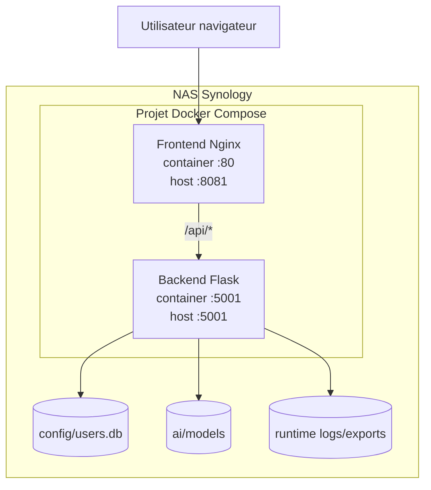
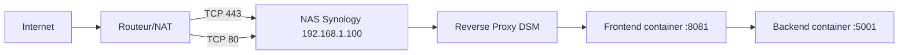
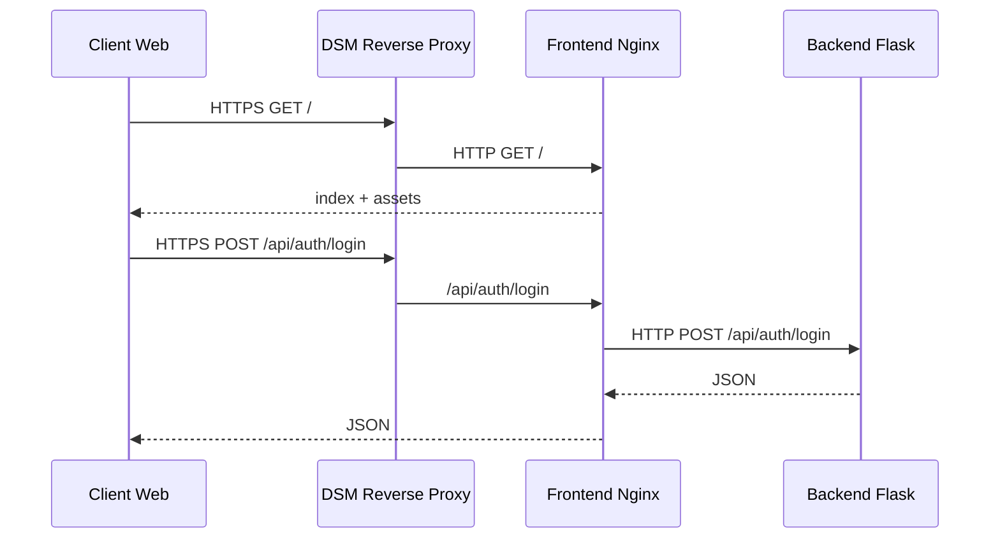
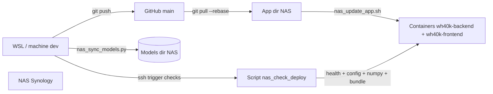

# Déploiement Synology — Containerisation et réseau

Document unique regroupant la containerisation Docker et la configuration réseau pour héberger l’application sur un NAS Synology (ex-`containerisation.md` et `Network.md`).

## Objectif

- Packager l’application en conteneurs Docker et la déployer sur le NAS.
- Exposer l’application en HTTPS depuis Internet sans exposer directement les ports des conteneurs.

---

## Contexte et stack

- **Backend** : Flask (API Python), port **5001** dans le conteneur.
- **Frontend** : React + Vite, servi en statique par Nginx, port **80** dans le conteneur, mappé en **8081** sur l’hôte.
- **Orchestration** : Docker Compose.

**Config déployée** (référence) :

- NAS : `192.168.1.100`
- DDNS : `game.40k-greg.synology.me`
- Frontend (host) : `127.0.0.1:8081`
- Backend (host) : `127.0.0.1:5001`

---

## 1. Containerisation

### 1.1 Architecture cible

- **backend** :
  - API sur le port **5001** (interne).
  - Volumes persistants (montés via variables d’environnement sur Synology) :
    - base utilisateur (`config/users.db`)
    - modèles IA (`ai/models/`)
    - runtime (logs, exports)
- **frontend** :
  - Build Vite en production, servi par Nginx sur le port **80** (interne), mappé en **8081** (host).
  - Les appels `/api/*` sont proxyfiés vers le backend.

Schéma logique :

1. Utilisateur → Frontend (`:8081` sur le NAS)
2. Frontend → Backend (`backend:5001` via réseau Docker)
3. Backend → volumes persistants (DB, modèles, runtime)

### 1.2 Fichiers existants

- `Dockerfile` (backend)
- `frontend/Dockerfile` (frontend)
- `docker-compose.yml`
- `requirements.runtime.txt` (runtime backend NAS)
- `scripts/nas_sync_models.py`
- `scripts/nas_update_app.sh`
- `scripts/nas_check_deploy.sh`

Le `docker-compose.yml` utilise des variables d’environnement obligatoires : `SYNO_CONFIG_PATH`, `SYNO_MODELS_PATH`, `SYNO_RUNTIME_PATH`. Pas de fallback : les variables doivent être définies.

### 1.3 Volumes persistants

Montages en production (configuration validée) :

- `${SYNO_CONFIG_PATH}/users.db:/app/config/users.db`
- `ai/models/` (modèles entraînés)
- répertoire runtime (logs, artefacts)

Objectif : conserver les données après redémarrage/mise à jour, séparer image immutable et données.

Important : ne pas monter tout `config/` vers `/app/config`, sinon les fichiers de configuration du repo (`scenario_game.json`, `unit_rules.json`, etc.) peuvent être masqués.

### 1.4 Déploiement sur Synology

**Option A — Container Manager (UI)**  
1. Build et push des images depuis la machine de dev (ou build sur le NAS).  
2. Ouvrir Container Manager sur le Synology.  
3. Créer un projet Compose, coller `docker-compose.yml`.  
4. Renseigner les variables d’environnement (`SYNO_CONFIG_PATH`, `SYNO_MODELS_PATH`, `SYNO_RUNTIME_PATH`) et les chemins des volumes sur le NAS.  
5. Lancer le projet.

**Option B — SSH + Docker Compose**  
1. Se connecter en SSH au NAS.  
2. Récupérer le dépôt (ou transférer compose + env).  
3. Lancer `./scripts/nas_update_app.sh`.  
4. Vérifier : `./scripts/nas_check_deploy.sh`.

Note Synology : utiliser `sudo /usr/local/bin/docker compose ...` (PATH `sudo` incomplet dans de nombreux environnements DSM).

### 1.5 Compatibilité et sécurité

- **Architecture** : Vérifier le NAS (amd64 / arm64). Pour multi-arch : buildx et manifest.
- **Sécurité** : images à jour, secrets via variables d’environnement (jamais en dur dans les Dockerfiles), pas de fallback silencieux si variable critique manquante.
- **Compatibilité modèles IA** : conserver `numpy==2.4.2` dans `requirements.runtime.txt` pour la compatibilité de chargement des modèles PPO sérialisés.
- **Healthcheck** : le backend expose `/api/health` ; le compose utilise un healthcheck HTTP sur `http://127.0.0.1:5001/api/health`.

---

## 2. Réseau et accès HTTPS

### 2.1 Architecture réseau

L’application est exposée en HTTPS via le reverse proxy DSM. Les ports **8081** et **5001** ne sont **pas** exposés sur le WAN.

### 2.2 Règles routeur (NAT/PAT)

À configurer uniquement :

1. `WAN TCP 80 → 192.168.1.100:80`
2. `WAN TCP 443 → 192.168.1.100:443`

À ne **pas** exposer en WAN : `5001` (API), `8081` (frontend).

### 2.3 DMZ

DMZ **désactivée** pour limiter la surface d’attaque ; les redirections 80/443 suffisent.

### 2.4 DDNS et certificat

- DDNS Synology : hôte `game.40k-greg.synology.me` (statut Normal).
- Certificat Let's Encrypt associé à ce domaine, utilisé par la règle reverse proxy DSM.

### 2.5 Reverse Proxy DSM

Règle active (exemple) :

- **Nom** : `40k-proxy`
- **Source** : HTTPS, nom d’hôte `game.40k-greg.synology.me`, port 443
- **Destination** : HTTP, `127.0.0.1`, port **8081**

### 2.6 Mapping API

Le frontend Nginx du conteneur redirige `/api/*` vers le backend interne `backend:5001`.

---

## 3. Checklist et durcissement

**Containerisation et démarrage**

- [ ] Dockerfiles backend/frontend et compose valides, démarrage local OK
- [ ] Variables `SYNO_CONFIG_PATH`, `SYNO_MODELS_PATH`, `SYNO_RUNTIME_PATH` définies sur le NAS
- [ ] Volumes persistants vérifiés (DB, modèles, runtime)
- [ ] Healthchecks OK (`curl -fsS http://127.0.0.1:5001/api/health`)
- [ ] `./scripts/nas_update_app.sh` passe sans erreur
- [ ] `./scripts/nas_check_deploy.sh` passe sans erreur
- [ ] Bundle frontend sans `localhost:5001` (check inclus dans `nas_check_deploy.sh`)
- [ ] Runtime NumPy compatible modèles (`numpy._core.numeric`, check inclus dans `nas_check_deploy.sh`)

**Réseau et HTTPS**

- [ ] Reverse proxy + HTTPS actifs
- [ ] Test externe (ex. 4G/5G) : `https://game.40k-greg.synology.me`

**Durcissement**

- DMZ désactivée, uniquement NAT 80/443
- 2FA activée sur les comptes admin DSM
- DSM et paquets à jour
- Sauvegardes régulières (ex. `/volume1/docker/40k/config`, `models`, `runtime`)
- Logs consultables et rotation planifiée
- Procédure de rollback définie (tag image précédent)

---

## 4. Procédure d'update standard (source de vérité = GitHub)

Depuis la machine de dev :

1. Push code :
   - `git push origin main`
2. Synchroniser les modèles :
   - `python3 scripts/nas_sync_models.py --dry-run`
   - `python3 scripts/nas_sync_models.py`
3. Déployer sur NAS :
   - `ssh -t nas40k 'cd /volume1/docker/40k/app && ./scripts/nas_update_app.sh'`
4. Vérifier :
   - `ssh -t nas40k 'cd /volume1/docker/40k/app && ./scripts/nas_check_deploy.sh'`

