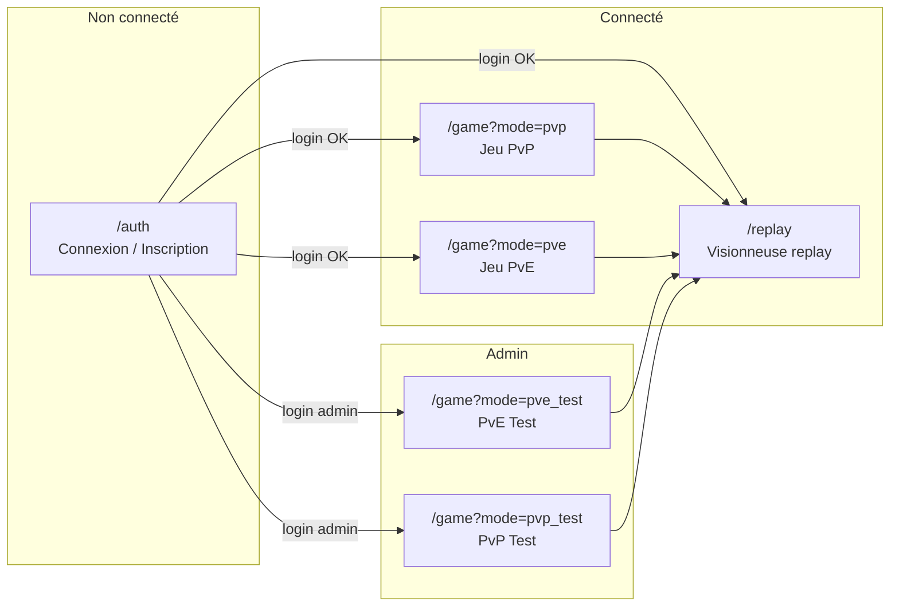
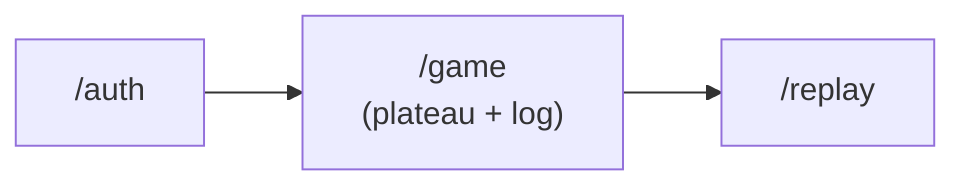

# Maquettes et enchaînement des écrans – Trazyn's Trials

## 1. Schéma d'enchaînement des écrans

Le parcours utilisateur principal est le suivant. Tu peux exporter ce schéma en image (Mermaid live editor, ou outil de ton IDE) pour l'insérer dans le mémoire.

**Version simplifiée (flux principal) :**

## 2. Légende

| Écran | Description |
|-------|-------------|
| **/auth** | Page d'authentification : formulaire connexion / inscription, appels à `POST /api/auth/login` et `POST /api/auth/register`. |
| **/game** | Interface de jeu : plateau hex (PIXI), panneau de contrôle (unités, phase, log), choix du mode (PvP, PvE, Test, Debug) selon permissions. |
| **/replay** | Visionneuse de replay : sélection d'un fichier, lecture pas à pas des actions enregistrées. |

## 3. Intégration au mémoire

- **Dans le corps du mémoire** : insérer l'image exportée du premier ou du second schéma Mermaid (ou les deux : flux détaillé + flux simplifié).
- **Légende** : « Enchaînement des écrans – Parcours utilisateur (auth → jeu → replay). »
- **Annexes** : tu peux ajouter 1–2 captures d'écran annotées (auth, plateau) avec la structure « Capture + Code correspondant » décrite dans `Captures_et_code.md`.
