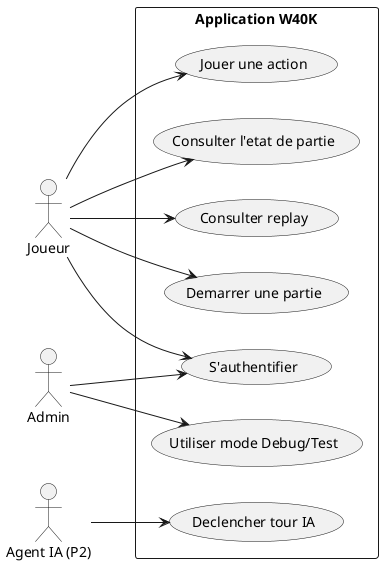
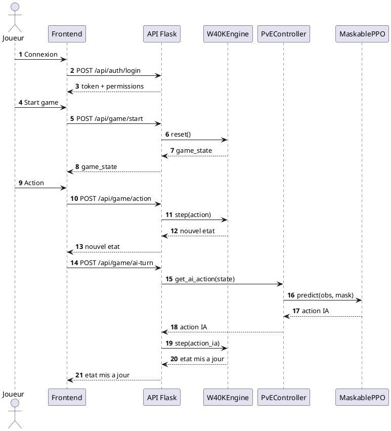

# Memoire de projet - CDA

## Page de garde

**Titre du memoire**  
Conception et developpement d'un moteur de jeu Warhammer 40K avec intelligence artificielle par renforcement

**Nom et prenom :** [A completer]  
**Formation et annee :** [A completer]  
**Entreprise :** [A completer]  
**Tuteur entreprise :** [A completer]  
**Tuteur pedagogique :** [A completer]  
**Date :** [A completer]

---

## Remerciements

Je tiens a remercier l'ensemble des personnes qui m'ont accompagne dans la realisation de ce projet.  
Je remercie particulierement mon tuteur en entreprise, [Nom], pour son encadrement, sa disponibilite et ses conseils techniques.  
Je remercie egalement les membres de l'equipe [Nom du service] pour leur accueil et leurs retours constructifs.  
Enfin, je remercie mes enseignants pour leur accompagnement methodologique.

---

## Resume

Ce memoire presente le developpement d'une application de simulation tactique inspiree de Warhammer 40K. Le projet combine un moteur de jeu par phases, une API Flask, une interface React/TypeScript et un pipeline d'entrainement par apprentissage par renforcement.

Le coeur IA s'appuie sur Stable-Baselines3 et sb3-contrib (MaskablePPO) pour gerer des actions contraintes. L'architecture est organisee en modules (`engine/`, `ai/`, `services/`, `frontend/`, `config/`) afin de separer clairement les responsabilites.

---

## Introduction

L'objectif du projet est de produire un systeme capable de simuler un tour de jeu structure (mouvement, tir, charge, combat) tout en entrainant des agents IA capables de prendre des decisions valides et performantes.

Objectifs :

1. concevoir un moteur de jeu robuste et conforme aux regles metier ;
2. exposer ce moteur via une API backend exploitable par une interface web ;
3. proposer une interface de jeu et de replay ;
4. entrainer et evaluer des agents RL sur des scenarios parametrables ;
5. documenter l'ensemble selon les attendus RE/REAC CDA.

---

## 1. Presentation du projet

### 1.1 Liste des competences mises en oeuvre

- API REST securisee avec Flask (`services/api_server.py`) ;
- moteur de simulation Python (`engine/w40k_core.py`, `engine/phase_handlers/`) ;
- frontend React + TypeScript + Vite + PIXI (`frontend/src/`) ;
- pipeline RL MaskablePPO (`ai/train.py`) ;
- suivi d'entrainement via callbacks et metriques (`ai/training_callbacks.py`, `ai/metrics_tracker.py`) ;
- configurations d'entrainement/recompenses/scenarios (`config/agents/...`) ;
- validation stricte des donnees (`shared/data_validation.py`).

### 1.2 Cahier des charges / expression des besoins

Le systeme doit :

- simuler des affrontements tactiques selon des regles de phases ;
- proposer des modes PvP, PvE, Test, Debug ;
- entrainer des agents IA sur scenarios reproductibles ;
- suivre les performances via metriques et replays.

### 1.3 Presentation de l'entreprise ou du service

[A completer]

---

## 2. Gestion de projet

### 2.1 Planning et suivi

Demarche iterative :

1. moteur et handlers de phases ;
2. API backend ;
3. integration frontend ;
4. entrainement IA ;
5. renforcement qualite/securite.

### 2.2 Environnement humain

[A completer]

### 2.3 Objectifs de qualite

- fiabilite des transitions de phases ;
- validation stricte des donnees ;
- tracabilite via logs/replays ;
- maintenabilite par architecture modulaire.

---

## 3. Specifications fonctionnelles et techniques

### 3.1 Specifications fonctionnelles

Fonctionnalites principales :

- `POST /api/game/start`
- `POST /api/game/action`
- `POST /api/game/ai-turn`
- `GET /api/game/state`
- `POST /api/game/reset`
- endpoints replay + endpoints auth.

### 3.2 Contraintes et livrables attendus

Contraintes :

- coherence stricte de l'etat de jeu ;
- prevention des actions invalides ;
- compatibilite JSON front/back ;
- entrainement parallele configurable.

Livrables :

- code moteur/API/frontend/IA ;
- configurations agents ;
- modeles entraines ;
- documentation technique.

### 3.3 Architecture logicielle

- **Moteur (`engine/`)** : `W40KEngine`, phase handlers, observation, rewards.
- **IA (`ai/`)** : entrainement, callbacks, evaluation bots, metriques.
- **API (`services/`)** : auth/game/replay/health/debug.
- **Frontend (`frontend/`)** : routes, hook API, rendu plateau PIXI.
- **Config (`config/`)** : entrainement, recompenses, scenarios.

### 3.4 Maquettes et enchainement des maquettes

Parcours principal :

1. `/auth`
2. `/game?mode=pve`
3. plateau + statut + log
4. replay.

### 3.5 Modele entite-association et modele physique

Base auth (`config/users.db`) :

- `profiles`, `users`, `game_modes`, `options`, `profile_game_modes`, `profile_options`, `sessions`.

### 3.6 Script de creation ou de modification BDD

Script SQL integre dans `services/api_server.py` (`initialize_auth_db` + `executescript`).

### 3.7 Diagrammes UML (PlantUML)

#### 3.7.1 Cas d'utilisation

#### 3.7.2 Sequence principale

---

## 4. Realisations techniques

### 4.1 Specifications techniques

- Backend : Python + Flask + SQLite
- IA : SB3 + sb3-contrib (MaskablePPO) + gymnasium
- Frontend : React 19, TypeScript 5.8, Vite 7, React Router, PIXI
- Styling : Tailwind CSS

### 4.2 Captures d'ecran et extraits de code

[A integrer : endpoints API, rendu plateau, config entrainement, callback evaluation]

### 4.3 Securite

- hash PBKDF2-HMAC-SHA256 (200000 iterations) ;
- token bearer de session ;
- controle des permissions par profil ;
- protection path traversal sur endpoints replay ;
- validation stricte via `require_key`.

### 4.4 Plan de tests

- test moteur (`main.py::test_basic_functionality`) ;
- controle regles (`scripts/check_ai_rules.py`) ;
- audit phase de tir (`scripts/audit_shooting_phase.py`) ;
- evaluation bots (`ai/bot_evaluation.py`) ;
- suivi metriques (`ai/metrics_tracker.py`).

### 4.5 Jeu d'essai

Agent : `SpaceMarine_Infantry_Troop_RangedSwarm`  
Config : `..._training_config.json` (30000 episodes, 48 envs, obs 323)  
Scenario : `..._scenario_bot-1.json` (14 unites, 5 objectifs).

Resultats observes : [A completer]

### 4.6 Veille technologique

- action masking RL ;
- evaluation robuste par bots ;
- pilotage metriques ;
- pratiques de securisation backend.

---

## 5. Conclusion

Le projet a permis de realiser une application complete combinant moteur, API, frontend et entrainement IA, avec une architecture modulaire et une validation stricte des donnees.

Perspectives :

- automatiser davantage les tests ;
- enrichir scenarios et evaluation ;
- renforcer CI/CD et reporting qualite.

---

## Annexes

- maquettes/captures interfaces ;
- extraits de code significatifs ;
- diagrammes UML exportes ;
- extrait SQL de `initialize_auth_db()` ;
- captures TensorBoard.

---

## Checklist de conformite (CDC RNCP 6)

- [x] Liste des competences
- [x] Cahier des charges / besoins
- [ ] Presentation entreprise/service
- [x] Gestion de projet
- [x] Specifications fonctionnelles
- [x] Contraintes + livrables
- [x] Architecture logicielle
- [ ] Maquettes et enchainement (images a ajouter)
- [ ] Modele EA / physique (schema a finaliser)
- [x] Script BDD
- [x] Diagramme cas d'utilisation
- [x] Diagramme sequence
- [x] Specifications techniques + securite
- [ ] Captures + code correspondant (a integrer)
- [x] Plan de tests
- [ ] Jeu d'essai final avec resultats/echarts
- [x] Veille
- [ ] Annexes finalisees

