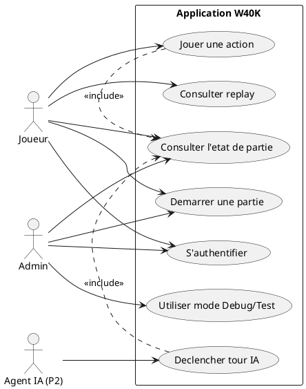
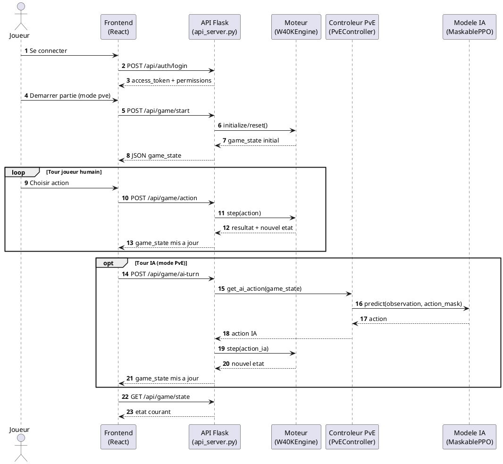

# Memoire de projet - CDA

## Page de garde

**Titre du memoire**  
Conception et developpement d'un moteur de jeu Warhammer 40K avec intelligence artificielle par renforcement

**Nom et prenom :** [A completer]  
**Formation et annee :** [A completer]  
**Entreprise :** [A completer]  
**Tuteur entreprise :** [A completer]  
**Tuteur pedagogique :** [A completer]  
**Date :** [A completer]

---

## Remerciements

Je tiens a remercier l'ensemble des personnes qui m'ont accompagne dans la realisation de ce projet.  
Je remercie particulierement mon tuteur en entreprise, [Nom], pour son encadrement, sa disponibilite et ses conseils techniques.  
Je remercie egalement les membres de l'equipe [Nom du service] pour leur accueil, leurs retours constructifs et leur soutien.  
Enfin, je remercie mes enseignants et l'equipe pedagogique de [Nom de l'ecole/centre] pour leur accompagnement methodologique.

---

## Resume

Ce memoire presente le developpement d'une application de simulation tactique inspiree de Warhammer 40K. Le projet combine un moteur de jeu par phases, une API Flask, une interface React/TypeScript et un pipeline d'entrainement par apprentissage par renforcement.

Le coeur IA s'appuie sur Stable-Baselines3 et sb3-contrib (MaskablePPO) afin de gerer des actions contraintes. L'architecture est organisee en modules (`engine/`, `ai/`, `services/`, `frontend/`, `config/`) pour separer clairement les responsabilites : regles du jeu, entrainement des agents, exposition API, visualisation et parametrage.

---

## Introduction

Le projet s'inscrit dans un contexte de developpement logiciel alliant simulation tactique et intelligence artificielle. L'enjeu est de produire un systeme capable de reproduire un tour de jeu structure (mouvement, tir, charge, combat), tout en entrainant des agents IA capables de prendre des decisions valides et utiles tactiquement.

Objectifs principaux :

1. concevoir un moteur de jeu robuste et conforme aux regles metier ;
2. exposer ce moteur via une API backend exploitable par une interface web ;
3. proposer une interface de jeu et de replay claire pour observer les decisions ;
4. entrainer et evaluer des agents RL sur des scenarios parametrables ;
5. documenter l'ensemble selon les attendus RE/REAC du titre CDA.

---

## 1. Presentation du projet

### 1.1 Liste des competences mises en oeuvre

Competences techniques mobilisees :

- developper une API REST securisee avec Flask (`services/api_server.py`) ;
- concevoir un moteur de simulation en Python (`engine/w40k_core.py`, `engine/phase_handlers/`) ;
- developper un frontend React 19 + TypeScript + Vite + PIXI (`frontend/src/`) ;
- mettre en place un pipeline RL avec MaskablePPO (`ai/train.py`) ;
- suivre l'entrainement avec callbacks et metriques (`ai/training_callbacks.py`, `ai/metrics_tracker.py`) ;
- gerer des configurations d'agents/recompenses/scenarios (`config/agents/...`) ;
- appliquer une validation stricte des donnees (`shared/data_validation.py`).

Competences transversales :

- analyse du besoin et formalisation technique ;
- gestion iterative du projet ;
- communication ecrite technique ;
- resolution de problemes complexes ;
- veille technologique et securite applicative.

### 1.2 Cahier des charges / expression des besoins

Le besoin est de disposer d'une application capable de :

- simuler des affrontements tactiques en respectant des regles de phases ;
- proposer des modes de jeu utilisables (PvP, PvE, Test, Debug) ;
- entrainer des agents IA sur des scenarios reproductibles ;
- suivre les performances via metriques et replays ;
- garantir la coherence de l'etat de jeu et la validite des actions.

Contraintes identifiees :

- coherence stricte de l'etat ;
- validation explicite des donnees et erreurs non silencieuses ;
- maintenabilite (separation engine/ai/services/frontend/config) ;
- reproductibilite via fichiers de configuration JSON.

### 1.3 Presentation de l'entreprise ou du service

[A completer avec ta situation reelle : secteur, taille, organisation, service d'accueil, role du service.]

---

## 2. Gestion de projet

### 2.1 Planning et suivi

Demarche iterative observee dans le repo :

1. construction du moteur et des handlers de phases ;
2. exposition des fonctionnalites via API ;
3. integration frontend pour visualisation et controle ;
4. ajout du pipeline IA (entrainement, callbacks, evaluation) ;
5. renforcement qualite/securite (validation, scripts de controle, metriques).

Suivi d'avancement materialise par :

- configurations versionnees (`config/agents/*`) ;
- scripts de verification (`scripts/check_ai_rules.py`, `scripts/audit_shooting_phase.py`) ;
- callbacks de suivi d'entrainement ;
- logs/replays (`step.log`, `train_step.log`, endpoints replay).

### 2.2 Environnement humain

[A completer avec l'organisation reelle de l'equipe : roles, interactions, frequence des points.]

### 2.3 Objectifs de qualite

Objectifs de qualite :

- fiabilite des transitions de phases et des activations ;
- validation stricte des cles/valeurs ;
- traçabilite via logs et replay ;
- separabilite des modules ;
- suivi quantitatif de l'entrainement.

Mesures appliquees :

- conventions de code et regles projet ;
- scripts de controle de conformite ;
- callbacks d'evaluation bot + sauvegarde meilleur modele ;
- gestion explicite des erreurs cote API.

---

## 3. Specifications fonctionnelles et techniques

### 3.1 Specifications fonctionnelles

Fonctionnalites majeures implementees :

- lancement d'une partie (`POST /api/game/start`) ;
- execution d'actions (`POST /api/game/action`) ;
- tour IA en PvE (`POST /api/game/ai-turn`) ;
- consultation de l'etat (`GET /api/game/state`) ;
- reset (`POST /api/game/reset`) ;
- replay (parse, lecture fichier, listing logs) ;
- authentification utilisateur (`/api/auth/register`, `/api/auth/login`, `/api/auth/me`).

### 3.2 Contraintes du projet et livrables attendus

Contraintes techniques :

- respect des regles de phase et pools d'activation ;
- prevention des etats invalides ;
- compatibilite front/back en JSON ;
- entrainement RL parallele (n_envs configurable).

Livrables techniques :

- moteur : `engine/` ;
- API Flask : `services/api_server.py` ;
- frontend : `frontend/src/` ;
- IA entrainement : `ai/train.py` + modules associes ;
- configurations : `config/agents/*` ;
- scripts d'audit/verification : `scripts/*.py` ;
- documentation : `Documentation/`.

### 3.3 Architecture logicielle

Architecture en couches :

- **Moteur (`engine/`)** : `W40KEngine` (gymnasium Env), handlers de phases, decodeur d'actions, calcul de recompense, construction d'observation.
- **IA (`ai/`)** : entrainement MaskablePPO, vectorisation env, callbacks, evaluation bots, metriques TensorBoard.
- **API (`services/`)** : endpoints auth/game/replay/health/debug, serialisation du game state.
- **Frontend (`frontend/`)** : routes protegees, hook API (`useEngineAPI`), plateau PIXI (`BoardPvp`), suivi des phases/logs.
- **Config (`config/`)** : entrainement, recompenses, scenarios, options de jeu.

### 3.4 Maquettes et enchainement des maquettes

Enchainement fonctionnel actuel :

1. `/auth` : authentification (`AuthPage.tsx`) ;
2. redirection vers `/game?mode=pve` si session valide (`Routes.tsx`) ;
3. page de jeu (`BoardWithAPI.tsx`) avec plateau, statut unites, log et suivi de phase ;
4. mode replay (`ReplayPage.tsx`, `BoardReplay.tsx`).

### 3.5 Modele entite-association et modele physique de la base de donnees

Base orientee authentification/autorisations (`config/users.db`), creee par `initialize_auth_db()` :

- `profiles`
- `users`
- `game_modes`
- `options`
- `profile_game_modes`
- `profile_options`
- `sessions`

Relations :

- un `user` appartient a un `profile` ;
- un `profile` autorise plusieurs `game_modes` ;
- un `profile` active plusieurs `options` ;
- une `session` est rattachee a un `user`.

### 3.6 Script de creation ou de modification de la base de donnees

Le script SQL est integre dans `services/api_server.py` (fonction `initialize_auth_db`, `cursor.executescript(...)`).

Il couvre :

- creation des tables auth ;
- seed des profils `base` et `admin` ;
- seed des modes (`pve`, `pvp`, `debug`, `test`) ;
- seed des options (`show_advance_warning`, `auto_weapon_selection`) ;
- affectation des permissions par profil.

### 3.7 Diagrammes UML (PlantUML pret a exporter)

#### 3.7.1 Diagramme de cas d'utilisation

Code PlantUML (copier-coller tel quel) :

**Texte explicatif a coller sous la figure :**  
Ce diagramme presente les interactions principales avec l'application : authentification, lancement de partie, execution d'actions, consultation d'etat et replay. Les modes Debug/Test sont reserves aux profils autorises (admin).

#### 3.7.2 Diagramme de sequence (flux principal de jeu)

Code PlantUML (copier-coller tel quel) :

**Texte explicatif a coller sous la figure :**  
Ce diagramme illustre le flux d'une partie en mode PvE : authentification, demarrage, boucle d'actions joueur, tour IA via `PvEController` et `MaskablePPO`, puis synchronisation continue de l'etat de jeu entre backend et frontend.

---

## 4. Realisations techniques

### 4.1 Specifications techniques du projet

Stack observee :

- Backend : Python + Flask + SQLite.
- IA : Stable-Baselines3 + sb3-contrib (MaskablePPO) + gymnasium.
- Frontend : React 19.1.1, TypeScript 5.8, Vite 7.1.2, React Router 7.8.2, PIXI 7.4.3.
- Styling : Tailwind CSS 4 + PostCSS/Autoprefixer.

### 4.2 Captures d'ecran et extraits de code

Elements a illustrer :

- endpoint auth (`/api/auth/login`) ;
- endpoint jeu (`/api/game/start`) ;
- composant principal (`BoardWithAPI.tsx`) ;
- rendu plateau (`BoardPvp.tsx`) ;
- config entrainement (`..._training_config.json`) ;
- callback d'evaluation (`BotEvaluationCallback`).

### 4.3 Securite

Mesures implementees :

- hash mot de passe PBKDF2-HMAC-SHA256 (200000 iterations) ;
- salt aleatoire + comparaison securisee ;
- token bearer de session ;
- controle des modes autorises selon profil ;
- protection anti path traversal sur endpoints replay ;
- validation stricte des donnees via `require_key`.

### 4.4 Plan de tests

Plan de test base sur le repo :

- test de fonctionnement moteur : `main.py::test_basic_functionality()` ;
- verification conformite regles : `scripts/check_ai_rules.py` ;
- audit phase de tir : `scripts/audit_shooting_phase.py` ;
- evaluation IA contre bots : `ai/bot_evaluation.py` ;
- suivi metriques TensorBoard : `ai/metrics_tracker.py`.

Note : pas de suite `pytest` complete dans l'etat actuel ; verification principalement par simulation, scripts et metriques.

### 4.5 Jeu d'essai

Exemple concret :

- Agent : `SpaceMarine_Infantry_Troop_RangedSwarm`
- Fichier training : `config/agents/SpaceMarine_Infantry_Troop_RangedSwarm/SpaceMarine_Infantry_Troop_RangedSwarm_training_config.json`
- Profil default :
  - `total_episodes`: 30000
  - `n_envs`: 48
  - `obs_size`: 323
  - `learning_rate`: 0.0002 -> 0.00006
  - `n_steps`: 16384
  - `batch_size`: 4096
- Scenario :
  - `config/agents/SpaceMarine_Infantry_Troop_RangedSwarm/scenarios/SpaceMarine_Infantry_Troop_RangedSwarm_scenario_bot-1.json`
  - 14 unites total (5 Space Marines joueur 1, 9 Tyranids joueur 2)
  - 5 objectifs (`West`, `North`, `East`, `South`, `Center`)

Resultats observes : [A completer avec captures TensorBoard / logs / win rates.]

### 4.6 Veille technologique

Axes de veille alignes avec les choix projet :

- apprentissage par renforcement avec action masking ;
- evaluation robuste via bots de reference ;
- pilotage par metriques d'entrainement ;
- pratiques de securisation backend ;
- conformite RE/REAC (qualite, tests, documentation).

---

## 5. Conclusion

Le projet a permis de realiser une application complete combinant moteur de simulation, API web, interface utilisateur et entrainement IA. Les objectifs de modularite, de coherence d'etat, de validation stricte et de suivi des performances ont ete atteints.

Les difficultes principales ont porte sur la complexite des regles de phase, la synchronisation front/back et le reglage des hyperparametres. Les solutions retenues reposent sur une architecture decoupee, des conventions strictes, des scripts de controle et un pilotage par metriques.

Perspectives :

- formaliser une campagne de tests automatisee (pytest/integration) ;
- enrichir les scenarios et la couverture des evaluations bots ;
- renforcer l'industrialisation CI/CD ;
- poursuivre l'optimisation des modeles IA.

---

## Annexes

Annexes a joindre :

- captures d'ecran des vues principales (`/auth`, `/game`, replay) ;
- extraits de code :
  - `services/api_server.py`
  - `engine/w40k_core.py`
  - `ai/train.py`
  - `ai/training_callbacks.py`
  - `frontend/src/components/BoardWithAPI.tsx`
- diagrammes UML exportes depuis les blocs PlantUML ci-dessus ;
- extrait SQL de `initialize_auth_db()` ;
- captures TensorBoard (metriques critiques, evaluation bots) ;
- references bibliographiques et sources.

### Comment exporter les diagrammes PlantUML en image

1. Copier un bloc `@startuml ... @enduml`.
2. Le coller dans un editeur PlantUML (plugin VSCode/Cursor ou site PlantUML).
3. Exporter en PNG ou SVG.
4. Inserer l'image dans les annexes du memoire.

---

## Checklist de conformite (RE/REAC CDA)

- [x] Liste des competences mises en oeuvre.
- [x] Cahier des charges / expression des besoins.
- [ ] Presentation de l'entreprise/service (a completer).
- [x] Gestion de projet (planning, suivi, environnement, qualite).
- [x] Specifications fonctionnelles et techniques.
- [x] Architecture logicielle.
- [x] Modele de donnees et script de creation DB (auth).
- [x] Diagrammes UML prepares en PlantUML (a exporter en image).
- [x] Securite (mesures concretes).
- [x] Plan de tests.
- [x] Jeu d'essai concret.
- [x] Veille technologique.

# Memoire de projet - CDA

## Page de garde

**Titre du memoire**  
Conception et developpement d'un moteur de jeu Warhammer 40K avec intelligence artificielle par renforcement

**Nom et prenom :** [A completer]  
**Formation et annee :** [A completer]  
**Entreprise :** [A completer]  
**Tuteur entreprise :** [A completer]  
**Tuteur pedagogique :** [A completer]  
**Date :** [A completer]

---

## Remerciements

Je tiens a remercier l'ensemble des personnes qui m'ont accompagne dans la realisation de ce projet.  
Je remercie particulierement mon tuteur en entreprise, [Nom], pour son encadrement, sa disponibilite et ses conseils techniques.  
Je remercie egalement les membres de l'equipe [Nom du service] pour leur accueil, leurs retours constructifs et leur soutien.  
Enfin, je remercie mes enseignants et l'equipe pedagogique de [Nom de l'ecole/centre] pour leur accompagnement methodologique.

---

## Resume

Ce memoire presente le developpement d'une application de simulation tactique inspiree de Warhammer 40K. Le projet combine un moteur de jeu par phases, une API Flask, une interface React/TypeScript et un pipeline d'entrainement par apprentissage par renforcement.

Le coeur de l'IA s'appuie sur Stable-Baselines3 et sb3-contrib (MaskablePPO) afin de gerer des actions contraintes (action masking). L'architecture est organisee en modules (`engine/`, `ai/`, `services/`, `frontend/`, `config/`) pour separer clairement les responsabilites : regles du jeu, entrainement des agents, exposition API, visualisation et parametrage.

Les resultats obtenus permettent de simuler des parties en modes PvP/PvE/Test/Debug, de suivre l'apprentissage par metriques, d'evaluer les agents contre des bots de reference, et de conserver un cadre de conformite fort (validation stricte des donnees, scripts de controle de regles). Le document decrit les choix techniques, la mise en oeuvre et les perspectives d'amelioration.

---

## Introduction

Le projet s'inscrit dans un contexte de developpement logiciel alliant simulation tactique et intelligence artificielle. L'enjeu est de produire un systeme capable de reproduire un tour de jeu structure (mouvement, tir, charge, combat), tout en entrainant des agents IA capables de prendre des decisions valides et utiles tactiquement.

Objectifs principaux :

1. concevoir un moteur de jeu robuste et conforme aux regles metier ;
2. exposer ce moteur via une API backend exploitable par une interface web ;
3. proposer une interface de jeu et de replay claire pour observer les decisions ;
4. entrainer et evaluer des agents RL sur des scenarios parametrables ;
5. documenter l'ensemble selon les attendus RE/REAC du titre CDA.

Le memoire est organise en cinq parties : presentation du projet, gestion de projet, specifications, realisations techniques et conclusion.

---

## 1. Presentation du projet

### 1.1 Liste des competences mises en oeuvre

Competences techniques effectivement mobilisees dans le repo :

- Developper une API REST securisee avec Flask (`services/api_server.py`).
- Concevoir un moteur de simulation en Python avec orchestration par phases (`engine/w40k_core.py`, `engine/phase_handlers/`).
- Developper un frontend React 19 + TypeScript + Vite + PIXI (`frontend/src/`).
- Mettre en place un pipeline RL avec MaskablePPO, callbacks et vectorisation (`ai/train.py`, `ai/training_callbacks.py`).
- Concevoir des configurations d'entrainement/recompenses/scenarios (`config/agents/...`).
- Suivre la qualite de l'entrainement avec metriques TensorBoard (`ai/metrics_tracker.py`).
- Mettre en oeuvre des pratiques de validation stricte (`shared/data_validation.py`).

Competences transversales :

- analyse des besoins et structuration d'un dossier technique ;
- planification iterative et suivi des taches ;
- communication technique ecrite ;
- resolution de problemes en environnement complexe ;
- veille technologique et securite applicative.

### 1.2 Cahier des charges / expression des besoins

Le besoin est de disposer d'une application capable de :

- simuler des affrontements tactiques en respectant des regles de phases ;
- proposer des modes de jeu utilisables (PvP, PvE, Test, Debug) ;
- entrainer des agents IA sur des scenarios reproductibles ;
- suivre les performances via metriques et replays ;
- garantir la coherence de l'etat de jeu et la validite des actions.

Contraintes identifiees :

- coherence stricte de l'etat (single source of truth sur certains champs critiques) ;
- validation explicite des donnees et erreurs non silencieuses ;
- maintenabilite (separation engine/ai/services/frontend/config) ;
- reproductibilite via fichiers de configuration JSON.

### 1.3 Presentation de l'entreprise ou du service

[A completer avec ta situation reelle : secteur, taille, organisation, service d'accueil, role du service.]

---

## 2. Gestion de projet

### 2.1 Planning et suivi

La progression observee dans le code et la structure du projet correspond a une demarche iterative :

1. construction du moteur de base et des handlers de phases ;
2. exposition des fonctionnalites via API ;
3. integration frontend pour visualisation et controle ;
4. ajout du pipeline IA (entrainement, callbacks, evaluation) ;
5. renforcement qualite/securite (validation, scripts de controle, metriques).

Le suivi est materialise par :

- des configurations versionnees (`config/agents/*`) ;
- des scripts de verification (`scripts/check_ai_rules.py`, `scripts/audit_shooting_phase.py`) ;
- des callbacks de suivi d'entrainement ;
- des logs/replays (`step.log`, `train_step.log`, endpoints replay).

### 2.2 Environnement humain

[A completer avec l'organisation reelle de ton equipe.]

Trame recommandee :

- role du stagiaire/alternant (conception, dev, tests, doc) ;
- role du tuteur (arbitrage, validation) ;
- interactions avec equipe dev/ops/metier ;
- frequence des points de suivi.

### 2.3 Objectifs de qualite

Objectifs de qualite visibles dans le projet :

- fiabilite des transitions de phases et des activations ;
- validation stricte des cles/valeurs via `require_key` et `require_present` ;
- traçabilite via logs et replay ;
- separabilite des modules (core, handlers, API, UI, IA) ;
- suivi quantitatif de l'entrainement (metriques critiques, tactiques et diagnostic).

Mesures mises en place :

- conventions de code et regles Cursor ;
- scripts de controle de conformite (`scripts/check_ai_rules.py`) ;
- callbacks dedies a l'evaluation bot et sauvegarde du meilleur modele ;
- gestion d'erreurs explicite cote API.

---

## 3. Specifications fonctionnelles et techniques

### 3.1 Specifications fonctionnelles

Fonctionnalites majeures implementees :

- lancement d'une partie avec mode choisi (`POST /api/game/start`) ;
- execution d'actions (`POST /api/game/action`) ;
- tour IA en PvE (`POST /api/game/ai-turn`) ;
- consultation de l'etat (`GET /api/game/state`) ;
- reset (`POST /api/game/reset`) ;
- replay (parse, lecture fichier, listing des logs) ;
- authentification utilisateur (register/login/me).

### 3.2 Contraintes du projet et livrables attendus

Contraintes techniques :

- respect des regles de phase et des pools d'activation ;
- prevention des etats invalides ;
- compatibilite front/back en JSON ;
- entrainement RL sur environnements paralleles (n_envs configurable).

Livrables techniques identifies dans le repo :

- moteur : `engine/` ;
- API Flask : `services/api_server.py` ;
- frontend : `frontend/src/` ;
- IA entrainement : `ai/train.py`, callbacks, metrics ;
- configurations : `config/agents/*` ;
- documentation : `Documentation/` ;
- scripts d'audit/verification : `scripts/*.py`.

### 3.3 Architecture logicielle

Architecture en couches/modules :

- **Moteur de jeu (`engine/`)** : `W40KEngine` (gymnasium Env), handlers de phases, decodeur d'actions, calcul de recompense, construction d'observation.
- **Pipeline IA (`ai/`)** : creation/env wrappers, entrainement MaskablePPO, callbacks, evaluation bots, tracking metriques.
- **API (`services/`)** : endpoints auth, game, replay, health/debug + serialisation d'etat.
- **Frontend (`frontend/`)** : routes protegees, hook API central (`useEngineAPI`), rendu plateau PIXI (`BoardPvp`), composants de suivi de tour/log.
- **Configuration (`config/`)** : agents, recompenses, entrainement, scenarios.

### 3.4 Maquettes et enchainement des maquettes

Sans maquettes graphiques exportees, l'enchainement fonctionnel observable dans le frontend est :

1. `/auth` : authentification utilisateur (`AuthPage.tsx`) ;
2. redirection vers `/game?mode=pve` si session valide (`Routes.tsx`) ;
3. page de jeu (`BoardWithAPI.tsx`) avec :
   - plateau principal (`BoardPvp.tsx`) ;
   - suivi de phase (`TurnPhaseTracker.tsx`) ;
   - tableau des unites (`UnitStatusTable.tsx`) ;
   - journal des actions (`GameLog.tsx`) ;
4. replay via page dediee (`ReplayPage.tsx`, `BoardReplay.tsx`).

### 3.5 Modele entite-association et modele physique de la base de donnees

La base presente dans le repo est orientee authentification/autorisations (`config/users.db`), creee dans `initialize_auth_db()` :

- `profiles` (base, admin)
- `users` (login, password_hash, profile_id)
- `game_modes` (pve, pvp, debug, test)
- `options` (show_advance_warning, auto_weapon_selection)
- `profile_game_modes`
- `profile_options`
- `sessions` (token, user_id, created_at)

Relations principales :

- un `user` appartient a un `profile` ;
- un `profile` autorise plusieurs `game_modes` ;
- un `profile` active plusieurs `options` ;
- une `session` est rattachee a un `user`.

### 3.6 Script de creation ou de modification de la base de donnees

Le script SQL n'est pas dans un fichier `.sql` separe : il est integre dans `services/api_server.py` (fonction `initialize_auth_db`, via `cursor.executescript(...)`).

Contenu principal :

- creation des tables `profiles`, `users`, `game_modes`, `options`, `profile_game_modes`, `profile_options`, `sessions` ;
- initialisation des profils `base` et `admin` ;
- initialisation des modes (`pve`, `pvp`, `debug`, `test`) ;
- initialisation des options de profil.

### 3.7 Diagrammes UML

Diagrammes a produire en annexe (et facilement derivables du code) :

- **Cas d'utilisation** : se connecter, lancer partie, jouer une action, declencher un tour IA, consulter replay.
- **Sequence principale** :
  1. frontend appelle `POST /api/game/start` ;
  2. API initialise moteur + reset ;
  3. frontend envoie `POST /api/game/action` ;
  4. moteur met a jour game_state ;
  5. frontend lit `GET /api/game/state` ;
  6. en PvE, frontend appelle `POST /api/game/ai-turn`.

---

## 4. Realisations techniques

### 4.1 Specifications techniques du projet

Stack observee :

- Backend : Python + Flask + SQLite.
- IA : Stable-Baselines3, sb3-contrib (MaskablePPO), gymnasium.
- Frontend : React 19.1.1, TypeScript 5.8, Vite 7, React Router, PIXI.
- Styling : Tailwind CSS + PostCSS/Autoprefixer.

Elements structurants :

- API base frontend : `http://localhost:5001/api` (`frontend/src/hooks/useEngineAPI.ts`) ;
- serveur frontend : port 5175 (`frontend/vite.config.ts`) ;
- serveur API : port 5001 (`services/api_server.py`) ;
- modes autorises par profil + options UI.

### 4.2 Captures d'ecran et extraits de code

Elements a illustrer (disponibles dans le repo) :

- endpoint d'auth (`/api/auth/login`) + creation de session token ;
- endpoint de jeu (`/api/game/start`) + retour state serialise ;
- composant principal UI (`BoardWithAPI.tsx`) ;
- rendu plateau hexagonal (`BoardPvp.tsx`) ;
- config agent (`..._training_config.json`, `..._rewards_config.json`) ;
- callbacks d'entrainement (`BotEvaluationCallback`).

### 4.3 Securite

Mesures de securite concretes implementees :

- hash mot de passe PBKDF2-HMAC-SHA256 avec 200000 iterations ;
- salt aleatoire (`secrets.token_bytes(16)`) ;
- comparaison securisee (`secrets.compare_digest`) ;
- token de session aleatoire (`secrets.token_urlsafe(48)`) ;
- validation du header `Authorization: Bearer <token>` ;
- controle des modes autorises selon profil ;
- protection replay contre path traversal (`..`, `/`, `\\`) ;
- restriction des fichiers replay a l'extension `.log` ;
- validation stricte des donnees via `require_key`.

### 4.4 Plan de tests

Plan de test reellement applicable au projet :

- **Tests de fonctionnement moteur** : `main.py::test_basic_functionality()`.
- **Verification de conformite regles AI** : `scripts/check_ai_rules.py`.
- **Verification regles Cursor** : `scripts/test_cursor_rules.py`.
- **Audit phase de tir** : `scripts/audit_shooting_phase.py`.
- **Evaluation IA contre bots** : `ai/bot_evaluation.py` + callback.
- **Suivi metriques** : `ai/metrics_tracker.py` (41 metriques documentees).

Note : le repo ne contient pas de suite `pytest` classique ; la validation est principalement faite via scripts dedies, simulation, replay et metriques d'entrainement.

### 4.5 Jeu d'essai

Jeu d'essai concret issu du repo :

- **Agent cible** : `SpaceMarine_Infantry_Troop_RangedSwarm`.
- **Config training (profil default)** :
  - `total_episodes`: 30000
  - `n_envs`: 48
  - `obs_size`: 323
  - `learning_rate`: 0.0002 -> 0.00006
  - `n_steps`: 16384
  - `batch_size`: 4096
- **Scenario utilise** :
  - `config/agents/SpaceMarine_Infantry_Troop_RangedSwarm/scenarios/SpaceMarine_Infantry_Troop_RangedSwarm_scenario_bot-1.json`
  - 14 unites total (5 Space Marines joueur 1, 9 Tyranids joueur 2)
  - 5 objectifs (`West`, `North`, `East`, `South`, `Center`)
  - deploiement `deployment_type: random`, `deployment_zone: hammer`

Resultats attendus pour ce jeu d'essai :

- respect des actions valides par phase ;
- enregistrement des metriques critiques (`game_critical/*`, `training_critical/*`) ;
- evaluation intermediaire contre bots selon `bot_eval_freq`.

Resultats observes : [A completer avec tes captures TensorBoard, logs et win rates.]

### 4.6 Veille technologique

Veille effectuee et visible dans les choix techniques :

- apprentissage par renforcement avec action masking (MaskablePPO) ;
- evaluation robuste via bots de reference (random/greedy/defensive) ;
- suivi metriques TensorBoard pour pilotage des hyperparametres ;
- pratiques de securisation backend (hash, tokens, validation) ;
- prise en compte des contraintes CDA/REAC (tests, securite, qualite, documentation).

---

## 5. Conclusion

Le projet a permis de realiser une application complete combinant moteur de simulation, API web, interface utilisateur et entrainement IA. Les objectifs de modularite, de coherence d'etat, de validation stricte et de suivi des performances ont ete atteints sur une base technique solide.

Les difficultes principales ont porte sur la complexite des regles de phase, la synchronisation front/back et le reglage des hyperparametres d'entrainement. Les solutions retenues reposent sur une architecture clairement decoupee, des conventions de validation strictes, des scripts de controle et un pilotage par metriques.

Perspectives d'amelioration :

- formaliser une campagne de tests automatisee type pytest/integration ;
- enrichir la partie base de donnees metier si besoin fonctionnel ;
- etendre les scenarios et la couverture de bots d'evaluation ;
- industrialiser davantage la CI/CD et les rapports qualite.

---

## Annexes

Annexes a integrer :

- captures d'ecran des vues principales (`/auth`, `/game`, replay) ;
- extraits de code :
  - `services/api_server.py`
  - `engine/w40k_core.py`
  - `ai/train.py`
  - `ai/training_callbacks.py`
  - `frontend/src/components/BoardWithAPI.tsx`
- schemas UML (cas d'utilisation + sequence) ;
- extrait SQL de `initialize_auth_db()` ;
- captures TensorBoard (metriques critiques et evaluation bots) ;
- bibliographie/sources (Flask, SB3, sb3-contrib, React, Vite, PIXI, OWASP/ANSSI selon tes references).

---

## Checklist de conformite (RE/REAC CDA)

- [x] Liste des competences mises en oeuvre.
- [x] Cahier des charges / expression des besoins.
- [ ] Presentation de l'entreprise/service (donnees personnelles a completer).
- [x] Gestion de projet (planning, suivi, environnement, qualite).
- [x] Specifications fonctionnelles et techniques.
- [x] Architecture logicielle.
- [x] Modele de donnees et script de creation DB (auth).
- [ ] Diagrammes UML (a joindre).
- [x] Securite (mesures concretes).
- [x] Plan de tests.
- [x] Jeu d'essai concret.
- [x] Veille technologique.

# Memoire de projet - CDA

## Page de garde

**Titre du memoire**  
Conception et developpement d'un moteur de jeu Warhammer 40K avec intelligence artificielle par renforcement

**Nom et prenom :** [A completer]  
**Formation et annee :** [A completer]  
**Entreprise :** [A completer]  
**Tuteur entreprise :** [A completer]  
**Tuteur pedagogique :** [A completer]  
**Date :** [A completer]

---

## Remerciements

Je tiens a remercier l'ensemble des personnes qui m'ont accompagne dans la realisation de ce projet.  
Je remercie particulierement mon tuteur en entreprise, [Nom], pour son encadrement, sa disponibilite et ses conseils techniques.  
Je remercie egalement les membres de l'equipe [Nom du service] pour leur accueil, leurs retours constructifs et leur soutien.  
Enfin, je remercie mes enseignants et l'equipe pedagogique de [Nom de l'ecole/centre] pour leur accompagnement methodologique.

---

## Resume

Ce memoire presente le developpement d'une application de simulation tactique inspiree de Warhammer 40K, integreant un moteur de jeu et un module d'intelligence artificielle base sur l'apprentissage par renforcement. Le projet repose sur une architecture modulaire composee d'un backend Python exposant une API Flask, d'un frontend React/TypeScript (Vite), et d'un systeme d'entrainement IA utilisant Stable-Baselines3 (PPO et MaskablePPO).

L'objectif principal est de permettre a des agents IA de prendre des decisions coherentes dans des phases de jeu complexes (mouvement, tir, charge, combat), tout en garantissant la coherence de l'etat de jeu et la robustesse logicielle. Le projet s'appuie sur des conventions strictes de validation, une structuration claire des configurations, et une separation nette entre moteur, API, interface et entrainement.

---

## Introduction

Le projet s'inscrit dans un contexte de developpement logiciel combinant simulation tactique et intelligence artificielle. L'enjeu est de construire une application capable de reproduire un tour de jeu structure, tout en servant d'environnement d'entrainement pour des agents IA.

Les objectifs sont :

1. concevoir une architecture logicielle modulaire et maintenable ;
2. implementer un moteur de regles fiable pour les differentes phases de jeu ;
3. exposer les fonctionnalites via une API backend ;
4. proposer une interface frontend exploitable ;
5. entrainer et evaluer des agents IA a l'aide de techniques de renforcement.

---

## 1. Presentation du projet

### 1.1 Liste des competences mises en oeuvre

- Installer et configurer un environnement de travail de developpement.
- Developper des interfaces utilisateur.
- Developper des composants metier.
- Contribuer a la gestion d'un projet informatique.
- Analyser les besoins et maquetter une application.
- Definir l'architecture logicielle d'une application.
- Concevoir et mettre en place une base de donnees relationnelle.
- Developper des composants d'acces aux donnees SQL et NoSQL.
- Preparer et executer des plans de tests.
- Preparer/documenter le deploiement et contribuer a la mise en production (demarche DevOps).
- Communiquer techniquement, resoudre les problemes et apprendre en continu (competences transversales).

### 1.2 Cahier des charges / expression des besoins

Le besoin principal est de disposer d'un environnement capable de :

- simuler des phases de jeu tactique selon des regles definies ;
- fournir des interactions via API et interface utilisateur ;
- entrainer des agents IA sur ce meme environnement ;
- mesurer les performances et suivre les evolutions des modeles.

Contraintes principales :

- respect strict des regles de phase ;
- coherence de l'etat applicatif ;
- robustesse de la logique metier ;
- maintenabilite et lisibilite du code ;
- possibilite d'ajuster les parametres d'entrainement sans modifier le coeur applicatif.

### 1.3 Presentation de l'entreprise ou du service

[A completer avec ta situation reelle : secteur, taille, organisation, service d'accueil, role du service.]

---

## 2. Gestion de projet

### 2.1 Planning et suivi

Le projet a ete mene selon une approche iterative :

1. cadrage du besoin ;
2. definition de l'architecture cible ;
3. implementation des briques principales ;
4. tests et ajustements ;
5. consolidation documentaire.

Le suivi s'est appuye sur :

- des objectifs par iteration ;
- des points reguliers avec le tuteur ;
- une priorisation des taches critiques ;
- un suivi des anomalies et corrections.

### 2.2 Environnement humain

- Stagiaire/alternant : conception, developpement, tests, redaction.
- Tuteur entreprise : supervision, validation technique, arbitrage.
- Equipe technique : retours d'experience et revue des choix.
- Encadrement pedagogique : suivi methodologique.

### 2.3 Objectifs de qualite

- Fiabilite fonctionnelle du moteur.
- Coherence de la gestion d'etat.
- Clarte et maintenabilite du code.
- Tracabilite des configurations et des evolutions.

Mesures appliquees :

- architecture modulaire ;
- validation explicite des donnees ;
- conventions de codage strictes ;
- separation claire des responsabilites (moteur/API/frontend/IA).

---

## 3. Specifications fonctionnelles et techniques

### 3.1 Specifications fonctionnelles

Fonctionnalites principales :

- gestion des unites et des actions disponibles ;
- simulation des phases de jeu (mouvement, tir, charge, combat) ;
- gestion de l'etat de partie ;
- visualisation et interaction via interface utilisateur ;
- entrainement d'agents IA parametrables.

### 3.2 Contraintes du projet et livrables attendus

Contraintes :

- techniques (coherence de l'etat, performance) ;
- organisationnelles (validation continue) ;
- temporelles (jalons academiques/projet).

Livrables :

- code source structure (`engine/`, `ai/`, `config/`) ;
- backend API (`services/api_server.py`) ;
- frontend React/TypeScript ;
- configurations d'agents et d'entrainement ;
- modeles IA entraines ;
- documentation technique.

### 3.3 Architecture logicielle

L'application repose sur une architecture en composants :

- `engine/` : regles de jeu et transitions de phase ;
- `ai/` : entrainement, callbacks, metriques, modeles ;
- `config/` : parametres agents/recompenses/entrainement ;
- API Flask : exposition des services ;
- frontend : interface de controle et de visualisation.

### 3.4 Maquettes et enchainement des maquettes

[A completer avec tes maquettes/captures.]  
Inclure : ecran de selection, ecran principal, enchainement des ecrans, schema d'enchainement.

### 3.5 Modele entite-association et modele physique de la base de donnees

Modele logique propose :

- Utilisateur
- Agent
- Configuration
- SessionEntrainement
- Metrique
- Modele

Relations principales :

- un agent possede plusieurs configurations ;
- une session d'entrainement est liee a un agent et produit des metriques ;
- une session peut generer un modele entraine.

[Adapter avec ton schema reel.]

### 3.6 Script de creation ou de modification de la base de donnees

[A integrer en annexe + expliquer ici.]  
Ajouter le script SQL principal et son role (creation schema, contraintes, index, migration).

### 3.7 Diagrammes UML

Ajouter :

- diagramme de cas d'utilisation ;
- diagramme de sequence sur 1 a 2 cas significatifs.

---

## 4. Realisations techniques

### 4.1 Specifications techniques du projet

Choix retenus :

- Python pour la logique metier et l'IA ;
- Flask pour l'API ;
- React + TypeScript + Vite pour l'interface ;
- Stable-Baselines3 (PPO / MaskablePPO) pour l'apprentissage.

Justification : technologies matures, separation front/back claire, compatibilite forte avec les besoins de simulation et d'experimentation IA.

### 4.2 Captures d'ecran et extraits de code

[Inserer ici 4 a 6 figures + legendes.]  
Inclure des extraits significatifs :

- interfaces utilisateur + code correspondant ;
- composants metier ;
- composants d'acces aux donnees ;
- autres composants (controleurs, utilitaires).

### 4.3 Securite

Elements a presenter explicitement :

- validation stricte des entrees ;
- gestion explicite des erreurs et exceptions ;
- controle de coherence des donnees ;
- mesures de protection liees aux vulnérabilites identifiees.

### 4.4 Plan de tests

Plan retenu :

- tests unitaires sur fonctions critiques ;
- tests fonctionnels sur les phases de jeu ;
- tests d'integration API/moteur ;
- verification des sorties d'entrainement IA ;
- tests de non-regression sur scenarios representatifs.

### 4.5 Jeu d'essai

Exemple :

- Contexte : entrainement de l'agent `SpaceMarine_Infantry_Troop_RangedSwarm` ;
- Entree : configuration d'entrainement + scenario initial ;
- Resultat attendu : enchainement d'actions valides selon la phase ;
- Resultat obtenu : [A completer] ;
- Analyse des ecarts : [A completer].

### 4.6 Veille technologique

Decrire la veille realisee pendant le projet :

- vulnerabilites de securite ;
- outils/methodes de test ;
- pratiques de developpement securise ;
- solutions evaluees et decisions prises.

---

## 5. Conclusion

Le projet a permis de developper une application complete associant moteur de simulation tactique, API backend, interface frontend et entrainement d'agents IA. Les objectifs principaux de structuration, de coherence fonctionnelle et de mise en place d'un pipeline d'apprentissage ont ete atteints.

Les difficultes majeures ont concerne la complexite des regles de jeu, la gestion rigoureuse de l'etat et le reglage des parametres d'apprentissage. Les solutions apportees reposent sur une architecture modulaire, des conventions strictes et une demarche iterative de validation.

Perspectives :

- enrichissement des scenarios ;
- amelioration des performances IA ;
- automatisation plus poussee des tests ;
- amelioration continue de l'experience utilisateur.

---

## Annexes

Annexes a prevoir (elements de la fonctionnalite la plus representative) :

- maquettes d'interfaces ;
- captures d'ecran et code correspondant ;
- code des composants metier significatifs ;
- code des composants d'acces aux donnees significatifs ;
- autres composants utiles (controleurs, utilitaires) ;
- script SQL de creation/modification BDD ;
- references bibliographiques et sources.

---

## Checklist de conformite (RE/REAC CDA)

- [ ] Le dossier presente la liste des competences mobilisees.
- [ ] Le cahier des charges / expression des besoins est explicite.
- [ ] La presentation de l'entreprise et du service est complete.
- [ ] La gestion de projet couvre planning, suivi, environnement humain, qualite.
- [ ] Les specs fonctionnelles et techniques sont distinguees et justifiees.
- [ ] Le modele de donnees + script BDD sont fournis.
- [ ] Les diagrammes UML (cas d'utilisation + sequence) sont inclus.
- [ ] Les choix de securite sont argumentes.
- [ ] Un plan de tests et un jeu d'essai avec ecarts analyses sont fournis.
- [ ] La veille technologique (dont securite) est documentee.
- [ ] Le document reste dans la plage cible du dossier projet (hors annexes) selon le referentiel applicable.
Mémoire de projet
Conception et développement d’un moteur de jeu Warhammer 40K avec intelligence artificielle par renforcement
Nom et prénom : [À compléter]Formation et année : [À compléter]Entreprise : [À compléter]Tuteur entreprise : [À compléter]Tuteur pédagogique : [À compléter]Date : [À compléter]

Remerciements
Je tiens à remercier l’ensemble des personnes qui m’ont accompagné dans la réalisation de ce projet.Je remercie particulièrement mon tuteur en entreprise, [Nom], pour son encadrement, sa disponibilité et la qualité de ses conseils techniques.Je remercie également les membres de l’équipe [Nom du service] pour leur accueil, leurs retours constructifs et leur soutien dans les différentes phases du développement.Enfin, je remercie mes enseignants et l’équipe pédagogique de [Nom de l’école/centre] pour leur accompagnement méthodologique tout au long de la formation.

Résumé
Ce mémoire présente le développement d’une application de simulation tactique inspirée de Warhammer 40K, intégrant un moteur de jeu et un module d’intelligence artificielle basé sur l’apprentissage par renforcement. Le projet repose sur une architecture modulaire composée d’un backend Python exposant une API Flask, d’un frontend React/TypeScript (Vite), et d’un système d’entraînement IA utilisant Stable-Baselines3 (PPO et MaskablePPO).L’objectif principal est de permettre à des agents IA de prendre des décisions cohérentes dans des phases de jeu complexes (mouvement, tir, charge, combat), tout en garantissant la cohérence de l’état de jeu et la robustesse logicielle. Le projet s’appuie sur des conventions strictes de validation, une structuration claire des configurations, et une séparation nette entre moteur, API, interface et entraînement.Le mémoire décrit le contexte du projet, les choix techniques, les spécifications fonctionnelles, les réalisations principales et les méthodes de qualité appliquées. Il se conclut par un bilan des résultats et des perspectives d’amélioration portant notamment sur l’optimisation de l’apprentissage, l’enrichissement des scénarios de test et l’industrialisation des outils de suivi.

Introduction
Le projet s’inscrit dans un contexte de développement logiciel combinant simulation tactique et intelligence artificielle. L’enjeu consiste à construire une application capable de reproduire un tour de jeu structuré, tout en servant d’environnement d’entraînement pour des agents IA.Les objectifs sont les suivants :
1. concevoir une architecture logicielle modulaire et maintenable ;
2. implémenter un moteur de règles fiable pour les différentes phases de jeu ;
3. exposer les fonctionnalités via une API backend ;
4. proposer une interface frontend exploitable ;
5. entraîner et évaluer des agents IA à l’aide de techniques de renforcement.
Le mémoire est organisé en cinq parties : présentation du projet, gestion de projet, spécifications fonctionnelles et techniques, réalisations techniques, puis conclusion et perspectives.

1. Présentation du projet
1.1 Liste des compétences mises en œuvre
Compétences techniques mobilisées :
développement backend en Python ;
conception d’API REST avec Flask ;
développement frontend avec React, TypeScript et Vite ;
conception de logique métier orientée moteur de règles ;
entraînement d’agents IA avec Stable-Baselines3 (PPO / MaskablePPO) ;
configuration d’expériences d’apprentissage (fichiers de configuration agent/récompense/training).
Compétences non techniques :
analyse du besoin ;
organisation du travail par itérations ;
communication avec les parties prenantes ;
documentation technique ;
amélioration continue basée sur les retours de tests.
Ces compétences ont permis de livrer une solution cohérente, évolutive et orientée qualité.
1.2 Cahier des charges / expression des besoins
Le besoin initial était de disposer d’un environnement capable de :
simuler des phases de jeu tactique selon des règles définies ;
fournir des interactions via API et interface utilisateur ;
entraîner des agents IA sur ce même environnement ;
mesurer les performances et suivre les évolutions des modèles.
Contraintes principales :
respect strict des règles de phase ;
cohérence d’état applicatif ;
robustesse de la logique métier ;
maintenabilité et lisibilité du code ;
possibilité d’ajuster les paramètres d’entraînement sans modifier le cœur applicatif.
1.3 Présentation de l’entreprise ou du service
[À compléter avec ta situation réelle]Exemple :L’entreprise [Nom] évolue dans le secteur [Secteur], avec une organisation [taille/type]. Le projet a été réalisé au sein du service [Nom du service], en charge de [missions principales]. Ce service contribue à [objectif métier] en collaboration avec [autres équipes].

2. Gestion de projet
2.1 Planning et suivi
Le projet a été mené selon une approche itérative :
1. cadrage du besoin ;
2. définition de l’architecture cible ;
3. implémentation des briques principales ;
4. phases de tests et ajustements ;
5. consolidation documentaire.
Le suivi d’avancement s’est appuyé sur :
des objectifs par sprint/itération ;
des points réguliers avec le tuteur ;
une priorisation des tâches critiques ;
un suivi des anomalies et corrections.
2.2 Environnement humain
Acteurs impliqués :
Stagiaire/alternant (moi-même) : conception, développement, tests, rédaction ;
Tuteur entreprise : supervision, validation technique, arbitrage ;
Équipe technique : retours d’expérience, revue de choix techniques ;
Encadrement pédagogique : suivi méthodologique.
La collaboration a été structurée autour d’échanges réguliers et de validations intermédiaires.
2.3 Objectifs de qualité
Les objectifs de qualité définis étaient :
fiabilité fonctionnelle du moteur ;
cohérence de la gestion d’état ;
clarté et maintenabilité du code ;
traçabilité des configurations et des évolutions.
Mesures mises en place :
architecture modulaire ;
validation explicite des données ;
conventions de codage strictes ;
séparation claire des responsabilités (moteur/API/frontend/IA).

3. Spécifications fonctionnelles et techniques
3.1 Spécifications fonctionnelles
Fonctionnalités principales :
gestion des unités et des actions disponibles ;
simulation des phases de jeu (mouvement, tir, charge, combat) ;
gestion de l’état de partie ;
visualisation et interaction via interface utilisateur ;
entraînement d’agents IA paramétrables.
Ces fonctionnalités répondent au besoin d’un environnement tactique à la fois simulable et exploitable pour l’apprentissage.
3.2 Contraintes du projet et livrables attendus
Contraintes :
techniques (cohérence de l’état, performance) ;
organisationnelles (validation continue) ;
temporelles (jalons académiques/projet).
Livrables :
code source structuré (engine/, ai/, config/) ;
backend API (services/api_server.py) ;
frontend React/TypeScript ;
configurations d’agents et d’entraînement ;
modèles IA entraînés ;
documentation technique.
3.3 Architecture logicielle
L’application repose sur une architecture en composants :
Moteur (engine/) : règles de jeu et transitions de phase ;
IA (ai/) : entraînement, callbacks, métriques, modèles ;
Configuration (config/) : paramètres agents/récompenses/entraînement ;
API Flask : exposition des services ;
Frontend : interface de contrôle et visualisation.
Cette architecture favorise l’évolutivité et la maintenance.
3.4 Maquettes et enchaînement des maquettes
[À compléter avec tes captures]Éléments recommandés :
écran de sélection d’agent ;
écran principal de simulation ;
affichage des actions/états ;
visualisation des métriques d’entraînement.
3.5 Modèle entité-association et modèle physique de la base de données
Modèle logique proposé :
Utilisateur
Agent
Configuration
SessionEntrainement
Metrique
Modele
Relations principales :
un agent possède plusieurs configurations ;
une session d’entraînement est liée à un agent et produit des métriques ;
une session peut générer un modèle entraîné.
[Adapter selon ton schéma réel.]
3.6 Diagrammes UML
Diagrammes à intégrer :
cas d’utilisation (entraîner agent, lancer simulation, consulter résultats) ;
séquence (frontend -> API -> moteur/IA -> retour) ;
diagramme de classes simplifié (optionnel).

4. Réalisations techniques
4.1 Spécifications techniques du projet
Choix retenus :
Python pour la logique métier et l’IA ;
Flask pour l’API ;
React + TypeScript + Vite pour l’interface ;
Stable-Baselines3 (PPO / MaskablePPO) pour l’apprentissage.
Justification :
technologies matures ;
séparation front/back claire ;
forte compatibilité avec les besoins de simulation et d’expérimentation IA.
4.2 Captures d’écran et extraits de code
[Insérer ici 4 à 6 figures + légendes] :
capture de l’interface principale ;
capture d’une séquence de simulation ;
extrait d’endpoint API ;
extrait de configuration d’entraînement ;
extrait de suivi de métriques.
4.3 Sécurité
Mesures appliquées :
validation stricte des entrées ;
contrôle de cohérence des données de configuration ;
gestion explicite des erreurs ;
réduction des comportements implicites.
[Ajouter auth/gestion des accès si présents dans ton projet.]
4.4 Plan de tests
Plan retenu :
tests unitaires sur fonctions critiques ;
tests fonctionnels sur les phases de jeu ;
tests d’intégration API/moteur ;
vérification des sorties d’entraînement IA ;
tests de non-régression sur scénarios représentatifs.
4.5 Jeu d’essai
Exemple :
Contexte : entraînement de l’agent SpaceMarine_Infantry_Troop_RangedSwarm ;
Entrée : configuration d’entraînement + scénario initial ;
Résultat attendu : enchaînement d’actions valides selon la phase ;
Résultat observé : [à compléter] ;
Écarts et corrections : [à compléter].
4.6 Veille technologique
La veille a porté sur :
méthodes RL adaptées aux environnements contraints ;
techniques de masquage d’actions invalides ;
bonnes pratiques de structuration des pipelines d’entraînement ;
suivi de métriques et interprétation des performances.
Elle a permis de conforter les choix techniques et d’orienter les optimisations.

5. Conclusion
Le projet a permis de développer une application complète associant moteur de simulation tactique, API backend, interface frontend et entraînement d’agents IA. Les objectifs principaux de structuration, de cohérence fonctionnelle et de mise en place d’un pipeline d’apprentissage ont été atteints.Les difficultés majeures ont concerné la complexité des règles de jeu, la gestion rigoureuse de l’état et le réglage des paramètres d’apprentissage. Les solutions apportées reposent sur une architecture modulaire, des conventions strictes et une démarche itérative de validation.Les perspectives d’évolution incluent l’enrichissement des scénarios, l’amélioration des performances IA, l’automatisation des tests et l’amélioration continue de l’expérience utilisateur.

Annexes
captures d’écran de l’application ;
extraits de code commentés ;
diagrammes UML ;
schéma de base de données ;
références bibliographiques et sources.
