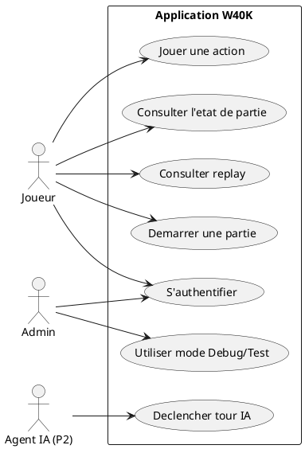
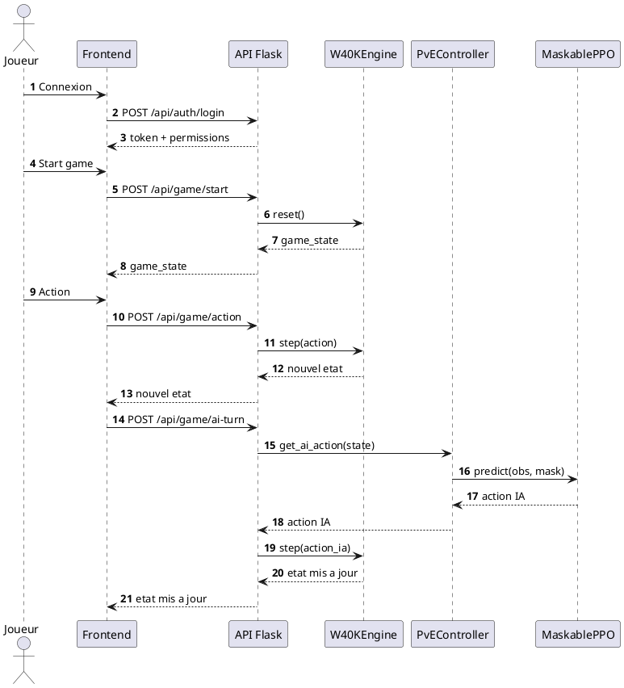
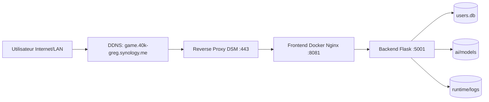
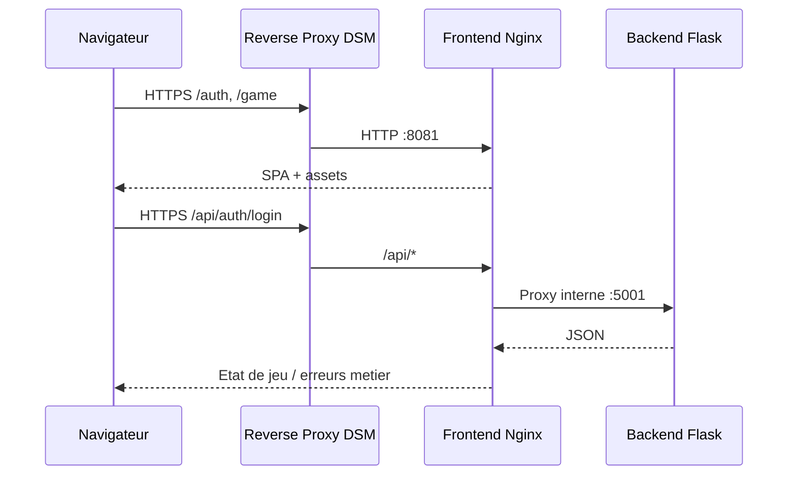

# Memoire de projet - CDA

## Page de garde

**Titre du memoire**  
Conception et developpement d'un moteur de jeu Warhammer 40K avec intelligence artificielle par renforcement

**Nom et prenom :** [A completer]  
**Formation et annee :** [A completer]  
**Entreprise :** [A completer]  
**Tuteur entreprise :** [A completer]  
**Tuteur pedagogique :** [A completer]  
**Date :** [A completer]

---

## Table des matières

Remerciements .......................................................................................................................... 1  
Résumé ...................................................................................................................................... 2  
Introduction ............................................................................................................................... 3  
1. Présentation du projet ......................................................................................................... 4  
 1.1 Liste des compétences mises en œuvre .................................................................... 4  
 1.2 Cahier des charges / expression des besoins ............................................................. 5  
 1.3 Présentation de l'entreprise ou du service ................................................................. 5  
2. Gestion de projet .................................................................................................................. 6  
 2.1 Planning et suivi ......................................................................................................... 6  
 2.2 Environnement humain et technique ......................................................................... 6  
 2.3 Objectifs qualité ......................................................................................................... 7  
3. Spécifications fonctionnelles et techniques ......................................................................... 8  
 3.1 Spécifications fonctionnelles .................................................................................... 8  
 3.2 Contraintes et livrables attendus ................................................................................ 8  
 3.3 Architecture logicielle ............................................................................................... 9  
 3.4 Maquettes et enchaînement ........................................................................................ 9  
 3.5 Modèle entité-association et modèle physique ......................................................... 10  
 3.6 Script de création ou de modification BDD .............................................................. 10  
 3.7 Diagrammes UML ...................................................................................................... 10  
 3.8 Documentation et guides du projet .......................................................................... 11  
4. Réalisations techniques ...................................................................................................... 12  
 4.1 Spécifications techniques (stack) ............................................................................ 12  
 4.2 Réalisations moteur et back-end ............................................................................... 13  
 4.3 Réalisations front-end .............................................................................................. 18  
 4.4 Réalisations IA (entraînement et conformité) ............................................................ 22  
 4.5 Captures d'écran et extraits de code ........................................................................ 26  
 4.6 Éléments de sécurité ................................................................................................ 27  
 4.7 Plan de tests ............................................................................................................. 29  
 4.8 Jeu d'essai ................................................................................................................. 30  
 4.9 Veille technologique ................................................................................................. 32  
 4.10 Déploiement Docker sur NAS Synology ................................................................... 33  
5. Respect du RGPD ................................................................................................................. 35  
6. Conclusion ........................................................................................................................... 36  
Annexes .................................................................................................................................... 37  
Checklist de conformité (CDC RNCP 6) ............................................................................... 38  

---

## Remerciements

Je tiens a remercier l'ensemble des personnes qui m'ont accompagne dans la realisation de ce projet.  
Je remercie particulierement mon tuteur en entreprise, [Nom], pour son encadrement, sa disponibilite et ses conseils techniques.  
Je remercie egalement les membres de l'equipe [Nom du service] pour leur accueil et leurs retours constructifs.  
Enfin, je remercie mes enseignants pour leur accompagnement methodologique.

---

## Resume

Ce memoire presente le developpement d'une application de simulation tactique inspiree de Warhammer 40K. Le projet combine un moteur de jeu par phases, une API Flask, une interface React/TypeScript et un pipeline d'entrainement par apprentissage par renforcement.

Le coeur IA s'appuie sur Stable-Baselines3 et sb3-contrib (MaskablePPO) pour gerer des actions contraintes. L'architecture est organisee en modules (`engine/`, `ai/`, `services/`, `frontend/`, `config/`) afin de separer clairement les responsabilites. La documentation technique (voir *Documentation/README.md*) et les guides de conformite (analyzer, check_ai_rules, tuning metriques) accompagnent le developpement et la validation des regles metier.

---

## Introduction

Ce mémoire présente la conception et le développement d'une application de simulation tactique inspirée de Warhammer 40K, réalisée dans le cadre du titre CDA. L'objectif est de produire un système capable de simuler un tour de jeu structuré (mouvement, tir, charge, combat, déploiement) tout en entraînant des agents IA capables de prendre des décisions valides et performantes. Le projet associe un moteur de jeu Python (gymnasium), une API Flask, une interface React/TypeScript (PIXI pour le plateau) et un pipeline d'apprentissage par renforcement (Stable-Baselines3, MaskablePPO). La rédaction s'appuie sur le modèle type du dossier projet (*\_redac dossier projet V2.pdf*) et sur les exigences des documents présents dans *Documentation/Memoire/* (méthodologie, REAC).

Objectifs du projet :

1. concevoir un moteur de jeu robuste et conforme aux regles metier ;
2. exposer ce moteur via une API backend exploitable par une interface web ;
3. proposer une interface de jeu et de replay ;
4. entrainer et evaluer des agents RL sur des scenarios parametrables ;
5. documenter l'ensemble selon les attendus RE/REAC CDA.

**Exigences et recommandations de rédaction** : Ce memoire suit la structure type du dossier projet CDA (referentiel, besoins, gestion de projet, realisations techniques, securite, jeux d'essai, deploiement, veille, conclusion, annexes). Les documents de reference se trouvent dans `Documentation/Memoire/` (methodologie, REAC, exemple *\_redac dossier projet V2.pdf*).

---

## 1. Presentation du projet

### 1.1 Liste des competences mises en oeuvre

- API REST securisee avec Flask (`services/api_server.py`) ;
- moteur de simulation Python (`engine/w40k_core.py`, `engine/phase_handlers/`, phase deployment implémentée) ;
- frontend React + TypeScript + Vite + PIXI (`frontend/src/`) ;
- pipeline RL MaskablePPO (`ai/train.py`) ;
- suivi d'entrainement via callbacks et metriques (`ai/training_callbacks.py`, `ai/metrics_tracker.py`) ;
- configurations d'entrainement/recompenses/scenarios par agent (`config/agents/<agent>/`) ;
- validation stricte des donnees (`shared/data_validation.py` : `require_key`, `require_present`) ;
- documentation technique et guides de conformite (voir section 3.8 et 4.4).

### 1.2 Cahier des charges / expression des besoins

**a. Contexte et besoins initiaux**

Le projet s'inscrit dans la conception d'un simulateur tactique inspiré de Warhammer 40K, avec un moteur de jeu par phases et des agents IA entraînés par renforcement. Les besoins initiaux étaient : disposer d'un moteur fiable et conforme à des règles métier explicites (tour, phases, activation séquentielle), d'une API pour piloter des parties depuis une interface web, et d'un pipeline d'entraînement reproductible pour faire évoluer les agents.

**b. Besoins fonctionnels**

- **Simulation** : Affrontements tactiques selon des règles de phases (déploiement, mouvement, tir, charge, combat), avec une seule source de vérité pour l'état de jeu, des pools d'activation et un suivi des unités (déplacées, ayant tiré, chargé, combattu, fui).
- **Modes de jeu** : PvP (deux joueurs humains), PvE (joueur contre IA), Test et Debug (réservés au profil admin), avec contrôle d'accès par profil (*USER_ACCESS_CONTROL.md*).
- **Entraînement IA** : Scénarios et configurations par agent (training, récompenses), entraînement reproductible (MaskablePPO), évaluation par bots (Random, Greedy, Defensive).
- **Suivi et traçabilité** : Métriques (TensorBoard, bot_eval), replays (step.log, viewer), scripts de conformité (check_ai_rules, analyzer) pour valider le respect des règles.

**c. Besoins non fonctionnels**

- **Fiabilité** : Transitions de phases déterministes, pas d'action invalide (action masking), validation stricte des données (require_key / require_present).
- **Maintenabilité** : Architecture modulaire (engine, ai, services, frontend, config), documentation indexée (*Documentation/README.md*), règles de codage (AI_TURN.md, coding_practices.mdc).
- **Sécurité** : Hachage des mots de passe, token de session, contrôle des permissions, protection path traversal, pas de fallback masquant des erreurs.
- **Déploiement** : Application conteneurisable (Docker Compose) et déployable sur NAS Synology (HTTPS, reverse proxy, volumes persistants).

### 1.3 Presentation de l'entreprise ou du service

[A completer]

---

## 2. Gestion de projet

### 2.1 Planning et suivi

Demarche iterative :

1. moteur et handlers de phases ;
2. API backend ;
3. integration frontend ;
4. entrainement IA (PPO, bots, metriques) ;
5. phase deploiement et qualite (conformite regles, analyzer, check_ai_rules).

**État d'avancement (référence : *Documentation/Roadmap.md*)** : Palier 0 (base moteur) ~70–75 % ; Palier 1 (IA apprenante) ~60–65 %. Déploiement actif implémenté (phase deployment, deploy_unit). Moteur stable, règles et phases cohérentes, step.log et analyzer en place.

### 2.2 Environnement humain et technique

[A completer : environnement humain — équipe, encadrement, contexte.]

L'environnement technique du projet est le suivant :

- **Backend** : Python 3, Flask pour l'API REST, SQLite pour l'authentification (`config/users.db`). Le moteur de jeu est en Python pur (pas de dépendance serveur spécifique). Validation stricte des données via `shared/data_validation.py` (`require_key`, `require_present`).
- **Moteur** : `engine/w40k_core.py` (classe `W40KEngine`, hérite de `gymnasium.Env`), `engine/phase_handlers/` (movement, shooting, charge, fight, deployment, command), `engine/observation_builder.py`, `engine/action_decoder.py`, `engine/reward_calculator.py`, `engine/game_state.py`. Référence : *Documentation/AI_IMPLEMENTATION.md*.
- **IA** : Stable-Baselines3 (SB3), sb3-contrib (MaskablePPO), gymnasium. Entraînement : `ai/train.py` ; évaluation par bots : `ai/bot_evaluation.py` ; analyse des logs : `ai/analyzer.py`, `ai/hidden_action_finder.py`.
- **Frontend** : React 19, TypeScript 5.8, Vite 7, React Router, PIXI pour le rendu du plateau hex, Tailwind CSS.
- **Contrôle de version** : Git. Documentation centralisée sous `Documentation/` avec index dans *README.md*.
- **Déploiement** : Docker Compose (backend + frontend Nginx), déploiement sur NAS Synology (voir section 4.10 et *Documentation/Deployment_Synology.md*).

### 2.3 Objectifs de qualite

- fiabilite des transitions de phases ;
- validation stricte des donnees (pas de fallback anti-erreur ; *AI_TURN.md* / *AI_IMPLEMENTATION.md*) ;
- tracabilite via logs (step.log), replays et scripts de conformite ;
- maintenabilite par architecture modulaire et documentation indexée (*Documentation/README.md*).

---

## 3. Specifications fonctionnelles et techniques

### 3.1 Specifications fonctionnelles

Fonctionnalites principales :

- `POST /api/game/start`
- `POST /api/game/action`
- `POST /api/game/ai-turn`
- `GET /api/game/state`
- `POST /api/game/reset`
- endpoints replay + endpoints auth (`POST /api/auth/register`, `POST /api/auth/login`, `GET /api/auth/me`).

### 3.2 Contraintes et livrables attendus

Contraintes :

- coherence stricte de l'etat de jeu (single source of truth, *units_cache*, *AI_IMPLEMENTATION.md*) ;
- prevention des actions invalides (action masking, pools d'activation) ;
- compatibilite JSON front/back ;
- entrainement parallele configurable.

Livrables :

- code moteur/API/frontend/IA ;
- configurations agents (training, rewards, scenarios par agent) ;
- modeles entraines (`ai/models/<agent_key>/`) ;
- documentation technique et guides (*Documentation/*, *Documentation/Code_Compliance/*).

### 3.3 Architecture logicielle

- **Moteur (`engine/`)** : `W40KEngine`, phase handlers (movement, shooting, charge, fight, deployment), observation, rewards, action_decoder.
- **IA (`ai/`)** : entrainement (`train.py`), callbacks, evaluation bots, metriques, analyzer (`analyzer.py`), hidden_action_finder.
- **API (`services/`)** : auth/game/replay/health/debug.
- **Frontend (`frontend/`)** : routes, hook API, rendu plateau PIXI.
- **Config (`config/`)** : game_config, unit_rules, weapon_rules, agents (`config/agents/<agent>/` : training_config, rewards_config, scenarios).

### 3.4 Maquettes et enchainement des maquettes

Parcours principal :

1. `/auth`
2. `/game?mode=pve`
3. plateau + statut + log
4. replay.

### 3.5 Modele entite-association et modele physique

Base auth (`config/users.db`) :

- `profiles`, `users`, `game_modes`, `options`, `profile_game_modes`, `profile_options`, `sessions`.  
Specification detaillee : *Documentation/USER_ACCESS_CONTROL.md*.

### 3.6 Script de creation ou de modification BDD

Script SQL integre dans `services/api_server.py` (`initialize_auth_db` + `executescript`).

### 3.7 Diagrammes UML (PlantUML)

#### 3.7.1 Cas d'utilisation

```plantuml
@startuml
left to right direction
actor "Joueur" as Player
actor "Admin" as Admin
actor "Agent IA (P2)" as AI

rectangle "Application W40K" {
  usecase "S'authentifier" as UC_Login
  usecase "Demarrer une partie" as UC_Start
  usecase "Jouer une action" as UC_Action
  usecase "Consulter l'etat de partie" as UC_State
  usecase "Declencher tour IA" as UC_AITurn
  usecase "Consulter replay" as UC_Replay
  usecase "Utiliser mode Debug/Test" as UC_Debug
}

Player --> UC_Login
Player --> UC_Start
Player --> UC_Action
Player --> UC_State
Player --> UC_Replay
AI --> UC_AITurn
Admin --> UC_Login
Admin --> UC_Debug
@enduml
```

#### 3.7.2 Sequence principale

```plantuml
@startuml
autonumber
actor Joueur
participant "Frontend" as FE
participant "API Flask" as API
participant "W40KEngine" as ENG
participant "PvEController" as PVE
participant "MaskablePPO" as MODEL

Joueur -> FE : Connexion
FE -> API : POST /api/auth/login
API --> FE : token + permissions

Joueur -> FE : Start game
FE -> API : POST /api/game/start
API -> ENG : reset()
ENG --> API : game_state
API --> FE : game_state

Joueur -> FE : Action
FE -> API : POST /api/game/action
API -> ENG : step(action)
ENG --> API : nouvel etat
API --> FE : nouvel etat

FE -> API : POST /api/game/ai-turn
API -> PVE : get_ai_action(state)
PVE -> MODEL : predict(obs, mask)
MODEL --> PVE : action IA
PVE --> API : action IA
API -> ENG : step(action_ia)
ENG --> API : etat mis a jour
API --> FE : etat mis a jour
@enduml
```

### 3.8 Documentation et guides du projet

La documentation est centralisee sous `Documentation/` avec un index dans *README.md*. Principaux documents :

- **Moteur et regles** : *AI_TURN.md* (regles de tour, phases, contrat de codage), *AI_IMPLEMENTATION.md* (architecture, caches, deployment).
- **Entrainement et metriques** : *AI_TRAINING.md* (pipeline, configs, bots, replay), *AI_METRICS.md* (metriques 0_critical, tuning, diagnostics).
- **Configuration** : *CONFIG_FILES.md* (weapon_rules, game_config, training/rewards par agent).
- **Conformite code** (*Documentation/Code_Compliance/*) : *GAME_Analyzer.md* (analyse de `step.log` via `ai/analyzer.py`), *AI_RULES_checker.md* (`scripts/check_ai_rules.py`), *Hidden_action_finder.md* (`ai/hidden_action_finder.py`), *Fix_violations_guideline.md*.
- **Deploiement et acces** : *Deployment_Synology.md* (Docker, reseau, HTTPS), *USER_ACCESS_CONTROL.md* (auth, profils).  
Etat et historique des mises a jour : *DOCUMENTATION_STATUS.md*.

---

## 4. Realisations techniques

### 4.1 Specifications techniques (stack)

- **Backend** : Python 3, Flask, SQLite (auth). Moteur : Python pur, gymnasium.
- **IA** : Stable-Baselines3, sb3-contrib (MaskablePPO), gymnasium.
- **Frontend** : React 19, TypeScript 5.8, Vite 7, React Router, PIXI (plateau hex), Tailwind CSS.

---

### 4.2 Realisations moteur et back-end

Le moteur de jeu et l'API constituent le cœur métier de l'application. Le moteur assure la simulation d'un tour de jeu structuré en phases (déploiement, mouvement, tir, charge, combat), avec une seule source de vérité pour l'état de jeu (`game_state`) et des modules dédiés pour l'observation, les récompenses et le décodage des actions. L'API Flask expose cet état et les actions (démarrage, action joueur, tour IA, reset, replay, auth).

#### 4.2.1 Structure du code moteur et API

Le code est organisé en modules distincts :

- **`engine/w40k_core.py`** : Classe `W40KEngine` (hérite de `gymnasium.Env`). Responsabilités : initialisation à partir d'un scénario et des configs, `reset()`, `step(action)`, orchestration des phases (avancement de phase lorsque les pools d'activation sont vides), délégation aux phase handlers, construction de l'observation et calcul des récompenses via des modules dédiés. Le `game_state` est un dictionnaire unique ; aucun module ne le copie ni ne le cache de façon persistante (single source of truth, *AI_IMPLEMENTATION.md*).

- **`engine/phase_handlers/`** : Un fichier par phase (movement, shooting, charge, fight, deployment, command). Chaque phase construit un pool d'activation au début de la phase (`*_phase_start`), traite les actions une par une (activation séquentielle), et met à jour les caches (ex. `units_cache` pour position et HP). Les handlers utilisent `require_key` / `require_present` pour toute donnée requise ; pas de fallback anti-erreur (*coding_practices.mdc*).

- **`engine/observation_builder.py`** : Construit le vecteur d'observation pour l'agent RL (positions, HP, objectifs, masque d'actions, etc.) à partir du `game_state`.

- **`engine/action_decoder.py`** : Traduit l'action entière de l'agent (index discret) en paramètres métier (type d'action, unité, cible, destination, etc.) et applique le masque d'actions valides (MaskablePPO).

- **`engine/reward_calculator.py`** : Calcule la récompense immédiate à partir du `game_state` et des configs de récompenses (fichiers par agent dans `config/agents/<agent>/`).

- **`services/api_server.py`** : Application Flask. Routes jeu : `POST /api/game/start`, `POST /api/game/action`, `POST /api/game/ai-turn`, `GET /api/game/state`, `POST /api/game/reset`. Routes auth : `POST /api/auth/register`, `POST /api/auth/login`, `GET /api/auth/me`. Routes replay et health. Le serveur instancie ou réutilise un `W40KEngine`, appelle `reset()` ou `step(action)` et renvoie l'état sérialisé (JSON). Les unités sont synchronisées avec `units_cache` pour les HP avant envoi au frontend (`_sync_units_hp_from_cache`).

#### 4.2.2 Exemple : point d'entrée step() et délégation

La méthode `step(action)` du moteur (dans `w40k_core.py`) : décode l'action via `ActionDecoder`, détermine la phase courante, appelle le handler de phase approprié (ex. `movement_handlers.handle_movement_phase_step`), qui consomme une activation (une unité fait une action), met à jour le `game_state` et les caches (ex. `update_units_cache_position`, `update_units_cache_hp`). La fin de phase est décidée par l'éligibilité : lorsqu'il n'y a plus d'unités éligibles dans les pools, on passe à la phase suivante. Aucun pas de simulation n'est effectué en dehors de ces handlers ; la cohérence est garantie par les règles documentées dans *AI_TURN.md* et vérifiées par `scripts/check_ai_rules.py`.

#### 4.2.3 Base de données et authentification

La base SQLite `config/users.db` stocke les comptes utilisateurs, les profils et les droits (tables : `profiles`, `users`, `game_modes`, `options`, `profile_game_modes`, `profile_options`, `sessions`). Le script SQL de création est exécuté au démarrage de l'API (`initialize_auth_db`). Les mots de passe sont hachés (PBKDF2-HMAC-SHA256, 200 000 itérations). Spécification détaillée : *Documentation/USER_ACCESS_CONTROL.md*.

---

### 4.3 Realisations front-end

L'interface utilisateur est une SPA React (TypeScript) qui permet de s'authentifier, de lancer une partie (PvP, PvE, Test, Debug selon les permissions), d'afficher le plateau de jeu et le log des actions, et de consulter des replays.

#### 4.3.1 Organisation du code

Le frontend est structuré en composants (pages et composants réutilisables), hooks (ex. appel API vers `/api/game/*`), et contexte ou store pour l'état global (utilisateur connecté, permissions, état de partie). Le routage (React Router) distingue les écrans : authentification, jeu (avec paramètre de mode), replay. Les appels API sont centralisés (base URL relative `/api` pour éviter les problèmes CORS en production avec proxy Nginx).

#### 4.3.2 Rendu du plateau et log

Le plateau hex est rendu avec PIXI : les unités, les objectifs et les hexagones sont positionnés selon les coordonnées du `game_state`. Le composant de log (ex. `GameLog`) affiche la liste des événements ou actions renvoyées par l'API (ou dérivées de l'état). L'état de partie est rafraîchi après chaque action (start, action, ai-turn, reset) pour garder une vue cohérente avec le backend.

#### 4.3.3 Parcours utilisateur type

Connexion (`/auth`) → choix du mode (si autorisé) → démarrage de partie (`POST /api/game/start`) → affichage du plateau et du statut → le joueur envoie des actions (`POST /api/game/action`) ou déclenche le tour IA (`POST /api/game/ai-turn`) → consultation du replay si disponible. Les modes Debug et Test sont réservés au profil admin (*USER_ACCESS_CONTROL.md*).

---

### 4.4 Realisations IA (entrainement et conformite)

L'entraînement des agents repose sur un environnement gymnasium (le moteur `W40KEngine`), MaskablePPO (sb3-contrib) pour gérer les actions contraintes (masque binaire des actions valides), et des configurations par agent (training, récompenses, scénarios).

#### 4.4.1 Pipeline d'entrainement

Le point d'entrée est `ai/train.py` (CLI : `--agent`, `--training-config`, `--rewards-config`, `--scenario`). Le script charge les configs depuis `config/agents/<agent>/`, crée l'environnement (wrappers si besoin), instancie ou charge le modèle MaskablePPO, et lance la boucle d'entraînement. Les modèles sont enregistrés dans `ai/models/<agent_key>/model_<agent_key>.zip`. Référence : *Documentation/AI_TRAINING.md*.

#### 4.4.2 Observation, récompenses et bots

L'observation est construite par `ObservationBuilder` (vecteur fixe selon la config ; asymétrie joueur/adversaire documentée dans *AI_OBSERVATION.md*). Les récompenses sont calculées par `RewardCalculator` à partir de `rewards_config.json` (victoire/défaite, objectifs, dégâts, etc.). L'évaluation en cours d'entraînement est assurée par des bots (RandomBot, GreedyBot, DefensiveBot) ; les win rates sont suivis (TensorBoard, métrique `bot_eval_combined`). Référence : *Documentation/AI_METRICS.md*.

#### 4.4.3 Conformité et analyse des logs

Pour garantir que le comportement de l'agent respecte les règles métier (*AI_TURN.md*), deux outils sont utilisés : (1) `scripts/check_ai_rules.py` vérifie le code (pas de fallback, pas de recalcul de caches hors phase_start, coordonnées normalisées, etc.) ; (2) `ai/analyzer.py` analyse le fichier `step.log` produit lors d'un entraînement avec `--step`, et signale les violations (mouvement, tir, charge, combat) ainsi que des métriques d'usage des règles. Le script `ai/hidden_action_finder.py` détecte les actions effectuées mais non loguées. Référence : *Documentation/Code_Compliance/GAME_Analyzer.md*, *AI_RULES_checker.md*, *Hidden_action_finder.md*.

---

### 4.5 Captures d'ecran et extraits de code

[A integrer : captures des écrans auth, plateau, log ; extraits de code significatifs (ex. appel API, construction observation, end_activation).]

---

### 4.6 Elements de securite

La sécurité a été prise en compte à la fois côté API et côté moteur, en cohérence avec les règles du projet (pas de fallback, validation explicite).

**1. Authentification et autorisation**

- **Authentification** : Connexion par login/mot de passe ; hachage PBKDF2-HMAC-SHA256 (200 000 itérations) ; token bearer de session pour les requêtes authentifiées.
- **Autorisation** : Contrôle des permissions par profil (base / admin). Les profils déterminent les modes de jeu et options accessibles (pve, pvp, debug, test pour admin). Spécification : *Documentation/USER_ACCESS_CONTROL.md*.
- **Protection des routes** : Les routes sensibles (game, replay, debug) vérifient le token et le profil ; toute action non autorisée renvoie 403.

**2. Protection contre les failles (XSS, injection)**

- Côté API : les entrées sont utilisées pour construire des requêtes au moteur (actions, paramètres de partie) ; pas de rendu HTML côté serveur. Les réponses sont en JSON.
- Côté frontend : le contenu affiché provient de l'état de partie ; l'utilisation de React et l'échappement par défaut limitent les risques XSS. Aucune injection SQL côté moteur (le moteur ne dialogue pas directement avec la BDD auth).

**3. Validation des donnees**

- **Backend / moteur** : Utilisation systématique de `require_key` et `require_present` (`shared/data_validation.py`) pour toute donnée requise. Aucune valeur par défaut pour éviter une erreur ; en cas de clé ou valeur manquante, une erreur explicite est levée (*AI_TURN.md*, *coding_practices.mdc*).
- **Configurations** : Les fichiers de config (scénarios, training, rewards) sont chargés et utilisés avec vérification des clés attendues ; les erreurs de config ne sont pas masquées.

**4. Stockage securise des informations sensibles**

- Les mots de passe ne sont jamais stockés en clair ; seuls les hashs sont persistés dans `config/users.db`.
- Les secrets (clé de session, éventuelles variables d'environnement pour la production) ne sont pas codés en dur ; le déploiement Synology utilise des variables d'environnement pour les chemins et données sensibles (*Deployment_Synology.md*).
- Protection path traversal sur les endpoints replay : les chemins de fichiers reçus sont validés pour ne pas sortir du répertoire autorisé.

---

### 4.7 Plan de tests

- test moteur (`main.py::test_basic_functionality`) ;
- controle regles : `scripts/check_ai_rules.py` (conformite *AI_TURN.md* / coding_practices ; pre-commit ou CI) ;
- audit phase de tir : `scripts/audit_shooting_phase.py` ;
- analyse des logs d'entrainement : `ai/analyzer.py step.log` (violations mouvement/tir/charge/combat, metriques regles ; voir *Code_Compliance/GAME_Analyzer.md*) ;
- detection actions non loguees : `ai/hidden_action_finder.py` (*Code_Compliance/Hidden_action_finder.md*) ;
- evaluation bots : `ai/bot_evaluation.py` (RandomBot, GreedyBot, DefensiveBot) ;
- suivi metriques : `ai/metrics_tracker.py`, TensorBoard, *AI_METRICS.md*.

### 4.8 Jeu d'essai

Les jeux d'essai permettent de valider le bon fonctionnement du moteur, de l'API, du frontend et du pipeline d'entraînement, ainsi que la conformité aux règles métier.

**Agents et configurations**

- **Agents disponibles** (exemples) : `Infantry_Troop_RangedTroop`, `Infantry_Troop_RangedSwarm`, `Infantry_Elite_RangedElite`, `Infantry_Troop_MeleeTroop`, etc. (liste dans `config_loader.ConfigLoader._INTERFACTION_AGENT_CONFIG_MAP` et répertoires `config/agents/<agent>/`).
- **Configurations** : Entraînement : `config/agents/<agent>/<agent>_training_config.json` (épisodes, envs, hyperparamètres). Récompenses : `config/agents/<agent>/<agent>_rewards_config.json`. Scénarios : `config/agents/<agent>/scenarios/training/` et `holdout/`.
- **Workflow type** : Générer `step.log` avec `python ai/train.py --agent Infantry_Troop_RangedTroop --training-config default --rewards-config Infantry_Troop_RangedTroop --scenario default --step --test-episodes 200` ; analyser avec `python ai/analyzer.py step.log`. Modèles enregistrés : `ai/models/<agent_key>/model_<agent_key>.zip`.

**Scénarios de test représentatifs** (à compléter avec résultats réels)

1. **Démarrage de partie (PvE)**  
   *Scénario* : Connexion en tant qu'utilisateur, sélection du mode PvE, clic sur « Démarrer une partie ».  
   *Résultat attendu* : Partie initialisée, plateau affiché, unités et objectifs positionnés selon le scénario.  
   *Résultat obtenu* : [À compléter]  
   *Analyse des écarts* : [À compléter]

2. **Action joueur puis tour IA**  
   *Scénario* : Après démarrage PvE, envoi d'une action valide (ex. mouvement), puis déclenchement du tour IA.  
   *Résultat attendu* : État mis à jour après chaque appel ; pas d'erreur 4xx/5xx ; log cohérent.  
   *Résultat obtenu* : [À compléter]  
   *Analyse des écarts* : [À compléter]

3. **Entraînement avec step.log et analyzer**  
   *Scénario* : Lancer un entraînement avec `--step --test-episodes 200`, puis `python ai/analyzer.py step.log`.  
   *Résultat attendu* : Fichier `step.log` généré ; analyzer produit un rapport (sections 1.1 à 2.7) ; taux de violations faible ou nul sur les règles critiques.  
   *Résultat obtenu* : [À compléter avec extraits du rapport et métriques bot_eval / win_rate]  
   *Analyse des écarts* : [À compléter]

4. **Conformité du code (check_ai_rules)**  
   *Scénario* : Exécuter `python scripts/check_ai_rules.py` sur le dépôt.  
   *Résultat attendu* : Aucune violation signalée (exit code 0).  
   *Résultat obtenu* : [À compléter]  
   *Analyse des écarts* : [À compléter]

5. **Accès mode Debug (profil admin)**  
   *Scénario* : Utilisateur avec profil admin se connecte et accède au mode Debug.  
   *Résultat attendu* : Accès autorisé. Utilisateur standard tentant d'accéder au mode Debug : redirection ou 403.  
   *Résultat obtenu* : [À compléter]  
   *Analyse des écarts* : [À compléter]

*Résultats chiffrés (bot_eval, win_rate, métriques TensorBoard)* : [À compléter avec graphiques ou tableaux si disponibles.]

---

### 4.9 Veille technologique

Une veille technologique a été menée sur les thèmes suivants, en lien avec les choix d'implémentation du projet :

- **Apprentissage par renforcement et action masking** : Utilisation de MaskablePPO (sb3-contrib) pour restreindre les actions aux seules actions valides (masque binaire), évitant les actions invalides et accélérant l'apprentissage. Documentation Stable-Baselines3, articles sur l'action masking en RL.
- **Évaluation robuste des agents** : Mise en place de bots de référence (Random, Greedy, Defensive) et métrique composite (ex. `bot_eval_combined`) pour suivre la performance réelle et limiter le surajustement à un seul type d'adversaire. Référence : *AI_TRAINING.md*, *AI_METRICS.md*.
- **Métriques et tuning PPO** : Suivi des métriques 0_critical (loss, explained_variance, clip_fraction, approx_kl, entropy, gradient_norm, etc.) et guide de tuning pour les plateaux, effondrements et instabilités. Référence : *AI_METRICS.md*.
- **Sécurisation backend** : Bonnes pratiques (hachage fort, token de session, validation stricte, pas de fallback silencieux), recommandations OWASP et documentation Flask.
- **Documentation et conformité code** : Règles de tour (*AI_TURN.md*), architecture (*AI_IMPLEMENTATION.md*), scripts de vérification automatique (check_ai_rules, analyzer) pour maintenir la cohérence entre code et règles métier.

---

### 4.10 Deploiement Docker sur NAS Synology

Le projet a été déployé sur un NAS Synology (DSM) via Docker Compose. Référence : *Documentation/Deployment_Synology.md*.

Configuration retenue :

- backend Flask sur port **5001** (interne) ; frontend Nginx sur port **80** (interne), mappe en **8081** (hote) ;
- reverse proxy DSM en HTTPS (ex. DDNS `game.40k-greg.synology.me`) vers le frontend ;
- variables d'environnement obligatoires pour les volumes : `SYNO_CONFIG_PATH`, `SYNO_MODELS_PATH`, `SYNO_RUNTIME_PATH` (pas de fallback).

Volumes persistants :

- `users.db` (auth), `ai/models/` (modeles IA), repertoire runtime (logs).  
Ne pas monter tout `config/` pour eviter de masquer les configs du repo.

Points de vigilance :

- compatibilité dependances Python (ex. `requirements.runtime.txt`, numpy pour chargement PPO) ;
- CORS / appels API en relatif (`/api`) ;
- healthcheck backend : `/api/health` utilise dans le compose.

Schema de deploiement :

```mermaid
flowchart LR
    U[Utilisateur Internet/LAN] --> DNS[DDNS: game.40k-greg.synology.me]
    DNS --> RP[Reverse Proxy DSM :443]
    RP --> FE[Frontend Docker Nginx :8081]
    FE --> API[Backend Flask :5001]
    API --> DB[(users.db)]
    API --> MODELS[(ai/models)]
    API --> RUNTIME[(runtime/logs)]
```

Flux applicatif simplifie :

```mermaid
sequenceDiagram
    participant B as Navigateur
    participant RP as Reverse Proxy DSM
    participant FE as Frontend Nginx
    participant API as Backend Flask

    B->>RP: HTTPS /auth, /game
    RP->>FE: HTTP :8081
    FE-->>B: SPA + assets
    B->>RP: HTTPS /api/auth/login
    RP->>FE: /api/*
    FE->>API: Proxy interne :5001
    API-->>FE: JSON
    FE-->>B: Etat de jeu / erreurs metier
```

---

## 5. Respect du RGPD

Le Règlement général sur la protection des données (RGPD) encadre le traitement des données personnelles. L'application, dans sa version actuelle, prend en compte les points suivants :

- **Minimisation des données** : Les données collectées lors de l'inscription et de la connexion sont limitées à ce qui est nécessaire (identifiant, mot de passe haché, profil, association aux modes de jeu et options). Aucune donnée de paiement ni donnée sensible superflue n'est collectée.
- **Information des utilisateurs** : Les utilisateurs peuvent être informés de l'utilisation de leurs données via une page ou une politique de confidentialité (à finaliser selon le contexte de déploiement).
- **Droits des utilisateurs** : Droit d'accès et de rectification via la gestion du compte ; droit à l'effacement (suppression de compte) peut être prévu. Les droits à l'opposition, à la limitation et à la portabilité sont à traiter selon les évolutions fonctionnelles.
- **Sécurité des données** : Voir section 4.6 (hachage des mots de passe, tokens, validation, pas de stockage en clair).
- **Cookies** : L'application n'utilise que les cookies strictement nécessaires au fonctionnement (session, authentification). Aucun cookie de suivi ou publicitaire n'est utilisé par défaut.

[A compléter selon les exigences juridiques du contexte (entreprise, hébergeur, mentions légales).]

---

## 6. Conclusion

Le projet a permis de realiser une application complete combinant moteur (phases mouvement, tir, charge, combat, deploiement), API, frontend et entrainement IA, avec une architecture modulaire, une validation stricte des donnees et une documentation structuree (index dans *Documentation/README.md*, guides de conformite et de tuning).

Perspectives (alignees *Roadmap.md*) :

- poursuite Palier 1 (IA apprenante) et Palier 2 (multi-figurines, cohesion) ;
- automatiser davantage les tests et la CI (check_ai_rules, analyzer) ;
- enrichir scenarios et evaluation (league / curriculum ; *AI_TRAINING.md*) ;
- renforcer reporting qualite et annexes du memoire (captures, jeux d'essai chiffres).

---

## Annexes

Les annexes complètent le mémoire par des supports détaillés et des références :

- **Annexe 1** : Diagramme des cas d'utilisation (export PlantUML ou image).
- **Annexe 2** : Diagramme de séquence principal (export PlantUML ou image).
- **Annexe 3** : Tableau récapitulatif de l'API REST (routes jeu, auth, replay, health, méthodes, paramètres, codes retour).
- **Annexe 4** : Liste des composants frontend principaux (pages, composants plateau, log, auth).
- **Annexe 5** : Maquettes et captures d'écran (auth, plateau, log, replay).
- **Annexe 6** : Extrait SQL de création de la BDD auth (`initialize_auth_db` dans `services/api_server.py`).
- **Annexe 7** : Extraits de code significatifs (ex. step moteur, construction observation, end_activation, appel API).
- **Annexe 8** : Jeux d'essai détaillés (scénarios, résultats attendus/obtenus, analyse des écarts) et captures TensorBoard / métriques.
- **Références aux guides** : *Documentation/README.md*, *Documentation/Code_Compliance/*, *Documentation/Deployment_Synology.md*, *Documentation/AI_METRICS.md*, *Documentation/AI_TRAINING.md*.

*Objectif de volume : ce mémoire est structuré pour atteindre environ 50 à 60 pages une fois les sections [À compléter] renseignées, les captures et annexes intégrées, et exporté en PDF (police 11–12 pt, interligne 1,2–1,5), en s’inspirant du modèle *\_redac dossier projet V2.pdf* (76 pages).*

---

## Checklist de conformite (CDC RNCP 6)

- [x] Liste des competences
- [x] Cahier des charges / besoins
- [ ] Presentation entreprise/service
- [x] Gestion de projet
- [x] Specifications fonctionnelles
- [x] Contraintes + livrables
- [x] Architecture logicielle
- [x] Documentation et guides (section 3.8)
- [ ] Maquettes et enchainement (images a ajouter)
- [ ] Modele EA / physique (schema a finaliser)
- [x] Script BDD
- [x] Diagramme cas d'utilisation
- [x] Diagramme sequence
- [x] Specifications techniques + securite
- [ ] Captures + code correspondant (a integrer)
- [x] Plan de tests (inclut analyzer, check_ai_rules, hidden_action_finder)
- [ ] Jeu d'essai final avec resultats / metriques
- [x] Veille
- [ ] Annexes finalisees
