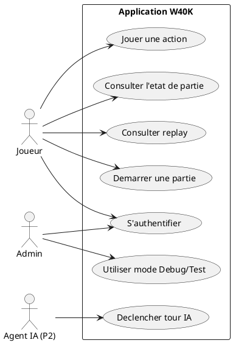
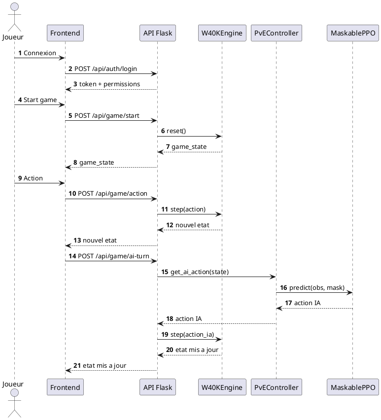

# Dossier de projet

# RNCP niveau 6

Concepteur développeur d'applications

{width="15.799cm" height="15.799cm"}

Trazyn's trials

SOUQUET Grégory

\
**Holberton School Thonon les bains 24/03/2026**

## Remerciements

Je souhaite tout d'abord exprimer ma gratitude à l'équipe pédagogique de Holberton School, pour leur enseignement de qualité, leur disponibilité et leurs conseils avisés tout au long de cette formation.

Je remercie particulièrement Sarah Benamor, pour son accompagnement personnalisé, son écoute attentive, et ses retours constructifs, qui m'ont permis de progresser et de mener ce projet à bien et Kevin Viais pour sa disponibilité, sa bienveillance et son retour technique.

Je remercie ma famile et mes amis, pour leur soutien et leur implication sans lesquels je n'aurais pas pu mener ce projet jusqu'à son niveau actuel.

\
Enfin, je remercie le jury de soutenance pour l'attention qu'il portera à ce projet et pour ses questions qui me permettront, je l'espère, de progresser encore.

## Résumé

Le projet qui vous est présenté dans ce mémoire est une application de simulation tactique inspirée de Warhammer 40'000, le wargame sur table. Le projet combine un moteur de jeu par phases, une API Flask, une interface React/TypeScript et un pipeline d'entrainement par apprentissage par renforcement.

L'architecture est organisee en modules (*engine/*, *ai/*, *services/*, *frontend/*, *config/*) afin de separer clairement les responsabilites.

La documentation technique et les outils de vérification de la conformite du code (aussi bien au niveau du respect des règles du jeu que des règles de codage) ont été mis en place tout au long du processus de developpement.

Le coeur IA s'appuie sur Stable-Baselines3 et sb3-contrib (MaskablePPO) pour gerer des actions contraintes.

## Introduction

La conception et le développement de cette simulation tactique a tout d'abord été réalisé dans le cadre de l'obtention de mon diplôme de spécialisation en Machine Learning.

L'objectif est de produire un système capable de simuler une partie de Warhammer 40'000 telle qu'elle serait jouée sur table ce qui, paradoxalement, n'a jamais été proposé malgré la multitude de jeux vidéos basés sur cet univers.

Cet aspect du projet seul est ambitieux, car ne serait-ce que pour développer le cadre du jeu, il a fallu convertir les 60 pages de règles en algorythmes. Mais au-delà de cette base, le jeu propose plus de 20 factions avec chacune ses règles spéciales et des dizaine d'unités au capacités uniques.

Warhammer 40,000 se joue en une série de rounds de bataille. Lors de chaque round, chaque joueur joue un tour. Le même joueur prend toujours le premier tour à chaque round -- la mission jouée stipulera de quel joueur il s'agit. Chaque tour consiste en une série de phases (commandement, mouvement, tir, charge, combat), qu'il faut résoudre dans l'ordre.

Le jeu reproduit cette structure (round, tour, phase) tout en entraînant des agents IA capables de prendre des décisions valides et performantes. Le projet associe un moteur de jeu Python (gymnasium), une API Flask, une interface React/TypeScript (PIXI pour le plateau) et un pipeline d'apprentissage par renforcement (Stable-Baselines3, MaskablePPO).

Objectifs du projet :

1. concevoir un moteur de jeu robuste et conforme aux regles metier ;
2. exposer ce moteur via une API backend exploitable par une interface web ;
3. proposer une interface de jeu et de replay ;
4. entrainer et evaluer des agents RL sur des scenarios parametrables ;
5. documenter l'ensemble selon les attendus RE/REAC CDA.

## Compétences du référentiel

- API REST securisee avec Flask (*services/api_server.py*) ;
- moteur de simulation Python (*engine/w40k_core.py*, *engine/phase_handlers/*, phase deployment implémentée) ;
- frontend React + TypeScript + Vite + PIXI (*frontend/src/*) ;
- pipeline RL MaskablePPO (*ai/train.py*) ;
- suivi d'entrainement via callbacks et metriques (*ai/training_callbacks.py*, *ai/metrics_tracker.py*) ;
- configurations d'entrainement/recompenses/scenarios par agent (*config/agents/<agent>/*) ;
- validation stricte des donnees (*shared/data_validation.py* : *require_key*, *require_present*) ;
- documentation technique et guides de conformite (Documentation et guides du projet, Réalisations IA).

## Besoins du projet

### 1. Contexte

Le projet s'inscrit dans un double contexte : d'une part, l'expansion de plus en plus forte de la notoriété de Warhammer 40'000, et d'autre part la réalité du quotidien — on n'a pas toujours des amis disponibles pour jouer à un wargame dont l'essence est de se jouer à deux minimum. C'est pourquoi je me suis lancé dans la conception d'un simulateur tactique basé sur le jeu Warhammer 40K, qui en respecterait toutes les règles à la lettre, avec un moteur de jeu par phases et des agents IA entraînés par renforcement.

**Présentation de l'entreprise ou du service** : [A completer]

### 2. Cahier des charges

a. Besoins initiaux

Il s'agissait de disposer d'un moteur fiable et conforme à des règles métier explicites (round, tour, phases, activation séquentielle, lignes de vue, etc.), d'une API pour piloter des parties depuis une interface web, et d'un pipeline d'entraînement reproductible pour faire évoluer les agents.

b. Besoins fonctionnels

- **Simulation** : Affrontements tactiques selon des règles de phases (déploiement, mouvement, tir, charge, combat), avec une seule source de vérité pour l'état de jeu, des pools d'activation et un suivi des unités (déplacées, ayant tiré, chargé, combattu, fui).
- **Modes de jeu** : PvP (deux joueurs humains), PvE (joueur contre IA), Test et Debug (réservés au profil admin), avec contrôle d'accès par profil (*USER_ACCESS_CONTROL.md*).
- **Entraînement IA** : Scénarios et configurations par agent (training, récompenses), entraînement reproductible (MaskablePPO), évaluation par bots (Random, Greedy, Defensive).
- **Suivi et traçabilité** : Métriques (TensorBoard, bot_eval), replays (step.log, viewer), scripts de conformité (check_ai_rules, analyzer) pour valider le respect des règles.

c. Besoins non fonctionnels

- **Fiabilité** : Transitions de phases déterministes, pas d'action invalide (action masking), validation stricte des données (require_key / require_present).
- **Maintenabilité** : Architecture modulaire (engine, ai, services, frontend, config), documentation indexée (*Documentation/README.md*), règles de codage (AI_TURN.md, coding_practices.mdc).
- **Sécurité** : Hachage des mots de passe, token de session, contrôle des permissions, protection path traversal, pas de fallback masquant des erreurs.
- **Déploiement** : Application conteneurisable (Docker Compose) et déployable sur NAS Synology (HTTPS, reverse proxy, volumes persistants).

### 3. Contraintes et livrables attendus

Le projet devait privilégier une architecture modulaire (moteur, API, frontend, IA) et l'utilisation de technologies open source (Python, Flask, React, Stable-Baselines3). L'hébergement et le déploiement devaient rester maîtrisables, avec une application conteneurisable (Docker Compose) et déployable sur une infrastructure type NAS (Synology) ou équivalent.

Sur le plan technique, le projet devait garantir une cohérence stricte de l'état de jeu (single source of truth, *units_cache*, *AI_IMPLEMENTATION.md*), la prévention des actions invalides (action masking, pools d'activation), la compatibilité JSON entre frontend et backend, et un entraînement parallèle configurable. L'interface web devait être compatible avec les navigateurs modernes (Chrome, Firefox, Safari, Edge) et s'adapter aux différentes tailles d'écran (ordinateur, tablette, smartphone).

Le respect des contraintes légales, et en particulier du Règlement général sur la protection des données (RGPD), était un impératif. Le projet devait donc intégrer les principes de protection des données personnelles dès la conception (privacy by design) et garantir la sécurité des informations collectées (authentification, profils, sessions).

Les livrables attendus à l'issue du projet étaient les suivants :

- Une application web fonctionnelle (simulateur tactique, interface de jeu et de replay, modes PvP/PvE), accessible en ligne via une URL publique (déploiement Docker, reverse proxy, par exemple sur NAS Synology).
- Le code source complet et commenté de l'application (frontend React/TypeScript, backend Flask/Python, moteur de jeu, pipeline IA), hébergé sur un dépôt Git, avec les configurations d'agents (training, rewards, scénarios) et les modèles entraînés (*ai/models/<agent_key>/*).
- La documentation technique et les guides du projet (*Documentation/*, *Documentation/Code_Compliance/*), ainsi que les outils de vérification de conformité (scripts, analyzer).
- Le présent dossier de présentation du projet, détaillant les différentes phases de conception et de réalisation.
- Une présentation orale du projet, incluant une démonstration de l'application.

## Gestion du projet

### 1. Environnement humain et technique

[A completer : environnement humain --- équipe, encadrement, contexte.]

**Démarche itérative et planning :**

1. moteur et handlers de phases ;
2. API backend ;
3. integration frontend ;
4. entrainement IA (PPO, bots, metriques) ;
5. phase deploiement et qualite (conformite regles, analyzer, check_ai_rules).

**État d'avancement (référence : *Documentation/Roadmap.md*)** : Palier 0 (base moteur) ~70--75 % ; Palier 1 (IA apprenante) ~60--65 %. Déploiement actif implémenté (phase deployment, deploy_unit). Moteur stable, règles et phases cohérentes, step.log et analyzer en place.

**Environnement technique :**

- **Backend** : Python 3, Flask pour l'API REST, SQLite pour l'authentification (*config/users.db*). Le moteur de jeu est en Python pur (pas de dépendance serveur spécifique). Validation stricte des données via *shared/data_validation.py* (*require_key*, *require_present*).
- **Moteur** : *engine/w40k_core.py* (classe *W40KEngine*, hérite de *gymnasium.Env*), *engine/phase_handlers/* (movement, shooting, charge, fight, deployment, command), *engine/observation_builder.py*, *engine/action_decoder.py*, *engine/reward_calculator.py*, *engine/game_state.py*. Référence : *Documentation/AI_IMPLEMENTATION.md*.
- **IA** : Stable-Baselines3 (SB3), sb3-contrib (MaskablePPO), gymnasium. Entraînement : *ai/train.py* ; évaluation par bots : *ai/bot_evaluation.py* ; analyse des logs : *ai/analyzer.py*, *ai/hidden_action_finder.py*.
- **Frontend** : React 19, TypeScript 5.8, Vite 7, React Router, PIXI pour le rendu du plateau hex, Tailwind CSS.
- **Contrôle de version** : Git. Documentation centralisée sous *Documentation/* avec index dans *README.md*.
- **Déploiement** : Docker Compose (backend + frontend Nginx), déploiement sur NAS Synology (voir section Déploiement et *Documentation/Deployment_Synology.md*).

### 2. Objectifs de qualité

- fiabilite des transitions de phases ;
- validation stricte des donnees (pas de fallback anti-erreur ; *AI_TURN.md* / *AI_IMPLEMENTATION.md*) ;
- tracabilite via logs (step.log), replays et scripts de conformite ;
- maintenabilite par architecture modulaire et documentation indexée (*Documentation/README.md*).

## Réalisations front-end

L'interface utilisateur est une SPA React (TypeScript) qui permet de s'authentifier, de lancer une partie (PvP, PvE, Test, Debug selon les permissions), d'afficher le plateau de jeu et le log des actions, et de consulter des replays.

### 1. Organisation du code

Le frontend est structuré en composants (pages et composants réutilisables), hooks (ex. appel API vers */api/game/*), et contexte ou store pour l'état global (utilisateur connecté, permissions, état de partie). Le routage (React Router) distingue les écrans : authentification, jeu (avec paramètre de mode), replay. Les appels API sont centralisés (base URL relative */api* pour éviter les problèmes CORS en production avec proxy Nginx).

### 2. Organisation de l'interface et maquettes

Parcours principal : */auth* → */game?mode=pve* → plateau + statut + log → replay.

### 3. Interface utilisateur – écrans et exemples

Le plateau hex est rendu avec PIXI : les unités, les objectifs et les hexagones sont positionnés selon les coordonnées du *game_state*. Le composant de log (ex. *GameLog*) affiche la liste des événements ou actions renvoyées par l'API (ou dérivées de l'état). L'état de partie est rafraîchi après chaque action (start, action, ai-turn, reset) pour garder une vue cohérente avec le backend.

**Parcours utilisateur type :** Connexion (*/auth*) → choix du mode (si autorisé) → démarrage de partie (*POST /api/game/start*) → affichage du plateau et du statut → le joueur envoie des actions (*POST /api/game/action*) ou déclenche le tour IA (*POST /api/game/ai-turn*) → consultation du replay si disponible. Les modes Debug et Test sont réservés au profil admin (*USER_ACCESS_CONTROL.md*).

**Captures d'écran et extraits de code** : [A integrer : captures des écrans auth, plateau, log ; extraits de code significatifs (ex. appel API, construction observation, end_activation).]

## Réalisation back-end (moteur et API)

Le moteur de jeu et l'API constituent le cœur métier de l'application. Le moteur assure la simulation d'un tour de jeu structuré en phases (déploiement, mouvement, tir, charge, combat), avec une seule source de vérité pour l'état de jeu (*game_state*) et des modules dédiés pour l'observation, les récompenses et le décodage des actions. L'API Flask expose cet état et les actions (démarrage, action joueur, tour IA, reset, replay, auth).

**Architecture logicielle :** Moteur (*engine/*) : *W40KEngine*, phase handlers (movement, shooting, charge, fight, deployment), observation, rewards, action_decoder. IA (*ai/*) : entrainement (*train.py*), callbacks, evaluation bots, metriques, analyzer (*analyzer.py*), hidden_action_finder. API (*services/*) : auth/game/replay/health/debug. Frontend (*frontend/*) : routes, hook API, rendu plateau PIXI. Config (*config/*) : game_config, unit_rules, weapon_rules, agents (*config/agents/<agent>/* : training_config, rewards_config, scenarios).

Fonctionnalités principales exposées : *POST /api/game/start*, *POST /api/game/action*, *POST /api/game/ai-turn*, *GET /api/game/state*, *POST /api/game/reset* ; endpoints replay + endpoints auth (*POST /api/auth/register*, *POST /api/auth/login*, *GET /api/auth/me*).

### 1. Structure du code moteur et API

- *engine/w40k_core.py* : Classe *W40KEngine* (hérite de *gymnasium.Env*). Responsabilités : initialisation à partir d'un scénario et des configs, *reset()*, *step(action)*, orchestration des phases (avancement de phase lorsque les pools d'activation sont vides), délégation aux phase handlers, construction de l'observation et calcul des récompenses via des modules dédiés. Le *game_state* est un dictionnaire unique ; aucun module ne le copie ni ne le cache de façon persistante (single source of truth, *AI_IMPLEMENTATION.md*).
- *engine/phase_handlers/* : Un fichier par phase (movement, shooting, charge, fight, deployment, command). Chaque phase construit un pool d'activation au début de la phase (*\*_phase_start*), traite les actions une par une (activation séquentielle), et met à jour les caches (ex. *units_cache* pour position et HP). Les handlers utilisent *require_key* / *require_present* pour toute donnée requise ; pas de fallback anti-erreur (*coding_practices.mdc*).
- *engine/observation_builder.py*, *engine/action_decoder.py*, *engine/reward_calculator.py* : observation pour l'agent RL, décodage d'action, récompenses.
- *services/api_server.py* : Application Flask. Routes jeu et auth (voir ci-dessus). Le serveur instancie ou réutilise un *W40KEngine*, appelle *reset()* ou *step(action)* et renvoie l'état sérialisé (JSON). Les unités sont synchronisées avec *units_cache* pour les HP avant envoi au frontend (*_sync_units_hp_from_cache*).

**Exemple : point d'entrée step() et délégation** : La méthode *step(action)* du moteur (dans *w40k_core.py*) : décode l'action via *ActionDecoder*, détermine la phase courante, appelle le handler de phase approprié (ex. *movement_handlers.handle_movement_phase_step*), qui consomme une activation, met à jour le *game_state* et les caches. La fin de phase est décidée par l'éligibilité : lorsqu'il n'y a plus d'unités éligibles dans les pools, on passe à la phase suivante. Référence : *AI_TURN.md*, *scripts/check_ai_rules.py*.

### 2. Base de données

La base SQLite *config/users.db* stocke les comptes utilisateurs, les profils et les droits (tables : *profiles*, *users*, *game_modes*, *options*, *profile_game_modes*, *profile_options*, *sessions*). Le script SQL de création est exécuté au démarrage de l'API (*initialize_auth_db*). Les mots de passe sont hachés (PBKDF2-HMAC-SHA256, 200 000 itérations). Spécification détaillée : *Documentation/USER_ACCESS_CONTROL.md*.

### 3. API RESTful

(Exposée par *services/api_server.py* : routes jeu, auth, replay, health — voir 1. Structure du code.)

### 4. Composants métier

(Moteur *W40KEngine*, phase handlers, observation, rewards, action_decoder — voir 1. Structure du code.)

## Réalisations IA (entrainement et conformité)

L'entraînement des agents repose sur un environnement gymnasium (le moteur *W40KEngine*), MaskablePPO (sb3-contrib) pour gérer les actions contraintes (masque binaire des actions valides), et des configurations par agent (training, récompenses, scénarios).

### Pipeline d'entrainement

Le point d'entrée est *ai/train.py* (CLI : *--agent*, *--training-config*, *--rewards-config*, *--scenario*). Le script charge les configs depuis *config/agents/<agent>/*, crée l'environnement (wrappers si besoin), instancie ou charge le modèle MaskablePPO, et lance la boucle d'entraînement. Les modèles sont enregistrés dans *ai/models/<agent_key>/model_<agent_key>.zip*. Référence : *Documentation/AI_TRAINING.md*.

### Observation, récompenses et bots

L'observation est construite par *ObservationBuilder*. Les récompenses sont calculées par *RewardCalculator* à partir de *rewards_config.json*. L'évaluation en cours d'entraînement est assurée par des bots (RandomBot, GreedyBot, DefensiveBot) ; les win rates sont suivis (TensorBoard, métrique *bot_eval_combined*). Référence : *Documentation/AI_METRICS.md*.

### Conformité et analyse des logs

Pour garantir que le comportement de l'agent respecte les règles métier (*AI_TURN.md*) : (1) *scripts/check_ai_rules.py* vérifie le code ; (2) *ai/analyzer.py* analyse le fichier *step.log* produit lors d'un entraînement avec *--step*, et signale les violations et métriques d'usage des règles. *ai/hidden_action_finder.py* détecte les actions effectuées mais non loguées. Référence : *Documentation/Code_Compliance/GAME_Analyzer.md*, *AI_RULES_checker.md*, *Hidden_action_finder.md*.

La documentation est centralisée sous *Documentation/* avec un index dans *README.md* (moteur et règles, entraînement et métriques, configuration, conformité code, déploiement et accès). État et historique : *DOCUMENTATION_STATUS.md*.

## Eléments de sécurité

La sécurité a été prise en compte à la fois côté API et côté moteur, en cohérence avec les règles du projet (pas de fallback, validation explicite).

1. **Authentification et autorisation** : Connexion par login/mot de passe ; hachage PBKDF2-HMAC-SHA256 (200 000 itérations) ; token bearer de session. Contrôle des permissions par profil (base / admin). Les profils déterminent les modes de jeu et options accessibles. Spécification : *Documentation/USER_ACCESS_CONTROL.md*. Les routes sensibles (game, replay, debug) vérifient le token et le profil ; toute action non autorisée renvoie 403.

2. **Protection contre les failles (XSS, injection)** : Côté API : les entrées sont utilisées pour construire des requêtes au moteur ; pas de rendu HTML côté serveur. Réponses en JSON. Côté frontend : contenu affiché provenant de l'état de partie ; React et l'échappement par défaut limitent les risques XSS. Aucune injection SQL côté moteur.

3. **Validation des données** : Backend / moteur : utilisation systématique de *require_key* et *require_present* (*shared/data_validation.py*). Aucune valeur par défaut pour éviter une erreur ; en cas de clé ou valeur manquante, erreur explicite (*AI_TURN.md*, *coding_practices.mdc*). Configurations : vérification des clés attendues ; les erreurs de config ne sont pas masquées.

4. **Stockage sécurisé des informations sensibles** : Les mots de passe ne sont jamais stockés en clair ; seuls les hashs sont persistés. Les secrets ne sont pas codés en dur ; le déploiement Synology utilise des variables d'environnement. Protection path traversal sur les endpoints replay : les chemins de fichiers reçus sont validés pour ne pas sortir du répertoire autorisé.

## Jeux d'essai

**Plan de tests :** test moteur (*main.py::test_basic_functionality*) ; contrôle règles : *scripts/check_ai_rules.py* (conformité *AI_TURN.md* / coding_practices ; pre-commit ou CI) ; audit phase de tir : *scripts/audit_shooting_phase.py* ; analyse des logs d'entrainement : *ai/analyzer.py step.log* (violations mouvement/tir/charge/combat, métriques règles ; voir *Code_Compliance/GAME_Analyzer.md*) ; détection actions non loguées : *ai/hidden_action_finder.py* ; évaluation bots : *ai/bot_evaluation.py* ; suivi métriques : *ai/metrics_tracker.py*, TensorBoard, *AI_METRICS.md*.

Les jeux d'essai permettent de valider le bon fonctionnement du moteur, de l'API, du frontend et du pipeline d'entraînement, ainsi que la conformité aux règles métier.

**Agents et configurations :** Agents disponibles (exemples) : *Infantry_Troop_RangedTroop*, *Infantry_Troop_RangedSwarm*, *Infantry_Elite_RangedElite*, *Infantry_Troop_MeleeTroop*, etc. Configurations : entraînement et récompenses dans *config/agents/<agent>/* ; scénarios dans *training/* et *holdout/*. **Workflow type** : Générer *step.log* avec *python ai/train.py --agent Infantry_Troop_RangedTroop ... --step --test-episodes 200* ; analyser avec *python ai/analyzer.py step.log*. Modèles enregistrés : *ai/models/<agent_key>/model_<agent_key>.zip*.

**Scénarios de test représentatifs** (à compléter avec résultats réels) : (1) Démarrage de partie (PvE) ; (2) Action joueur puis tour IA ; (3) Entraînement avec step.log et analyzer ; (4) Conformité du code (check_ai_rules) ; (5) Accès mode Debug (profil admin). Résultats chiffrés (bot_eval, win_rate, métriques TensorBoard) : [À compléter].

## Respect Du RGPD

Le Règlement général sur la protection des données (RGPD) encadre le traitement des données personnelles. L'application, dans sa version actuelle, prend en compte les points suivants :

- **Minimisation des données** : Les données collectées lors de l'inscription et de la connexion sont limitées à ce qui est nécessaire (identifiant, mot de passe haché, profil, association aux modes de jeu et options). Aucune donnée de paiement ni donnée sensible superflue n'est collectée.
- **Information des utilisateurs** : Les utilisateurs peuvent être informés de l'utilisation de leurs données via une page ou une politique de confidentialité (à finaliser selon le contexte de déploiement).
- **Droits des utilisateurs** : Droit d'accès et de rectification via la gestion du compte ; droit à l'effacement (suppression de compte) peut être prévu. Les droits à l'opposition, à la limitation et à la portabilité sont à traiter selon les évolutions fonctionnelles.
- **Sécurité des données** : Voir section Eléments de sécurité (hachage des mots de passe, tokens, validation, pas de stockage en clair).
- **Cookies** : L'application n'utilise que les cookies strictement nécessaires au fonctionnement (session, authentification). Aucun cookie de suivi ou publicitaire n'est utilisé par défaut.

[A compléter selon les exigences juridiques du contexte (entreprise, hébergeur, mentions légales).]

## Déploiement

Le projet a été déployé sur un NAS Synology (DSM) via Docker Compose. Référence : *Documentation/Deployment_Synology.md*.

Configuration retenue : backend Flask sur port **5001** (interne) ; frontend Nginx sur port **80** (interne), mappé en **8081** (hôte) ; reverse proxy DSM en HTTPS (ex. DDNS *game.40k-greg.synology.me*) vers le frontend ; variables d'environnement obligatoires pour les volumes : *SYNO_CONFIG_PATH*, *SYNO_MODELS_PATH*, *SYNO_RUNTIME_PATH* (pas de fallback).

Volumes persistants : *users.db* (auth), *ai/models/* (modèles IA), répertoire runtime (logs). Ne pas monter tout *config/* pour éviter de masquer les configs du repo.

Points de vigilance : compatibilité dépendances Python (ex. *requirements.runtime.txt*, numpy pour chargement PPO) ; CORS / appels API en relatif (*/api*) ; healthcheck backend : */api/health* utilisé dans le compose.

Schéma de déploiement : Utilisateur → DNS (DDNS) → Reverse Proxy DSM :443 → Frontend Docker Nginx :8081 → Backend Flask :5001 → (users.db, ai/models, runtime/logs). Flux applicatif : Navigateur ↔ Reverse Proxy DSM ↔ Frontend Nginx ↔ Backend Flask (JSON).

## Veille durant le projet

Une veille technologique a été menée sur les thèmes suivants, en lien avec les choix d'implémentation du projet :

- **Apprentissage par renforcement et action masking** : Utilisation de MaskablePPO (sb3-contrib) pour restreindre les actions aux seules actions valides (masque binaire), évitant les actions invalides et accélérant l'apprentissage. Documentation Stable-Baselines3, articles sur l'action masking en RL.
- **Évaluation robuste des agents** : Mise en place de bots de référence (Random, Greedy, Defensive) et métrique composite (ex. *bot_eval_combined*) pour suivre la performance réelle et limiter le surajustement à un seul type d'adversaire. Référence : *AI_TRAINING.md*, *AI_METRICS.md*.
- **Métriques et tuning PPO** : Suivi des métriques 0_critical (loss, explained_variance, clip_fraction, approx_kl, entropy, gradient_norm, etc.) et guide de tuning pour les plateaux, effondrements et instabilités. Référence : *AI_METRICS.md*.
- **Sécurisation backend** : Bonnes pratiques (hachage fort, token de session, validation stricte, pas de fallback silencieux), recommandations OWASP et documentation Flask.
- **Documentation et conformité code** : Règles de tour (*AI_TURN.md*), architecture (*AI_IMPLEMENTATION.md*), scripts de vérification automatique (check_ai_rules, analyzer) pour maintenir la cohérence entre code et règles métier.

## Conclusion

Le projet a permis de realiser une application complete combinant moteur (phases mouvement, tir, charge, combat, deploiement), API, frontend et entrainement IA, avec une architecture modulaire, une validation stricte des donnees et une documentation structuree (index dans *Documentation/README.md*, guides de conformite et de tuning).

Perspectives (alignees *Roadmap.md*) : poursuite Palier 1 (IA apprenante) et Palier 2 (multi-figurines, cohesion) ; automatiser davantage les tests et la CI (check_ai_rules, analyzer) ; enrichir scenarios et evaluation (league / curriculum ; *AI_TRAINING.md*) ; renforcer reporting qualite et annexes du memoire (captures, jeux d'essai chiffres).

## Annexes

Les annexes complètent le mémoire par des supports détaillés et des références :

- **Annexe 1** : Diagramme des cas d'utilisation (source PlantUML ci-dessous ; export en image à joindre).

- **Annexe 2** : Diagramme de séquence principal (source PlantUML ci-dessous ; export en image à joindre).

- **Annexe 3** : Tableau récapitulatif de l'API REST (routes jeu, auth, replay, health, méthodes, paramètres, codes retour).
- **Annexe 4** : Liste des composants frontend principaux (pages, composants plateau, log, auth).
- **Annexe 5** : Maquettes et captures d'écran (auth, plateau, log, replay).
- **Annexe 6** : Extrait SQL de création de la BDD auth (*initialize_auth_db* dans *services/api_server.py*).
- **Annexe 7** : Extraits de code significatifs (ex. step moteur, construction observation, end_activation, appel API).
- **Annexe 8** : Jeux d'essai détaillés (scénarios, résultats attendus/obtenus, analyse des écarts) et captures TensorBoard / métriques.
- **Références aux guides** : *Documentation/README.md*, *Documentation/Code_Compliance/*, *Documentation/Deployment_Synology.md*, *Documentation/AI_METRICS.md*, *Documentation/AI_TRAINING.md*.

Base auth (*config/users.db*) : *profiles*, *users*, *game_modes*, *options*, *profile_game_modes*, *profile_options*, *sessions*. Spécification détaillée : *Documentation/USER_ACCESS_CONTROL.md*.

*Objectif de volume : ce mémoire est structuré pour atteindre environ 50 à 60 pages une fois les sections [À compléter] renseignées, les captures et annexes intégrées, et exporté en PDF (police 11--12 pt, interligne 1,2--1,5), en s'inspirant du modèle _redac dossier projet V2.pdf (76 pages).*

## Checklist de conformité (CDC RNCP 6)

- [x] Liste des competences
- [x] Cahier des charges / besoins
- [x] Presentation entreprise/service (ou contexte de realisation formation)
- [x] Gestion de projet
- [x] Specifications fonctionnelles
- [x] Contraintes + livrables
- [x] Architecture logicielle
- [x] Documentation et guides
- [ ] Maquettes et enchainement (voir 2.c Plan du site ou 2.a Maquettes)
- [x] Modele EA / physique (schema a finaliser)
- [x] Script BDD
- [x] Diagramme cas d'utilisation
- [x] Diagramme sequence
- [x] Specifications techniques + securite
- [x] Captures + code correspondant (a integrer)
- [x] Plan de tests (inclut analyzer, check_ai_rules, hidden_action_finder)
- [ ] Jeu d'essai final avec resultats / metriques (ex. analyzer.py + verification visuelle)
- [x] Veille
- [ ] Annexes finalisees (contenus dans Documentation/Memoire/*.sql, *.md)
