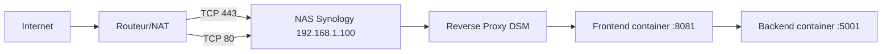
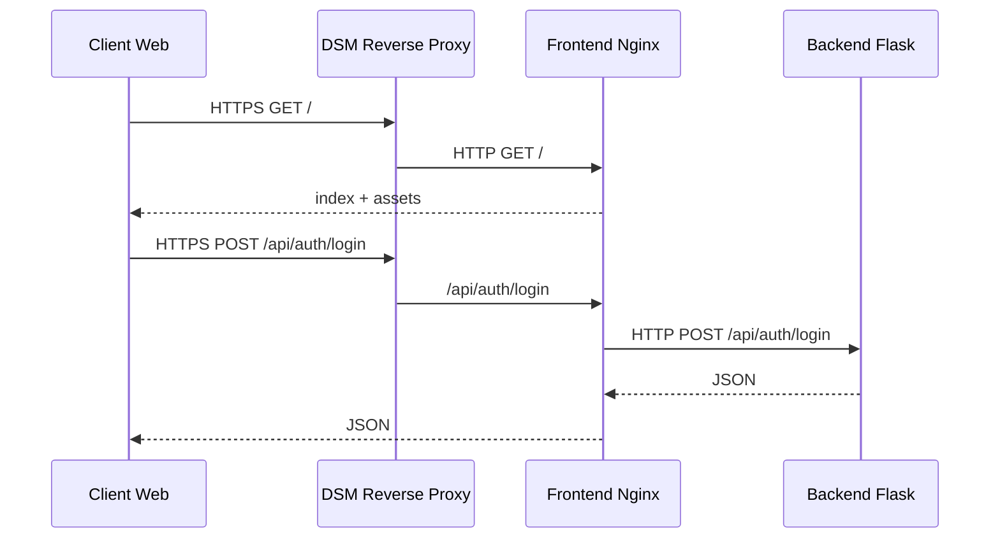

# Configuration reseau - Deploiement Synology

## Contexte

Cette documentation decrit la configuration reseau mise en place pour exposer l'application Docker hebergee sur NAS Synology.

- NAS : `192.168.1.100`
- DDNS : `game.40k-greg.synology.me`
- Frontend Docker : `127.0.0.1:8081`
- Backend Docker : `127.0.0.1:5001`

## Objectif

Exposer l'application en HTTPS depuis Internet sans exposer directement les ports techniques du conteneur (`8081`, `5001`).

## Architecture reseau retenue

## Regles routeur (NAT/PAT)

Ne configurer que ces regles :

1. `WAN TCP 80 -> 192.168.1.100:80`
2. `WAN TCP 443 -> 192.168.1.100:443`

Regles a ne pas publier en WAN :

- `5001` (API backend)
- `8081` (frontend interne NAS)

## DMZ

DMZ **desactivee**.

Raison :

- DMZ expose un grand nombre de ports du NAS ;
- la surface d'attaque devient inutilement large ;
- le besoin est couvert par 2 redirections ciblees (`80`, `443`).

## DDNS

DDNS Synology configure et valide :

- hote : `game.40k-greg.synology.me`
- statut : `Normal`

## Certificat HTTPS

Certificat Let's Encrypt associe au domaine :

- `game.40k-greg.synology.me`

Association du certificat a la regle reverse proxy correspondante dans DSM.

## Reverse Proxy DSM

Regle active :

- Nom : `40k-proxy`
- Source :
  - Protocole : `HTTPS`
  - Nom d'hote : `game.40k-greg.synology.me`
  - Port : `443`
- Destination :
  - Protocole : `HTTP`
  - Nom d'hote : `127.0.0.1`
  - Port : `8081`

## Mapping API

Le frontend Nginx du conteneur redirige `/api/*` vers le backend interne `backend:5001`.

## Checklist de verification

1. Conteneurs up :
   - `sudo docker compose ps`
2. Frontend local NAS :
   - `curl -I http://127.0.0.1:8081`
3. Health backend :
   - `curl -fsS http://127.0.0.1:5001/api/health`
4. Test externe (4G/5G) :
   - `https://game.40k-greg.synology.me`

## Durcissement recommande

- Conserver DMZ desactivee ;
- Conserver uniquement NAT 80/443 ;
- Activer 2FA sur comptes DSM admin ;
- Garder DSM et paquets a jour ;
- Sauvegarder regulierement :
  - `/volume1/docker/40k/config`
  - `/volume1/docker/40k/models`
  - `/volume1/docker/40k/runtime`
