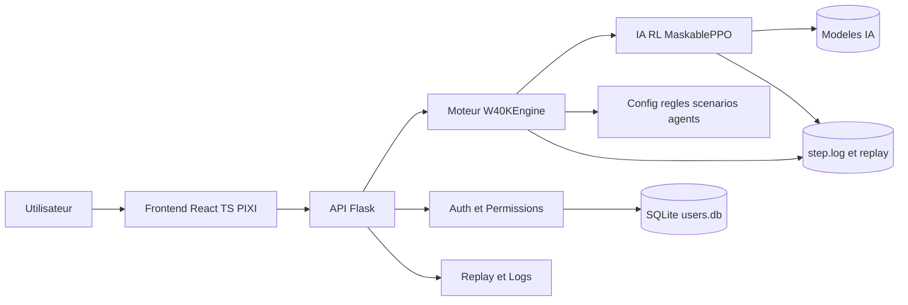
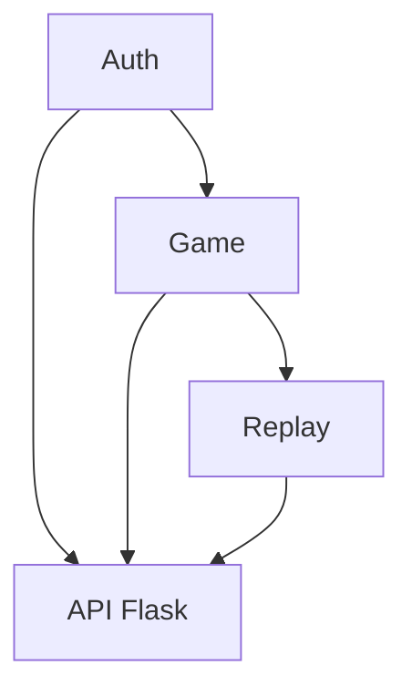
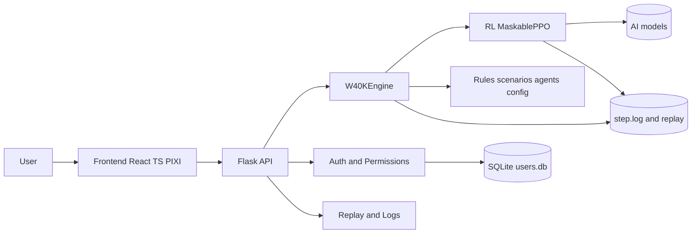
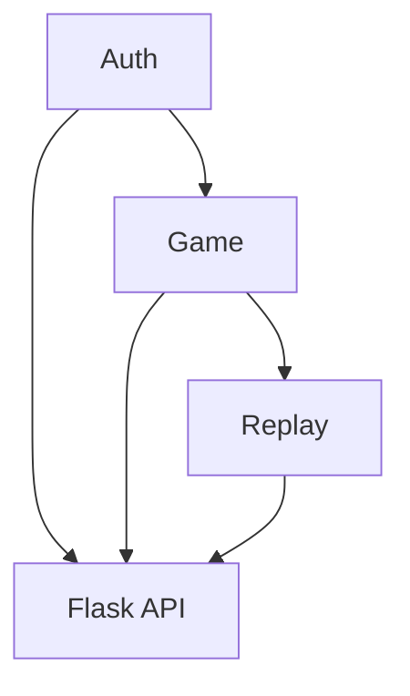

# Trazyn's Trials — Simulateur tactique Warhammer 40K avec IA


> **FR 🇫🇷 / EN 🇬🇧**
> Ce README est d'abord en **français**.  
> **English version is available below** (section: `English Version`).

## Aperçu

**Trazyn's Trials** est une application web de simulation tactique inspirée de Warhammer 40K.

Le projet combine :
- un **moteur de jeu par phases** (déploiement, mouvement, tir, charge, combat),
- une **API Flask** sécurisée,
- un **frontend React/TypeScript** avec rendu plateau (PIXI),
- un pipeline d'**entraînement IA** (MaskablePPO) et des outils d'analyse.

L'objectif : proposer un mode **PvE** crédible tout en conservant un mode **PvP**, avec traçabilité (logs/replay) et conformité aux règles métier.

## Illustration 1 — Architecture logique



## Illustration 2 — Parcours utilisateur



## Fonctionnalités principales

- **Simulation complète** par phases avec activation séquentielle.
- **Modes de jeu** : `pve`, `pvp`, `debug`, `test` (selon profil).
- **API REST** : auth, gestion de partie, replay, healthcheck.
- **Auth/RBAC** : profils, modes autorisés, options par profil.
- **Replay & audit** : `step.log`, parsing replay, analyzer.
- **IA entraînable** : configs par agent, modèles par agent, évaluation bots.

## Structure du dépôt

```text
/home/greg/40k
├── frontend/           # UI React + TypeScript + PIXI
├── services/           # API Flask
├── engine/             # Moteur de jeu (W40KEngine + phase_handlers)
├── ai/                 # Entraînement, évaluation, analyse IA
├── config/             # Configs agents/scénarios/règles + users.db
├── scripts/            # Scripts qualité, audit, déploiement
└── Documentation/      # Documentation technique + mémoire
```

## Démarrage rapide (local)

### 1) Dépendances

```bash
# depuis la racine du repo
pip install -r requirements.txt
npm --prefix frontend install
```

### 2) Lancer l'API

```bash
python services/api_server.py
```

### 3) Lancer le frontend

```bash
npm --prefix frontend run dev
```

## Entraînement IA (exemple)

```bash
python ai/train.py --agent CoreAgent --scenario bot --new
```

Autres exemples (seat-aware, test-only) dans :
- `Documentation/AI_TRAINING.md`

## Documentation utile

- `Documentation/AI_IMPLEMENTATION.md` — architecture moteur et conformité
- `Documentation/AI_TRAINING.md` — pipeline d'entraînement et tuning
- `Documentation/FRONTEND_UI.md` — LoS/couvert/tooltips/preview
- `Documentation/USER_ACCESS_CONTROL.md` — auth, profils, permissions
- `Documentation/Deployment_Synology.md` — déploiement Docker + HTTPS

## Déploiement

Le déploiement cible est documenté pour **Synology + Docker Compose + reverse proxy HTTPS**.
Voir `Documentation/Deployment_Synology.md`.

---

# English Version

## Overview

**Trazyn's Trials** is a tactical web application inspired by Warhammer 40K.

The project combines:
- a **phase-based game engine** (deployment, movement, shooting, charge, fight),
- a secure **Flask API**,
- a **React/TypeScript frontend** with board rendering (PIXI),
- an **RL training pipeline** (MaskablePPO) and analysis tools.

Goal: provide a credible **PvE** experience while preserving **PvP**, with strong traceability (logs/replay) and strict game-rule compliance.

## Illustration 1 — Logical Architecture



## Illustration 2 — User Flow



## Key Features

- Full **phase-based simulation** with sequential unit activation.
- **Game modes**: `pve`, `pvp`, `debug`, `test` (profile-based access).
- **REST API**: auth, game control, replay, healthcheck.
- **Auth/RBAC**: profiles, allowed modes, profile options.
- **Replay and audit**: `step.log`, replay parsing, analyzer.
- **Trainable AI**: per-agent configs, per-agent models, bot evaluation.

## Repository Structure

```text
/home/greg/40k
├── frontend/           # React + TypeScript + PIXI UI
├── services/           # Flask API
├── engine/             # Game engine (W40KEngine + phase_handlers)
├── ai/                 # Training, evaluation, AI analysis
├── config/             # Agent/scenario/rules configs + users.db
├── scripts/            # Quality, audit, deployment scripts
└── Documentation/      # Technical docs + thesis/memoir docs
```

## Quick Start (Local)

### 1) Dependencies

```bash
# from repository root
pip install -r requirements.txt
npm --prefix frontend install
```

### 2) Run API

```bash
python services/api_server.py
```

### 3) Run frontend

```bash
npm --prefix frontend run dev
```

## AI Training (example)

```bash
python ai/train.py --agent CoreAgent --scenario bot --new
```

More examples (seat-aware, test-only) in:
- `Documentation/AI_TRAINING.md`

## Useful Documentation

- `Documentation/AI_IMPLEMENTATION.md` — engine architecture and compliance
- `Documentation/AI_TRAINING.md` — training pipeline and tuning
- `Documentation/FRONTEND_UI.md` — LoS/cover/tooltips/preview
- `Documentation/USER_ACCESS_CONTROL.md` — auth, profiles, permissions
- `Documentation/Deployment_Synology.md` — Docker + HTTPS deployment

## Deployment

Production deployment target is documented for **Synology + Docker Compose + HTTPS reverse proxy**.  
See `Documentation/Deployment_Synology.md`.
