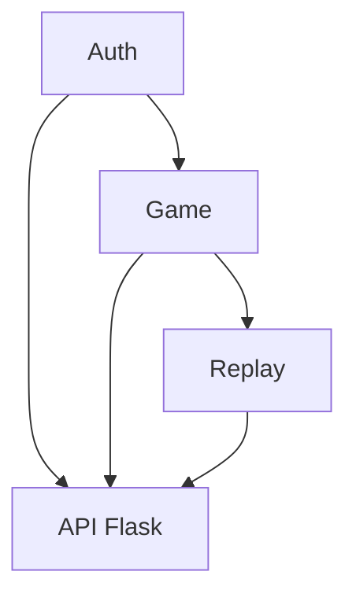

# Trazyn's Trials

<p align="center">
  <strong>Warhammer 40K Tactical Simulator with Reinforcement Learning AI</strong><br/>
  <em>Frontend React/TypeScript • Flask API • Phase-based game engine • MaskablePPO</em>
</p>

<p align="center">
  
  
  
  
  
  
</p>

<p align="center">
  <a href="#fran%C3%A7ais">Français</a> •
  <a href="#english">English</a>
</p>

---

## Français

### Pourquoi ce projet ?
Trazyn's Trials transforme une partie de Warhammer 40K en expérience numérique jouable en solo ou à deux :
- **PvE** contre des agents IA entraînés,
- **PvP** local/web via l'interface,
- conformité stricte aux règles métier (phases, activation, LoS, couvert),
- traçabilité complète via logs et replay.

### Ce que l'application fait

| Domaine | Capacité |
|---|---|
| 🎮 Simulation | Déploiement, mouvement, tir, charge, combat (ordre strict) |
| 🔐 Sécurité | Authentification, profils, permissions, contrôle backend (403) |
| 🌐 API REST | `auth`, `game`, `replay`, `health`, `debug` |
| 🤖 IA | Entraînement MaskablePPO, évaluation bots, modèles par agent |
| 📊 Qualité | `step.log`, analyzer, check de conformité, replay parser |
| 🚀 Déploiement | Docker Compose + reverse proxy HTTPS (Synology) |

### Illustration — Architecture logique


### Illustration — Parcours utilisateur



### Démarrage rapide (local)

```bash
# 1) Dépendances
pip install -r requirements.txt
npm --prefix frontend install

# 2) API Flask
python services/api_server.py

# 3) Frontend
npm --prefix frontend run dev
```

### Entraînement IA (exemple)

```bash
python ai/train.py --agent CoreAgent --scenario bot --new
```

### Arborescence (vue synthétique)

```text
/home/greg/40k
├── frontend/       # UI React + TypeScript + PIXI
├── services/       # API Flask
├── engine/         # Moteur (W40KEngine + phase_handlers)
├── ai/             # Training, eval, analyzer
├── config/         # Scenarios/rules/agents + users.db
├── scripts/        # Qualité, audit, déploiement
└── Documentation/  # Docs techniques et mémoire
```

### Documentation utile
- `Documentation/AI_IMPLEMENTATION.md`
- `Documentation/AI_TRAINING.md`
- `Documentation/FRONTEND_UI.md`
- `Documentation/USER_ACCESS_CONTROL.md`
- `Documentation/Deployment_Synology.md`

---

## English

### What is it?
Trazyn's Trials is a tactical Warhammer 40K web simulator built for:
- **PvE** against trained RL agents,
- **PvP** sessions,
- strict rule compliance (phase flow, activation, line of sight, cover),
- full traceability with logs and replay tooling.

### Key capabilities

| Area | Capability |
|---|---|
| 🎮 Simulation | Deployment, movement, shooting, charge, fight (strict order) |
| 🔐 Security | Authentication, profiles, permissions, backend 403 enforcement |
| 🌐 REST API | `auth`, `game`, `replay`, `health`, `debug` |
| 🤖 AI | MaskablePPO training, bot evaluation, per-agent model management |
| 📊 Quality | `step.log`, analyzer, compliance checks, replay parser |
| 🚀 Deployment | Docker Compose + HTTPS reverse proxy (Synology target) |

### Quick start (local)

```bash
# 1) Dependencies
pip install -r requirements.txt
npm --prefix frontend install

# 2) Flask API
python services/api_server.py

# 3) Frontend
npm --prefix frontend run dev
```

### AI training example

```bash
python ai/train.py --agent CoreAgent --scenario bot --new
```

### Docs
- `Documentation/AI_IMPLEMENTATION.md`
- `Documentation/AI_TRAINING.md`
- `Documentation/FRONTEND_UI.md`
- `Documentation/USER_ACCESS_CONTROL.md`
- `Documentation/Deployment_Synology.md`

