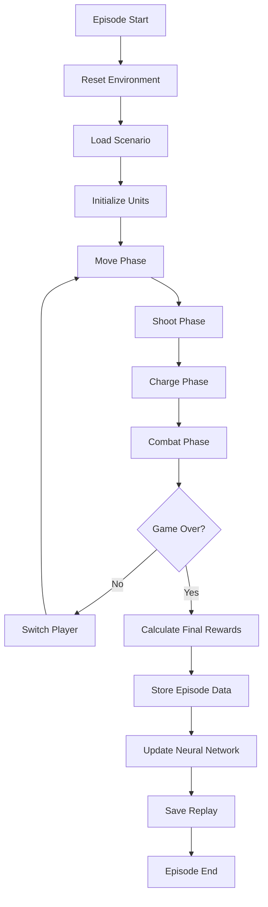

# Training Configuration Documentation

## Parameter Explanations

### Training Duration & Episode Control

| Parameter | Purpose | Typical Values |
|-----------|---------|----------------|
| `total_timesteps` | Total number of environment steps to train for | 100k-2M (1M = substantial learning) |
| `max_steps_per_episode` | Maximum steps before episode is truncated | 50-200 (prevents infinite games) |
| `eval_freq` | How often to evaluate model performance | 1k-10k (balance monitoring vs training time) |

### Callback Parameters

| Parameter | Purpose | Typical Values |
|-----------|---------|----------------|
| `eval_deterministic` | Use deterministic policy during evaluation | `true` (no random exploration during eval) |
| `eval_render` | Render visual output during evaluation | `false` (faster evaluation) |
| `n_eval_episodes` | Number of episodes to run per evaluation | 3-10 (statistical reliability vs speed) |
| `checkpoint_save_freq` | Save model checkpoint frequency | 10k-50k steps |
| `checkpoint_name_prefix` | Filename prefix for saved checkpoints | String for organization |

### Model Parameters

#### Neural Network Architecture
| Parameter | Purpose | Typical Values |
|-----------|---------|----------------|
| `policy` | Neural network architecture type | `"MlpPolicy"` (fully-connected layers) |
| `verbose` | Logging level during training | 0=silent, 1=info, 2=debug |

#### Experience Replay Settings
| Parameter | Purpose | Typical Values |
|-----------|---------|----------------|
| `buffer_size` | Size of replay buffer (stores past experiences) | 10k-200k (more = diverse e# Warhammer 40K AI Training System - Complete Documentation

## Table of Contents
1. [Overview](#overview)
2. [Architecture](#architecture)
3. [Training Process](#training-process)
4. [Configuration System](#configuration-system)
5. [Multi-Agent Training](#multi-agent-training)
6. [Scenario Management](#scenario-management)
7. [Reward System](#reward-system)
8. [Phase-Based Environment](#phase-based-environment)
9. [Replay System](#replay-system)
10. [Training Workflows](#training-workflows)
11. [Monitoring & Evaluation](#monitoring--evaluation)
12. [File Structure](#file-structure)

---

## Overview

The Warhammer 40K AI Training System is a sophisticated multi-agent reinforcement learning platform designed to train AI agents in tactical combat scenarios. The system uses **Deep Q-Networks (DQN)** with **prioritized experience replay** to teach different unit types optimal combat strategies within the Warhammer 40K universe.

### Key Features
- **Multi-Agent Training**: Simultaneous training of different agent types (SpaceMarine_Ranged, SpaceMarine_Melee, Tyranid_Ranged, Tyranid_Melee)
- **Phase-Based Combat**: Realistic turn-based combat following Warhammer 40K rules
- **Dynamic Scenario Generation**: Automated creation of balanced training scenarios
- **Comprehensive Replay System**: Detailed action logging and replay analysis
- **Zero-Hardcoding Design**: Configuration-driven approach for maximum flexibility

---

## Architecture

### Core Components

```
Training System Architecture
├── Training Orchestration
│   ├── train.py                    # Main training script
│   ├── multi_agent_trainer.py      # Multi-agent coordination
│   └── scenario_manager.py         # Dynamic scenario generation
├── Environment
│   ├── gym40k.py                   # Gymnasium environment
│   ├── unit_registry.py           # Dynamic unit discovery
│   └── shared/gameRules.py         # Combat mechanics
├── Configuration
│   ├── config_loader.py            # Centralized config management
│   ├── training_config.json        # DQN hyperparameters
│   ├── rewards_config.json         # Reward matrices
│   └── scenario_templates.json     # Scenario generation templates
└── Analysis
    ├── evaluate.py                 # Model evaluation
    └── event_log/                  # Replay storage
```

### Technology Stack
- **Framework**: Python with Gymnasium (OpenAI Gym)
- **Deep Learning**: PyTorch for neural networks
- **Algorithm**: Deep Q-Network (DQN) with Prioritized Experience Replay
- **Environment**: Custom Warhammer 40K tactical combat simulator
- **Configuration**: JSON-based configuration system
- **Visualization**: Web-based replay viewer (TypeScript/React/PIXI.js)

---

## Training Process

### 1. Initialization Phase

#### Agent Discovery
```python
# Automatic discovery of available agents
unit_registry = UnitRegistry()
available_agents = unit_registry.get_required_models()
# Returns: ['SpaceMarine_Ranged', 'SpaceMarine_Melee', 'Tyranid_Ranged', 'Tyranid_Melee']
```

#### Environment Setup
```python
# Create training environment
env = W40KEnv(
    rewards_config="SpaceMarine_Ranged",
    training_config_name="default",
    controlled_agent="SpaceMarine_Ranged",
    scenario_file="scenarios/generated_scenario.json"
)
```

### 2. Training Loop

#### Episode Structure
1. **Environment Reset**: Load scenario and initialize unit positions
2. **Phase-Based Execution**: Follow strict turn order (Move → Shoot → Charge → Combat)
3. **Action Selection**: Agent selects actions using ε-greedy policy
4. **Environment Step**: Execute action and calculate rewards
5. **Experience Storage**: Store (state, action, reward, next_state) in replay buffer
6. **Network Update**: Train neural network using prioritized samples

#### Training Algorithm (DQN)
```python
# DQN Training Step
def train_step(self, batch_size=32):
    # Sample prioritized experiences
    experiences = self.memory.sample(batch_size)
    
    # Compute Q-targets
    q_targets = self.compute_q_targets(experiences)
    
    # Update main network
    loss = self.update_main_network(experiences, q_targets)
    
    # Soft update target network
    self.soft_update_target_network()
    
    # Update priorities in replay buffer
    self.memory.update_priorities(experiences, loss)
```

### 3. Episode Flow



---

## Configuration System

### Training Configuration (`config/training_config.json`)

```json
{
  "default": {
    "learning_rate": 0.0001,
    "batch_size": 32,
    "memory_size": 10000,
    "gamma": 0.99,
    "eps_start": 1.0,
    "eps_end": 0.01,
    "eps_decay": 0.995,
    "target_update": 1000,
    "hidden_layers": [128, 128],
    "max_episodes": 5000,
    "max_steps_per_episode": 1000
  },
  "debug": {
    "learning_rate": 0.001,
    "max_episodes": 10,
    "max_steps_per_episode": 50
  }
}
```

### Reward Configuration (`config/rewards_config.json`)

```json
{
  "SpaceMarine_Ranged": {
    "move_to_rng": 0.3,
    "move_close": 0.1,
    "move_away": -0.1,
    "ranged_attack": 0.5,
    "enemy_killed_r": 2.0,
    "enemy_killed_no_overkill_r": 3.0,
    "enemy_killed_lowests_hp_r": 2.5,
    "win": 10.0,
    "lose": -10.0,
    "wait": -0.1
  },
  "SpaceMarine_Melee": {
    "move_to_charge": 0.4,
    "charge_success": 0.6,
    "attack": 0.5,
    "enemy_killed_m": 2.0,
    "enemy_killed_no_overkill_m": 3.0,
    "enemy_killed_lowests_hp_m": 2.5,
    "win": 10.0,
    "lose": -10.0,
    "wait": -0.1
  }
}
```

### Usage in Code

```python
# Load configuration
config = get_config_loader()
training_config = config.load_training_config("default")
rewards_config = config.load_rewards_config("SpaceMarine_Ranged")

# Access parameters
learning_rate = training_config["learning_rate"]
move_reward = rewards_config["move_to_rng"]
```

---

## Multi-Agent Training

### Agent Types

#### 1. SpaceMarine_Ranged
- **Units**: Intercessor
- **Role**: Long-range combat, positioning, target prioritization
- **Strategy**: Maintain optimal range, avoid melee engagement

#### 2. SpaceMarine_Melee  
- **Units**: AssaultIntercessor, CaptainGravis
- **Role**: Close combat, charging, enemy elimination
- **Strategy**: Close distance quickly, maximize combat effectiveness

#### 3. Tyranid_Ranged
- **Units**: Termagant
- **Role**: Swarm ranged attacks, overwhelming firepower
- **Strategy**: Coordinated shooting, target focus

#### 4. Tyranid_Melee
- **Units**: Hormagaunt, Carnifex
- **Role**: Assault tactics, disruption, close combat
- **Strategy**: Aggressive charging, priority targeting

### Training Coordination

```python
# Multi-agent training session
class MultiAgentTrainer:
    def __init__(self):
        self.agents = {
            'SpaceMarine_Ranged': DQNAgent(...),
            'SpaceMarine_Melee': DQNAgent(...),
            'Tyranid_Ranged': DQNAgent(...),
            'Tyranid_Melee': DQNAgent(...)
        }
    
    def train_episode(self, scenario):
        # Create separate environments for each agent
        environments = self.create_agent_environments(scenario)
        
        # Train each agent in parallel
        for agent_key, agent in self.agents.items():
            env = environments[agent_key]
            agent.train_episode(env)
    
    def orchestrate_training(self, total_episodes):
        # Generate balanced training rotation
        rotation = self.scenario_manager.get_balanced_training_rotation(total_episodes)
        
        for matchup in rotation:
            scenario = self.generate_scenario(matchup)
            self.train_matchup(matchup, scenario)
```

### Training Phases

#### Phase 1: Individual Specialization (Solo Training)
- Each agent trains against scripted opponents
- Focus on learning basic tactics and unit abilities
- Templates: `solo_spacemarine_ranged`, `solo_spacemarine_melee`, etc.

#### Phase 2: Cross-Faction Learning
- Agents train against other faction types
- Learn counter-strategies and adaptation
- Templates: `cross_spacemarine_vs_tyranid_balanced`

#### Phase 3: Full Composition Training
- Complex multi-unit scenarios
- Team coordination and combined arms tactics
- Templates: `marines_vs_tyranids_new_composition`

---

## Scenario Management

### Dynamic Scenario Generation

The scenario manager automatically creates balanced training scenarios based on templates and agent requirements.

```python
# Generate training scenario
scenario_manager = ScenarioManager()
scenario = scenario_manager.generate_training_scenario(
    template_name="cross_spacemarine_vs_tyranid_balanced",
    player_0_agent="SpaceMarine_Ranged", 
    player_1_agent="Tyranid_Melee"
)
```

### Scenario Structure

```json
{
  "metadata": {
    "template": "cross_spacemarine_vs_tyranid_balanced",
    "player_0_agent": "SpaceMarine_Ranged",
    "player_1_agent": "Tyranid_Melee",
    "board_size": [24, 18],
    "difficulty": "medium",
    "generated_timestamp": "20241229_143022"
  },
  "units": [
    {
      "id": 1,
      "unit_type": "Intercessor",
      "player": 0,
      "col": 2,
      "row": 8
    },
    {
      "id": 2,
      "unit_type": "Carnifex",
      "player": 1,
      "col": 21,
      "row": 9
    }
  ]
}
```

### Template System

Templates define deployment zones, unit compositions, and training focus:

```json
{
  "cross_spacemarine_vs_tyranid_balanced": {
    "description": "Balanced cross-faction training",
    "board_size": [24, 18],
    "agent_compositions": {
      "SpaceMarine_Ranged": ["Intercessor"],
      "Tyranid_Melee": ["Carnifex"]
    },
    "unit_counts": {
      "Intercessor": 2,
      "Carnifex": 2
    },
    "deployment_zones": {
      "0": [[2, 8], [2, 10]],
      "1": [[21, 8], [21, 10]]
    },
    "difficulty": "medium",
    "training_focus": "cross_faction"
  }
}
```

---

## Reward System

### Reward Categories

#### Movement Rewards
- **Tactical Positioning**: Rewards for moving to optimal ranges
- **Strategic Movement**: Bonuses for charge positioning (melee units)
- **Range Management**: Rewards for maintaining shooting distance (ranged units)

#### Combat Rewards
- **Successful Attacks**: Base rewards for hitting targets
- **Damage Scaling**: Rewards proportional to damage dealt
- **Kill Bonuses**: Large rewards for eliminating enemies
- **Efficiency Bonuses**: Extra rewards for no-overkill kills

#### Strategic Rewards
- **Priority Targeting**: Bonuses for attacking high-value targets
- **Tactical Compliance**: Rewards for following AI_GAME.md guidelines
- **Game Outcome**: Large rewards/penalties for winning/losing

### Reward Calculation

```python
def calculate_shooting_reward(self, unit, target, damage_dealt):
    """Calculate reward for shooting action."""
    unit_rewards = self._get_unit_reward_config(unit)
    
    # Base attack reward
    reward = unit_rewards.get("ranged_attack", 0.5)
    
    # Scale by damage
    if damage_dealt > 0:
        reward *= damage_dealt
    
    # Kill bonuses
    if target["cur_hp"] <= 0:
        reward += unit_rewards.get("enemy_killed_r", 2.0)
        
        # No-overkill bonus
        if damage_dealt == target["hp_before"]:
            reward += unit_rewards.get("enemy_killed_no_overkill_r", 3.0)
    
    return reward
```

### Agent-Specific Reward Matrices

Each agent type has specialized reward configurations:

- **SpaceMarine_Ranged**: Emphasizes positioning and ranged combat
- **SpaceMarine_Melee**: Focuses on charging and close combat
- **Tyranid_Ranged**: Rewards swarm tactics and coordinated fire
- **Tyranid_Melee**: Emphasizes aggressive assault and disruption

---

## Phase-Based Environment

### Game Phases

The environment follows strict Warhammer 40K phase order:

1. **Movement Phase**
   - Units can move up to their MOVE value
   - Cannot move if adjacent to enemies
   - Tactical positioning for future phases

2. **Shooting Phase**
   - Ranged units can attack targets within RNG_RNG
   - Cannot shoot if adjacent to enemies
   - Dice-based damage calculation

3. **Charge Phase**
   - Units can move adjacent to enemies for combat
   - Sets up close combat engagements
   - Strategic positioning for assault

4. **Combat Phase**
   - Close combat between adjacent units
   - Dice-based melee combat resolution
   - Elimination of enemy units

### Phase Enforcement

```python
def _get_valid_actions_for_phase(self, unit, current_phase):
    """Get valid action types for current phase."""
    if current_phase == "move":
        return [0, 1, 2, 3]  # Only movement actions
    elif current_phase == "shoot":
        return [4]  # Only shooting action
    elif current_phase == "charge":
        return [5]  # Only charge action
    elif current_phase == "combat":
        return [6]  # Only attack action
    else:
        return []
```

### Combat Mechanics

#### Shooting Sequence
```python
def execute_shooting_sequence(shooter, target):
    """Execute complete shooting sequence with dice rolls."""
    result = {
        "hit_rolls": [],
        "wound_rolls": [],
        "save_rolls": [],
        "damage_rolls": [],
        "totalDamage": 0,
        "summary": ""
    }
    
    # Number of attacks
    num_attacks = shooter.get("rng_nb", 1)
    
    for attack in range(num_attacks):
        # To Hit roll
        hit_needed = shooter.get("rng_atk", 4)
        hit_roll = roll_d6()
        result["hit_rolls"].append(hit_roll)
        
        if hit_roll >= hit_needed:
            # To Wound roll
            wound_target = calculate_wound_target(
                shooter.get("rng_str", 4),
                target.get("t", 4)
            )
            wound_roll = roll_d6()
            result["wound_rolls"].append(wound_roll)
            
            if wound_roll >= wound_target:
                # Save roll
                save_target = calculate_save_target(
                    target.get("armor_save", 4),
                    shooter.get("rng_ap", 0),
                    target.get("invul_save", 0)
                )
                save_roll = roll_d6()
                result["save_rolls"].append(save_roll)
                
                if save_roll < save_target:
                    # Damage
                    damage = shooter.get("rng_dmg", 1)
                    result["damage_rolls"].append(damage)
                    result["totalDamage"] += damage
    
    return result
```

### Action Space

```python
# Action encoding: unit_index * 8 + action_type
# Actions per unit:
# 0: Move North    4: Shoot       
# 1: Move South    5: Charge      
# 2: Move East     6: Attack      
# 3: Move West     7: Wait        

action_space = spaces.Discrete(max_units * 8)
```

### Observation Space

```python
# Fixed-size observation vector (26 elements)
# AI units: 2 units × 7 values = 14 elements
# Enemy units: 2 units × 4 values = 8 elements  
# Phase encoding: 4 elements
# Total: 26 elements

observation_space = spaces.Box(low=0, high=1, shape=(26,), dtype=np.float32)
```

---

## Replay System

### Replay Data Structure

```json
{
  "game_info": {
    "scenario": "cross_spacemarine_vs_tyranid_balanced",
    "ai_behavior": "phase_based_following_AI_GAME_OVERVIEW",
    "total_turns": 15,
    "winner": 1,
    "ai_units_final": 1,
    "enemy_units_final": 0
  },
  "metadata": {
    "template": "cross_spacemarine_vs_tyranid_balanced",
    "player_0_agent": "SpaceMarine_Ranged",
    "player_1_agent": "Tyranid_Melee"
  },
  "initial_state": {
    "units": [...],
    "board_size": [24, 18]
  },
  "actions": [
    {
      "turn": 1,
      "phase": "move",
      "player": 1,
      "unit_id": 1,
      "unit_type": "Intercessor",
      "action_type": 2,
      "position": [3, 8],
      "hp": 2,
      "reward": 0.3,
      "timestamp": "2024-12-29T14:30:45"
    }
  ]
}
```

### Detailed Action Logging

The system captures comprehensive action details including dice rolls:

```python
def _record_detailed_shooting_action(self, shooter, target, shooting_result, old_hp):
    """Record detailed shooting action with all dice rolls."""
    action_record = {
        "turn": self.current_turn,
        "phase": self.current_phase,
        "action_type": "shooting",
        "shooter": {
            "id": shooter["id"],
            "position": {"col": shooter["col"], "row": shooter["row"]},
            "stats": {
                "rng_nb": shooter.get("rng_nb", 1),
                "rng_atk": shooter.get("rng_atk", 4),
                "rng_str": shooter.get("rng_str", 4),
                "rng_ap": shooter.get("rng_ap", 0),
                "rng_dmg": shooter.get("rng_dmg", 1)
            }
        },
        "target": {
            "id": target["id"],
            "hp_before": old_hp,
            "hp_after": target["cur_hp"]
        },
        "shooting_summary": shooting_result["summary"],
        "total_damage": shooting_result["totalDamage"]
    }
    
    self.detailed_action_log.append(action_record)
```

### Replay Analysis

Replays are automatically saved and can be analyzed using the web-based viewer:

- **Step-by-step playback** of entire episodes
- **Unit state visualization** at each turn
- **Action analysis** with reward breakdowns
- **Combat statistics** including dice roll details
- **Strategic pattern recognition** for training evaluation

---

## Training Workflows

### Basic Training

```bash
# Single agent training with default configuration
python ai/train.py

# Specify training configuration
python ai/train.py --training-config debug

# Train specific agent type
python ai/train.py --agent SpaceMarine_Ranged
```

### Multi-Agent Orchestration

```bash
# Orchestrated multi-agent training
python ai/train.py --orchestrate --total-episodes 1000

# Phase-specific training
python ai/train.py --orchestrate --phase solo --total-episodes 500
python ai/train.py --orchestrate --phase cross_faction --total-episodes 300
python ai/train.py --orchestrate --phase full_composition --total-episodes 200
```

### Evaluation

```bash
# Evaluate trained models
python ai/evaluate.py --episodes 50

# Evaluate specific agent
python ai/evaluate.py --agent SpaceMarine_Ranged --episodes 20

# Generate detailed evaluation report
python ai/evaluate.py --episodes 100 --detailed
```

### Training Parameters

```python
# Key training parameters (configurable via JSON)
{
    "learning_rate": 0.0001,        # Neural network learning rate
    "batch_size": 32,               # Training batch size
    "memory_size": 10000,           # Experience replay buffer size
    "gamma": 0.99,                  # Discount factor
    "eps_start": 1.0,               # Initial exploration rate
    "eps_end": 0.01,                # Final exploration rate
    "eps_decay": 0.995,             # Exploration decay rate
    "target_update": 1000,          # Target network update frequency
    "max_episodes": 5000,           # Maximum training episodes
    "max_steps_per_episode": 1000   # Episode step limit
}
```

---

## Monitoring & Evaluation

### Training Metrics

#### Performance Metrics
- **Episode Rewards**: Cumulative reward per episode
- **Win Rate**: Percentage of episodes won
- **Episode Length**: Average number of steps per episode
- **Exploration Rate**: Current ε-greedy exploration rate

#### Learning Progress
- **Loss Function**: Neural network training loss
- **Q-Value Evolution**: Average Q-values over time
- **Action Distribution**: Frequency of different actions
- **Strategy Evolution**: Changes in tactical behavior

### TensorBoard Integration

```python
# Training metrics logging
self.writer.add_scalar('Training/Episode_Reward', episode_reward, episode)
self.writer.add_scalar('Training/Episode_Length', episode_length, episode)
self.writer.add_scalar('Training/Win_Rate', win_rate, episode)
self.writer.add_scalar('Training/Exploration_Rate', self.epsilon, episode)
self.writer.add_scalar('Training/Loss', loss, step)
```

### Evaluation Metrics

```python
def evaluate_agent(self, agent, num_episodes=50):
    """Comprehensive agent evaluation."""
    metrics = {
        'total_episodes': num_episodes,
        'wins': 0,
        'losses': 0,
        'draws': 0,
        'avg_reward': 0.0,
        'avg_episode_length': 0.0,
        'action_distribution': {},
        'tactical_analysis': {}
    }
    
    for episode in range(num_episodes):
        result = self.run_evaluation_episode(agent)
        self.update_metrics(metrics, result)
    
    return self.compute_final_metrics(metrics)
```

### Performance Benchmarks

#### Target Performance Levels
- **Beginner**: 40-60% win rate against scripted opponents
- **Intermediate**: 60-80% win rate, consistent tactical behavior
- **Advanced**: 80%+ win rate, adaptive strategies
- **Expert**: Near-optimal play, complex multi-unit coordination

---

## File Structure

### Core Training Files

```
ai/
├── train.py                       # Main training orchestration
├── multi_agent_trainer.py         # Multi-agent coordination
├── gym40k.py                      # Gymnasium environment
├── scenario_manager.py            # Dynamic scenario generation
├── unit_registry.py               # Unit discovery and mapping
├── evaluate.py                    # Model evaluation
└── models/                        # Trained model storage
    ├── SpaceMarine_Ranged_model.pth
    ├── SpaceMarine_Melee_model.pth
    ├── Tyranid_Ranged_model.pth
    └── Tyranid_Melee_model.pth
```

### Configuration Files

```
config/
├── training_config.json           # DQN hyperparameters
├── rewards_config.json            # Agent reward matrices
├── scenario_templates.json        # Scenario generation templates
├── board_config.json              # Game board configuration
└── unit_registry.json             # Unit type mappings
```

### Generated Content

```
ai/
├── session_scenarios/              # Generated training scenarios
│   ├── scenario_solo_spacemarine_20241229_143022.json
│   └── scenario_cross_faction_20241229_143045.json
├── event_log/                      # Training replays
│   ├── replay_SpaceMarine_Ranged_vs_bot.json
│   └── replay_cross_faction_training.json
└── tensorboard/                    # Training metrics
    ├── SpaceMarine_Ranged/
    └── Tyranid_Melee/
```

### Shared Components

```
shared/
├── gameRules.py                    # Combat mechanics (Python)
└── gameRules.ts                    # Combat mechanics (TypeScript)
```

---

## Best Practices

### Training Optimization

1. **Start with Solo Training**: Build foundational skills before cross-agent training
2. **Use Progressive Difficulty**: Begin with simple scenarios, increase complexity gradually
3. **Monitor Convergence**: Watch for stable win rates and consistent behavior
4. **Regular Evaluation**: Test agents periodically against fresh scenarios
5. **Save Checkpoints**: Regular model saves for recovery and analysis

### Configuration Management

1. **Version Control Configs**: Track configuration changes with git
2. **Environment-Specific Configs**: Separate configs for development/production
3. **Validation**: Always validate config files before training
4. **Documentation**: Document all configuration parameters and their effects

### Debugging and Analysis

1. **Replay Analysis**: Use replay viewer to understand agent behavior
2. **Metric Monitoring**: Track training metrics with TensorBoard
3. **Scenario Validation**: Test new scenarios before large training runs
4. **Performance Profiling**: Monitor resource usage during training

### Scalability Considerations

1. **Parallel Training**: Use multiple processes for different agents
2. **Resource Management**: Monitor CPU/memory usage during orchestration
3. **Storage Planning**: Replays and models can consume significant disk space
4. **Network Architecture**: Adjust neural network size based on problem complexity

---

## Troubleshooting

### Common Issues

#### Training Not Converging
- **Check Learning Rate**: Too high/low can prevent learning
- **Verify Rewards**: Ensure reward signals are meaningful
- **Monitor Exploration**: Balance exploration vs exploitation
- **Scenario Difficulty**: Start with simpler scenarios

#### Poor Performance
- **Reward Engineering**: Review reward structure for unintended incentives
- **Network Architecture**: Adjust hidden layer sizes
- **Training Duration**: Ensure sufficient training episodes
- **Evaluation Methodology**: Use diverse test scenarios

#### Memory Issues
- **Replay Buffer Size**: Reduce if memory constraints exist
- **Batch Size**: Smaller batches use less memory
- **Model Complexity**: Reduce network size if needed
- **Scenario Complexity**: Simplify scenarios to reduce memory usage

#### File System Issues
- **Path Configuration**: Verify all file paths in config
- **Permissions**: Ensure write access to output directories
- **Disk Space**: Monitor available storage for replays/models
- **File Locking**: Avoid concurrent access to model files

---

## Conclusion

The Warhammer 40K AI Training System provides a comprehensive platform for training sophisticated tactical AI agents. Through its modular architecture, extensive configuration system, and detailed monitoring capabilities, it enables the development of AI agents capable of complex strategic decision-making in turn-based combat scenarios.

The system's zero-hardcoding philosophy ensures maximum flexibility and extensibility, while the multi-agent approach allows for realistic training scenarios that mirror actual gameplay. With proper configuration and monitoring, agents can achieve expert-level performance in tactical combat situations.

For additional support and advanced configuration options, refer to the individual configuration files and their embedded documentation.periences) |
| `learning_starts` | Steps of pure exploration before learning begins | 1k-10k (fills buffer # Warhammer 40K AI Training System - Complete Documentation

## Table of Contents
1. [Overview](#overview)
2. [Architecture](#architecture)
3. [Training Process](#training-process)
4. [Configuration System](#configuration-system)
5. [Multi-Agent Training](#multi-agent-training)
6. [Scenario Management](#scenario-management)
7. [Reward System](#reward-system)
8. [Phase-Based Environment](#phase-based-environment)
9. [Replay System](#replay-system)
10. [Training Workflows](#training-workflows)
11. [Monitoring & Evaluation](#monitoring--evaluation)
12. [File Structure](#file-structure)

---

## Overview

The Warhammer 40K AI Training System is a sophisticated multi-agent reinforcement learning platform designed to train AI agents in tactical combat scenarios. The system uses **Deep Q-Networks (DQN)** with **prioritized experience replay** to teach different unit types optimal combat strategies within the Warhammer 40K universe.

### Key Features
- **Multi-Agent Training**: Simultaneous training of different agent types (SpaceMarine_Ranged, SpaceMarine_Melee, Tyranid_Ranged, Tyranid_Melee)
- **Phase-Based Combat**: Realistic turn-based combat following Warhammer 40K rules
- **Dynamic Scenario Generation**: Automated creation of balanced training scenarios
- **Comprehensive Replay System**: Detailed action logging and replay analysis
- **Zero-Hardcoding Design**: Configuration-driven approach for maximum flexibility

---

## Architecture

### Core Components

```
Training System Architecture
├── Training Orchestration
│   ├── train.py                    # Main training script
│   ├── multi_agent_trainer.py      # Multi-agent coordination
│   └── scenario_manager.py         # Dynamic scenario generation
├── Environment
│   ├── gym40k.py                   # Gymnasium environment
│   ├── unit_registry.py           # Dynamic unit discovery
│   └── shared/gameRules.py         # Combat mechanics
├── Configuration
│   ├── config_loader.py            # Centralized config management
│   ├── training_config.json        # DQN hyperparameters
│   ├── rewards_config.json         # Reward matrices
│   └── scenario_templates.json     # Scenario generation templates
└── Analysis
    ├── evaluate.py                 # Model evaluation
    └── event_log/                  # Replay storage
```

### Technology Stack
- **Framework**: Python with Gymnasium (OpenAI Gym)
- **Deep Learning**: PyTorch for neural networks
- **Algorithm**: Deep Q-Network (DQN) with Prioritized Experience Replay
- **Environment**: Custom Warhammer 40K tactical combat simulator
- **Configuration**: JSON-based configuration system
- **Visualization**: Web-based replay viewer (TypeScript/React/PIXI.js)

---

## Training Process

### 1. Initialization Phase

#### Agent Discovery
```python
# Automatic discovery of available agents
unit_registry = UnitRegistry()
available_agents = unit_registry.get_required_models()
# Returns: ['SpaceMarine_Ranged', 'SpaceMarine_Melee', 'Tyranid_Ranged', 'Tyranid_Melee']
```

#### Environment Setup
```python
# Create training environment
env = W40KEnv(
    rewards_config="SpaceMarine_Ranged",
    training_config_name="default",
    controlled_agent="SpaceMarine_Ranged",
    scenario_file="scenarios/generated_scenario.json"
)
```

### 2. Training Loop

#### Episode Structure
1. **Environment Reset**: Load scenario and initialize unit positions
2. **Phase-Based Execution**: Follow strict turn order (Move → Shoot → Charge → Combat)
3. **Action Selection**: Agent selects actions using ε-greedy policy
4. **Environment Step**: Execute action and calculate rewards
5. **Experience Storage**: Store (state, action, reward, next_state) in replay buffer
6. **Network Update**: Train neural network using prioritized samples

#### Training Algorithm (DQN)
```python
# DQN Training Step
def train_step(self, batch_size=32):
    # Sample prioritized experiences
    experiences = self.memory.sample(batch_size)
    
    # Compute Q-targets
    q_targets = self.compute_q_targets(experiences)
    
    # Update main network
    loss = self.update_main_network(experiences, q_targets)
    
    # Soft update target network
    self.soft_update_target_network()
    
    # Update priorities in replay buffer
    self.memory.update_priorities(experiences, loss)
```

### 3. Episode Flow


---

## Configuration System

### Training Configuration (`config/training_config.json`)

```json
{
  "default": {
    "learning_rate": 0.0001,
    "batch_size": 32,
    "memory_size": 10000,
    "gamma": 0.99,
    "eps_start": 1.0,
    "eps_end": 0.01,
    "eps_decay": 0.995,
    "target_update": 1000,
    "hidden_layers": [128, 128],
    "max_episodes": 5000,
    "max_steps_per_episode": 1000
  },
  "debug": {
    "learning_rate": 0.001,
    "max_episodes": 10,
    "max_steps_per_episode": 50
  }
}
```

### Reward Configuration (`config/rewards_config.json`)

```json
{
  "SpaceMarine_Ranged": {
    "move_to_rng": 0.3,
    "move_close": 0.1,
    "move_away": -0.1,
    "ranged_attack": 0.5,
    "enemy_killed_r": 2.0,
    "enemy_killed_no_overkill_r": 3.0,
    "enemy_killed_lowests_hp_r": 2.5,
    "win": 10.0,
    "lose": -10.0,
    "wait": -0.1
  },
  "SpaceMarine_Melee": {
    "move_to_charge": 0.4,
    "charge_success": 0.6,
    "attack": 0.5,
    "enemy_killed_m": 2.0,
    "enemy_killed_no_overkill_m": 3.0,
    "enemy_killed_lowests_hp_m": 2.5,
    "win": 10.0,
    "lose": -10.0,
    "wait": -0.1
  }
}
```

### Usage in Code

```python
# Load configuration
config = get_config_loader()
training_config = config.load_training_config("default")
rewards_config = config.load_rewards_config("SpaceMarine_Ranged")

# Access parameters
learning_rate = training_config["learning_rate"]
move_reward = rewards_config["move_to_rng"]
```

---

## Multi-Agent Training

### Agent Types

#### 1. SpaceMarine_Ranged
- **Units**: Intercessor
- **Role**: Long-range combat, positioning, target prioritization
- **Strategy**: Maintain optimal range, avoid melee engagement

#### 2. SpaceMarine_Melee  
- **Units**: AssaultIntercessor, CaptainGravis
- **Role**: Close combat, charging, enemy elimination
- **Strategy**: Close distance quickly, maximize combat effectiveness

#### 3. Tyranid_Ranged
- **Units**: Termagant
- **Role**: Swarm ranged attacks, overwhelming firepower
- **Strategy**: Coordinated shooting, target focus

#### 4. Tyranid_Melee
- **Units**: Hormagaunt, Carnifex
- **Role**: Assault tactics, disruption, close combat
- **Strategy**: Aggressive charging, priority targeting

### Training Coordination

```python
# Multi-agent training session
class MultiAgentTrainer:
    def __init__(self):
        self.agents = {
            'SpaceMarine_Ranged': DQNAgent(...),
            'SpaceMarine_Melee': DQNAgent(...),
            'Tyranid_Ranged': DQNAgent(...),
            'Tyranid_Melee': DQNAgent(...)
        }
    
    def train_episode(self, scenario):
        # Create separate environments for each agent
        environments = self.create_agent_environments(scenario)
        
        # Train each agent in parallel
        for agent_key, agent in self.agents.items():
            env = environments[agent_key]
            agent.train_episode(env)
    
    def orchestrate_training(self, total_episodes):
        # Generate balanced training rotation
        rotation = self.scenario_manager.get_balanced_training_rotation(total_episodes)
        
        for matchup in rotation:
            scenario = self.generate_scenario(matchup)
            self.train_matchup(matchup, scenario)
```

### Training Phases

#### Phase 1: Individual Specialization (Solo Training)
- Each agent trains against scripted opponents
- Focus on learning basic tactics and unit abilities
- Templates: `solo_spacemarine_ranged`, `solo_spacemarine_melee`, etc.

#### Phase 2: Cross-Faction Learning
- Agents train against other faction types
- Learn counter-strategies and adaptation
- Templates: `cross_spacemarine_vs_tyranid_balanced`

#### Phase 3: Full Composition Training
- Complex multi-unit scenarios
- Team coordination and combined arms tactics
- Templates: `marines_vs_tyranids_new_composition`

---

## Scenario Management

### Dynamic Scenario Generation

The scenario manager automatically creates balanced training scenarios based on templates and agent requirements.

```python
# Generate training scenario
scenario_manager = ScenarioManager()
scenario = scenario_manager.generate_training_scenario(
    template_name="cross_spacemarine_vs_tyranid_balanced",
    player_0_agent="SpaceMarine_Ranged", 
    player_1_agent="Tyranid_Melee"
)
```

### Scenario Structure

```json
{
  "metadata": {
    "template": "cross_spacemarine_vs_tyranid_balanced",
    "player_0_agent": "SpaceMarine_Ranged",
    "player_1_agent": "Tyranid_Melee",
    "board_size": [24, 18],
    "difficulty": "medium",
    "generated_timestamp": "20241229_143022"
  },
  "units": [
    {
      "id": 1,
      "unit_type": "Intercessor",
      "player": 0,
      "col": 2,
      "row": 8
    },
    {
      "id": 2,
      "unit_type": "Carnifex",
      "player": 1,
      "col": 21,
      "row": 9
    }
  ]
}
```

### Template System

Templates define deployment zones, unit compositions, and training focus:

```json
{
  "cross_spacemarine_vs_tyranid_balanced": {
    "description": "Balanced cross-faction training",
    "board_size": [24, 18],
    "agent_compositions": {
      "SpaceMarine_Ranged": ["Intercessor"],
      "Tyranid_Melee": ["Carnifex"]
    },
    "unit_counts": {
      "Intercessor": 2,
      "Carnifex": 2
    },
    "deployment_zones": {
      "0": [[2, 8], [2, 10]],
      "1": [[21, 8], [21, 10]]
    },
    "difficulty": "medium",
    "training_focus": "cross_faction"
  }
}
```

---

## Reward System

### Reward Categories

#### Movement Rewards
- **Tactical Positioning**: Rewards for moving to optimal ranges
- **Strategic Movement**: Bonuses for charge positioning (melee units)
- **Range Management**: Rewards for maintaining shooting distance (ranged units)

#### Combat Rewards
- **Successful Attacks**: Base rewards for hitting targets
- **Damage Scaling**: Rewards proportional to damage dealt
- **Kill Bonuses**: Large rewards for eliminating enemies
- **Efficiency Bonuses**: Extra rewards for no-overkill kills

#### Strategic Rewards
- **Priority Targeting**: Bonuses for attacking high-value targets
- **Tactical Compliance**: Rewards for following AI_GAME.md guidelines
- **Game Outcome**: Large rewards/penalties for winning/losing

### Reward Calculation

```python
def calculate_shooting_reward(self, unit, target, damage_dealt):
    """Calculate reward for shooting action."""
    unit_rewards = self._get_unit_reward_config(unit)
    
    # Base attack reward
    reward = unit_rewards.get("ranged_attack", 0.5)
    
    # Scale by damage
    if damage_dealt > 0:
        reward *= damage_dealt
    
    # Kill bonuses
    if target["cur_hp"] <= 0:
        reward += unit_rewards.get("enemy_killed_r", 2.0)
        
        # No-overkill bonus
        if damage_dealt == target["hp_before"]:
            reward += unit_rewards.get("enemy_killed_no_overkill_r", 3.0)
    
    return reward
```

### Agent-Specific Reward Matrices

Each agent type has specialized reward configurations:

- **SpaceMarine_Ranged**: Emphasizes positioning and ranged combat
- **SpaceMarine_Melee**: Focuses on charging and close combat
- **Tyranid_Ranged**: Rewards swarm tactics and coordinated fire
- **Tyranid_Melee**: Emphasizes aggressive assault and disruption

---

## Phase-Based Environment

### Game Phases

The environment follows strict Warhammer 40K phase order:

1. **Movement Phase**
   - Units can move up to their MOVE value
   - Cannot move if adjacent to enemies
   - Tactical positioning for future phases

2. **Shooting Phase**
   - Ranged units can attack targets within RNG_RNG
   - Cannot shoot if adjacent to enemies
   - Dice-based damage calculation

3. **Charge Phase**
   - Units can move adjacent to enemies for combat
   - Sets up close combat engagements
   - Strategic positioning for assault

4. **Combat Phase**
   - Close combat between adjacent units
   - Dice-based melee combat resolution
   - Elimination of enemy units

### Phase Enforcement

```python
def _get_valid_actions_for_phase(self, unit, current_phase):
    """Get valid action types for current phase."""
    if current_phase == "move":
        return [0, 1, 2, 3]  # Only movement actions
    elif current_phase == "shoot":
        return [4]  # Only shooting action
    elif current_phase == "charge":
        return [5]  # Only charge action
    elif current_phase == "combat":
        return [6]  # Only attack action
    else:
        return []
```

### Combat Mechanics

#### Shooting Sequence
```python
def execute_shooting_sequence(shooter, target):
    """Execute complete shooting sequence with dice rolls."""
    result = {
        "hit_rolls": [],
        "wound_rolls": [],
        "save_rolls": [],
        "damage_rolls": [],
        "totalDamage": 0,
        "summary": ""
    }
    
    # Number of attacks
    num_attacks = shooter.get("rng_nb", 1)
    
    for attack in range(num_attacks):
        # To Hit roll
        hit_needed = shooter.get("rng_atk", 4)
        hit_roll = roll_d6()
        result["hit_rolls"].append(hit_roll)
        
        if hit_roll >= hit_needed:
            # To Wound roll
            wound_target = calculate_wound_target(
                shooter.get("rng_str", 4),
                target.get("t", 4)
            )
            wound_roll = roll_d6()
            result["wound_rolls"].append(wound_roll)
            
            if wound_roll >= wound_target:
                # Save roll
                save_target = calculate_save_target(
                    target.get("armor_save", 4),
                    shooter.get("rng_ap", 0),
                    target.get("invul_save", 0)
                )
                save_roll = roll_d6()
                result["save_rolls"].append(save_roll)
                
                if save_roll < save_target:
                    # Damage
                    damage = shooter.get("rng_dmg", 1)
                    result["damage_rolls"].append(damage)
                    result["totalDamage"] += damage
    
    return result
```

### Action Space

```python
# Action encoding: unit_index * 8 + action_type
# Actions per unit:
# 0: Move North    4: Shoot       
# 1: Move South    5: Charge      
# 2: Move East     6: Attack      
# 3: Move West     7: Wait        

action_space = spaces.Discrete(max_units * 8)
```

### Observation Space

```python
# Fixed-size observation vector (26 elements)
# AI units: 2 units × 7 values = 14 elements
# Enemy units: 2 units × 4 values = 8 elements  
# Phase encoding: 4 elements
# Total: 26 elements

observation_space = spaces.Box(low=0, high=1, shape=(26,), dtype=np.float32)
```

---

## Replay System

### Replay Data Structure

```json
{
  "game_info": {
    "scenario": "cross_spacemarine_vs_tyranid_balanced",
    "ai_behavior": "phase_based_following_AI_GAME_OVERVIEW",
    "total_turns": 15,
    "winner": 1,
    "ai_units_final": 1,
    "enemy_units_final": 0
  },
  "metadata": {
    "template": "cross_spacemarine_vs_tyranid_balanced",
    "player_0_agent": "SpaceMarine_Ranged",
    "player_1_agent": "Tyranid_Melee"
  },
  "initial_state": {
    "units": [...],
    "board_size": [24, 18]
  },
  "actions": [
    {
      "turn": 1,
      "phase": "move",
      "player": 1,
      "unit_id": 1,
      "unit_type": "Intercessor",
      "action_type": 2,
      "position": [3, 8],
      "hp": 2,
      "reward": 0.3,
      "timestamp": "2024-12-29T14:30:45"
    }
  ]
}
```

### Detailed Action Logging

The system captures comprehensive action details including dice rolls:

```python
def _record_detailed_shooting_action(self, shooter, target, shooting_result, old_hp):
    """Record detailed shooting action with all dice rolls."""
    action_record = {
        "turn": self.current_turn,
        "phase": self.current_phase,
        "action_type": "shooting",
        "shooter": {
            "id": shooter["id"],
            "position": {"col": shooter["col"], "row": shooter["row"]},
            "stats": {
                "rng_nb": shooter.get("rng_nb", 1),
                "rng_atk": shooter.get("rng_atk", 4),
                "rng_str": shooter.get("rng_str", 4),
                "rng_ap": shooter.get("rng_ap", 0),
                "rng_dmg": shooter.get("rng_dmg", 1)
            }
        },
        "target": {
            "id": target["id"],
            "hp_before": old_hp,
            "hp_after": target["cur_hp"]
        },
        "shooting_summary": shooting_result["summary"],
        "total_damage": shooting_result["totalDamage"]
    }
    
    self.detailed_action_log.append(action_record)
```

### Replay Analysis

Replays are automatically saved and can be analyzed using the web-based viewer:

- **Step-by-step playback** of entire episodes
- **Unit state visualization** at each turn
- **Action analysis** with reward breakdowns
- **Combat statistics** including dice roll details
- **Strategic pattern recognition** for training evaluation

---

## Training Workflows

### Basic Training

```bash
# Single agent training with default configuration
python ai/train.py

# Specify training configuration
python ai/train.py --training-config debug

# Train specific agent type
python ai/train.py --agent SpaceMarine_Ranged
```

### Multi-Agent Orchestration

```bash
# Orchestrated multi-agent training
python ai/train.py --orchestrate --total-episodes 1000

# Phase-specific training
python ai/train.py --orchestrate --phase solo --total-episodes 500
python ai/train.py --orchestrate --phase cross_faction --total-episodes 300
python ai/train.py --orchestrate --phase full_composition --total-episodes 200
```

### Evaluation

```bash
# Evaluate trained models
python ai/evaluate.py --episodes 50

# Evaluate specific agent
python ai/evaluate.py --agent SpaceMarine_Ranged --episodes 20

# Generate detailed evaluation report
python ai/evaluate.py --episodes 100 --detailed
```

### Training Parameters

```python
# Key training parameters (configurable via JSON)
{
    "learning_rate": 0.0001,        # Neural network learning rate
    "batch_size": 32,               # Training batch size
    "memory_size": 10000,           # Experience replay buffer size
    "gamma": 0.99,                  # Discount factor
    "eps_start": 1.0,               # Initial exploration rate
    "eps_end": 0.01,                # Final exploration rate
    "eps_decay": 0.995,             # Exploration decay rate
    "target_update": 1000,          # Target network update frequency
    "max_episodes": 5000,           # Maximum training episodes
    "max_steps_per_episode": 1000   # Episode step limit
}
```

---

## Monitoring & Evaluation

### Training Metrics

#### Performance Metrics
- **Episode Rewards**: Cumulative reward per episode
- **Win Rate**: Percentage of episodes won
- **Episode Length**: Average number of steps per episode
- **Exploration Rate**: Current ε-greedy exploration rate

#### Learning Progress
- **Loss Function**: Neural network training loss
- **Q-Value Evolution**: Average Q-values over time
- **Action Distribution**: Frequency of different actions
- **Strategy Evolution**: Changes in tactical behavior

### TensorBoard Integration

```python
# Training metrics logging
self.writer.add_scalar('Training/Episode_Reward', episode_reward, episode)
self.writer.add_scalar('Training/Episode_Length', episode_length, episode)
self.writer.add_scalar('Training/Win_Rate', win_rate, episode)
self.writer.add_scalar('Training/Exploration_Rate', self.epsilon, episode)
self.writer.add_scalar('Training/Loss', loss, step)
```

### Evaluation Metrics

```python
def evaluate_agent(self, agent, num_episodes=50):
    """Comprehensive agent evaluation."""
    metrics = {
        'total_episodes': num_episodes,
        'wins': 0,
        'losses': 0,
        'draws': 0,
        'avg_reward': 0.0,
        'avg_episode_length': 0.0,
        'action_distribution': {},
        'tactical_analysis': {}
    }
    
    for episode in range(num_episodes):
        result = self.run_evaluation_episode(agent)
        self.update_metrics(metrics, result)
    
    return self.compute_final_metrics(metrics)
```

### Performance Benchmarks

#### Target Performance Levels
- **Beginner**: 40-60% win rate against scripted opponents
- **Intermediate**: 60-80% win rate, consistent tactical behavior
- **Advanced**: 80%+ win rate, adaptive strategies
- **Expert**: Near-optimal play, complex multi-unit coordination

---

## File Structure

### Core Training Files

```
ai/
├── train.py                       # Main training orchestration
├── multi_agent_trainer.py         # Multi-agent coordination
├── gym40k.py                      # Gymnasium environment
├── scenario_manager.py            # Dynamic scenario generation
├── unit_registry.py               # Unit discovery and mapping
├── evaluate.py                    # Model evaluation
└── models/                        # Trained model storage
    ├── SpaceMarine_Ranged_model.pth
    ├── SpaceMarine_Melee_model.pth
    ├── Tyranid_Ranged_model.pth
    └── Tyranid_Melee_model.pth
```

### Configuration Files

```
config/
├── training_config.json           # DQN hyperparameters
├── rewards_config.json            # Agent reward matrices
├── scenario_templates.json        # Scenario generation templates
├── board_config.json              # Game board configuration
└── unit_registry.json             # Unit type mappings
```

### Generated Content

```
ai/
├── session_scenarios/              # Generated training scenarios
│   ├── scenario_solo_spacemarine_20241229_143022.json
│   └── scenario_cross_faction_20241229_143045.json
├── event_log/                      # Training replays
│   ├── replay_SpaceMarine_Ranged_vs_bot.json
│   └── replay_cross_faction_training.json
└── tensorboard/                    # Training metrics
    ├── SpaceMarine_Ranged/
    └── Tyranid_Melee/
```

### Shared Components

```
shared/
├── gameRules.py                    # Combat mechanics (Python)
└── gameRules.ts                    # Combat mechanics (TypeScript)
```

---

## Best Practices

### Training Optimization

1. **Start with Solo Training**: Build foundational skills before cross-agent training
2. **Use Progressive Difficulty**: Begin with simple scenarios, increase complexity gradually
3. **Monitor Convergence**: Watch for stable win rates and consistent behavior
4. **Regular Evaluation**: Test agents periodically against fresh scenarios
5. **Save Checkpoints**: Regular model saves for recovery and analysis

### Configuration Management

1. **Version Control Configs**: Track configuration changes with git
2. **Environment-Specific Configs**: Separate configs for development/production
3. **Validation**: Always validate config files before training
4. **Documentation**: Document all configuration parameters and their effects

### Debugging and Analysis

1. **Replay Analysis**: Use replay viewer to understand agent behavior
2. **Metric Monitoring**: Track training metrics with TensorBoard
3. **Scenario Validation**: Test new scenarios before large training runs
4. **Performance Profiling**: Monitor resource usage during training

### Scalability Considerations

1. **Parallel Training**: Use multiple processes for different agents
2. **Resource Management**: Monitor CPU/memory usage during orchestration
3. **Storage Planning**: Replays and models can consume significant disk space
4. **Network Architecture**: Adjust neural network size based on problem complexity

---

## Troubleshooting

### Common Issues

#### Training Not Converging
- **Check Learning Rate**: Too high/low can prevent learning
- **Verify Rewards**: Ensure reward signals are meaningful
- **Monitor Exploration**: Balance exploration vs exploitation
- **Scenario Difficulty**: Start with simpler scenarios

#### Poor Performance
- **Reward Engineering**: Review reward structure for unintended incentives
- **Network Architecture**: Adjust hidden layer sizes
- **Training Duration**: Ensure sufficient training episodes
- **Evaluation Methodology**: Use diverse test scenarios

#### Memory Issues
- **Replay Buffer Size**: Reduce if memory constraints exist
- **Batch Size**: Smaller batches use less memory
- **Model Complexity**: Reduce network size if needed
- **Scenario Complexity**: Simplify scenarios to reduce memory usage

#### File System Issues
- **Path Configuration**: Verify all file paths in config
- **Permissions**: Ensure write access to output directories
- **Disk Space**: Monitor available storage for replays/models
- **File Locking**: Avoid concurrent access to model files

---

## Conclusion

The Warhammer 40K AI Training System provides a comprehensive platform for training sophisticated tactical AI agents. Through its modular architecture, extensive configuration system, and detailed monitoring capabilities, it enables the development of AI agents capable of complex strategic decision-making in turn-based combat scenarios.

The system's zero-hardcoding philosophy ensures maximum flexibility and extensibility, while the multi-agent approach allows for realistic training scenarios that mirror actual gameplay. With proper configuration and monitoring, agents can achieve expert-level performance in tactical combat situations.

For additional support and advanced configuration options, refer to the individual configuration files and their embedded documentation.irst) |
| `batch_size` | Number of experiences sampled per learning update | 32, 64, 128, 256 (powers # Warhammer 40K AI Training System - Complete Documentation

## Table of Contents
1. [Overview](#overview)
2. [Architecture](#architecture)
3. [Training Process](#training-process)
4. [Configuration System](#configuration-system)
5. [Multi-Agent Training](#multi-agent-training)
6. [Scenario Management](#scenario-management)
7. [Reward System](#reward-system)
8. [Phase-Based Environment](#phase-based-environment)
9. [Replay System](#replay-system)
10. [Training Workflows](#training-workflows)
11. [Monitoring & Evaluation](#monitoring--evaluation)
12. [File Structure](#file-structure)

---

## Overview

The Warhammer 40K AI Training System is a sophisticated multi-agent reinforcement learning platform designed to train AI agents in tactical combat scenarios. The system uses **Deep Q-Networks (DQN)** with **prioritized experience replay** to teach different unit types optimal combat strategies within the Warhammer 40K universe.

### Key Features
- **Multi-Agent Training**: Simultaneous training of different agent types (SpaceMarine_Ranged, SpaceMarine_Melee, Tyranid_Ranged, Tyranid_Melee)
- **Phase-Based Combat**: Realistic turn-based combat following Warhammer 40K rules
- **Dynamic Scenario Generation**: Automated creation of balanced training scenarios
- **Comprehensive Replay System**: Detailed action logging and replay analysis
- **Zero-Hardcoding Design**: Configuration-driven approach for maximum flexibility

---

## Architecture

### Core Components

```
Training System Architecture
├── Training Orchestration
│   ├── train.py                    # Main training script
│   ├── multi_agent_trainer.py      # Multi-agent coordination
│   └── scenario_manager.py         # Dynamic scenario generation
├── Environment
│   ├── gym40k.py                   # Gymnasium environment
│   ├── unit_registry.py           # Dynamic unit discovery
│   └── shared/gameRules.py         # Combat mechanics
├── Configuration
│   ├── config_loader.py            # Centralized config management
│   ├── training_config.json        # DQN hyperparameters
│   ├── rewards_config.json         # Reward matrices
│   └── scenario_templates.json     # Scenario generation templates
└── Analysis
    ├── evaluate.py                 # Model evaluation
    └── event_log/                  # Replay storage
```

### Technology Stack
- **Framework**: Python with Gymnasium (OpenAI Gym)
- **Deep Learning**: PyTorch for neural networks
- **Algorithm**: Deep Q-Network (DQN) with Prioritized Experience Replay
- **Environment**: Custom Warhammer 40K tactical combat simulator
- **Configuration**: JSON-based configuration system
- **Visualization**: Web-based replay viewer (TypeScript/React/PIXI.js)

---

## Training Process

### 1. Initialization Phase

#### Agent Discovery
```python
# Automatic discovery of available agents
unit_registry = UnitRegistry()
available_agents = unit_registry.get_required_models()
# Returns: ['SpaceMarine_Ranged', 'SpaceMarine_Melee', 'Tyranid_Ranged', 'Tyranid_Melee']
```

#### Environment Setup
```python
# Create training environment
env = W40KEnv(
    rewards_config="SpaceMarine_Ranged",
    training_config_name="default",
    controlled_agent="SpaceMarine_Ranged",
    scenario_file="scenarios/generated_scenario.json"
)
```

### 2. Training Loop

#### Episode Structure
1. **Environment Reset**: Load scenario and initialize unit positions
2. **Phase-Based Execution**: Follow strict turn order (Move → Shoot → Charge → Combat)
3. **Action Selection**: Agent selects actions using ε-greedy policy
4. **Environment Step**: Execute action and calculate rewards
5. **Experience Storage**: Store (state, action, reward, next_state) in replay buffer
6. **Network Update**: Train neural network using prioritized samples

#### Training Algorithm (DQN)
```python
# DQN Training Step
def train_step(self, batch_size=32):
    # Sample prioritized experiences
    experiences = self.memory.sample(batch_size)
    
    # Compute Q-targets
    q_targets = self.compute_q_targets(experiences)
    
    # Update main network
    loss = self.update_main_network(experiences, q_targets)
    
    # Soft update target network
    self.soft_update_target_network()
    
    # Update priorities in replay buffer
    self.memory.update_priorities(experiences, loss)
```

### 3. Episode Flow


---

## Configuration System

### Training Configuration (`config/training_config.json`)

```json
{
  "default": {
    "learning_rate": 0.0001,
    "batch_size": 32,
    "memory_size": 10000,
    "gamma": 0.99,
    "eps_start": 1.0,
    "eps_end": 0.01,
    "eps_decay": 0.995,
    "target_update": 1000,
    "hidden_layers": [128, 128],
    "max_episodes": 5000,
    "max_steps_per_episode": 1000
  },
  "debug": {
    "learning_rate": 0.001,
    "max_episodes": 10,
    "max_steps_per_episode": 50
  }
}
```

### Reward Configuration (`config/rewards_config.json`)

```json
{
  "SpaceMarine_Ranged": {
    "move_to_rng": 0.3,
    "move_close": 0.1,
    "move_away": -0.1,
    "ranged_attack": 0.5,
    "enemy_killed_r": 2.0,
    "enemy_killed_no_overkill_r": 3.0,
    "enemy_killed_lowests_hp_r": 2.5,
    "win": 10.0,
    "lose": -10.0,
    "wait": -0.1
  },
  "SpaceMarine_Melee": {
    "move_to_charge": 0.4,
    "charge_success": 0.6,
    "attack": 0.5,
    "enemy_killed_m": 2.0,
    "enemy_killed_no_overkill_m": 3.0,
    "enemy_killed_lowests_hp_m": 2.5,
    "win": 10.0,
    "lose": -10.0,
    "wait": -0.1
  }
}
```

### Usage in Code

```python
# Load configuration
config = get_config_loader()
training_config = config.load_training_config("default")
rewards_config = config.load_rewards_config("SpaceMarine_Ranged")

# Access parameters
learning_rate = training_config["learning_rate"]
move_reward = rewards_config["move_to_rng"]
```

---

## Multi-Agent Training

### Agent Types

#### 1. SpaceMarine_Ranged
- **Units**: Intercessor
- **Role**: Long-range combat, positioning, target prioritization
- **Strategy**: Maintain optimal range, avoid melee engagement

#### 2. SpaceMarine_Melee  
- **Units**: AssaultIntercessor, CaptainGravis
- **Role**: Close combat, charging, enemy elimination
- **Strategy**: Close distance quickly, maximize combat effectiveness

#### 3. Tyranid_Ranged
- **Units**: Termagant
- **Role**: Swarm ranged attacks, overwhelming firepower
- **Strategy**: Coordinated shooting, target focus

#### 4. Tyranid_Melee
- **Units**: Hormagaunt, Carnifex
- **Role**: Assault tactics, disruption, close combat
- **Strategy**: Aggressive charging, priority targeting

### Training Coordination

```python
# Multi-agent training session
class MultiAgentTrainer:
    def __init__(self):
        self.agents = {
            'SpaceMarine_Ranged': DQNAgent(...),
            'SpaceMarine_Melee': DQNAgent(...),
            'Tyranid_Ranged': DQNAgent(...),
            'Tyranid_Melee': DQNAgent(...)
        }
    
    def train_episode(self, scenario):
        # Create separate environments for each agent
        environments = self.create_agent_environments(scenario)
        
        # Train each agent in parallel
        for agent_key, agent in self.agents.items():
            env = environments[agent_key]
            agent.train_episode(env)
    
    def orchestrate_training(self, total_episodes):
        # Generate balanced training rotation
        rotation = self.scenario_manager.get_balanced_training_rotation(total_episodes)
        
        for matchup in rotation:
            scenario = self.generate_scenario(matchup)
            self.train_matchup(matchup, scenario)
```

### Training Phases

#### Phase 1: Individual Specialization (Solo Training)
- Each agent trains against scripted opponents
- Focus on learning basic tactics and unit abilities
- Templates: `solo_spacemarine_ranged`, `solo_spacemarine_melee`, etc.

#### Phase 2: Cross-Faction Learning
- Agents train against other faction types
- Learn counter-strategies and adaptation
- Templates: `cross_spacemarine_vs_tyranid_balanced`

#### Phase 3: Full Composition Training
- Complex multi-unit scenarios
- Team coordination and combined arms tactics
- Templates: `marines_vs_tyranids_new_composition`

---

## Scenario Management

### Dynamic Scenario Generation

The scenario manager automatically creates balanced training scenarios based on templates and agent requirements.

```python
# Generate training scenario
scenario_manager = ScenarioManager()
scenario = scenario_manager.generate_training_scenario(
    template_name="cross_spacemarine_vs_tyranid_balanced",
    player_0_agent="SpaceMarine_Ranged", 
    player_1_agent="Tyranid_Melee"
)
```

### Scenario Structure

```json
{
  "metadata": {
    "template": "cross_spacemarine_vs_tyranid_balanced",
    "player_0_agent": "SpaceMarine_Ranged",
    "player_1_agent": "Tyranid_Melee",
    "board_size": [24, 18],
    "difficulty": "medium",
    "generated_timestamp": "20241229_143022"
  },
  "units": [
    {
      "id": 1,
      "unit_type": "Intercessor",
      "player": 0,
      "col": 2,
      "row": 8
    },
    {
      "id": 2,
      "unit_type": "Carnifex",
      "player": 1,
      "col": 21,
      "row": 9
    }
  ]
}
```

### Template System

Templates define deployment zones, unit compositions, and training focus:

```json
{
  "cross_spacemarine_vs_tyranid_balanced": {
    "description": "Balanced cross-faction training",
    "board_size": [24, 18],
    "agent_compositions": {
      "SpaceMarine_Ranged": ["Intercessor"],
      "Tyranid_Melee": ["Carnifex"]
    },
    "unit_counts": {
      "Intercessor": 2,
      "Carnifex": 2
    },
    "deployment_zones": {
      "0": [[2, 8], [2, 10]],
      "1": [[21, 8], [21, 10]]
    },
    "difficulty": "medium",
    "training_focus": "cross_faction"
  }
}
```

---

## Reward System

### Reward Categories

#### Movement Rewards
- **Tactical Positioning**: Rewards for moving to optimal ranges
- **Strategic Movement**: Bonuses for charge positioning (melee units)
- **Range Management**: Rewards for maintaining shooting distance (ranged units)

#### Combat Rewards
- **Successful Attacks**: Base rewards for hitting targets
- **Damage Scaling**: Rewards proportional to damage dealt
- **Kill Bonuses**: Large rewards for eliminating enemies
- **Efficiency Bonuses**: Extra rewards for no-overkill kills

#### Strategic Rewards
- **Priority Targeting**: Bonuses for attacking high-value targets
- **Tactical Compliance**: Rewards for following AI_GAME.md guidelines
- **Game Outcome**: Large rewards/penalties for winning/losing

### Reward Calculation

```python
def calculate_shooting_reward(self, unit, target, damage_dealt):
    """Calculate reward for shooting action."""
    unit_rewards = self._get_unit_reward_config(unit)
    
    # Base attack reward
    reward = unit_rewards.get("ranged_attack", 0.5)
    
    # Scale by damage
    if damage_dealt > 0:
        reward *= damage_dealt
    
    # Kill bonuses
    if target["cur_hp"] <= 0:
        reward += unit_rewards.get("enemy_killed_r", 2.0)
        
        # No-overkill bonus
        if damage_dealt == target["hp_before"]:
            reward += unit_rewards.get("enemy_killed_no_overkill_r", 3.0)
    
    return reward
```

### Agent-Specific Reward Matrices

Each agent type has specialized reward configurations:

- **SpaceMarine_Ranged**: Emphasizes positioning and ranged combat
- **SpaceMarine_Melee**: Focuses on charging and close combat
- **Tyranid_Ranged**: Rewards swarm tactics and coordinated fire
- **Tyranid_Melee**: Emphasizes aggressive assault and disruption

---

## Phase-Based Environment

### Game Phases

The environment follows strict Warhammer 40K phase order:

1. **Movement Phase**
   - Units can move up to their MOVE value
   - Cannot move if adjacent to enemies
   - Tactical positioning for future phases

2. **Shooting Phase**
   - Ranged units can attack targets within RNG_RNG
   - Cannot shoot if adjacent to enemies
   - Dice-based damage calculation

3. **Charge Phase**
   - Units can move adjacent to enemies for combat
   - Sets up close combat engagements
   - Strategic positioning for assault

4. **Combat Phase**
   - Close combat between adjacent units
   - Dice-based melee combat resolution
   - Elimination of enemy units

### Phase Enforcement

```python
def _get_valid_actions_for_phase(self, unit, current_phase):
    """Get valid action types for current phase."""
    if current_phase == "move":
        return [0, 1, 2, 3]  # Only movement actions
    elif current_phase == "shoot":
        return [4]  # Only shooting action
    elif current_phase == "charge":
        return [5]  # Only charge action
    elif current_phase == "combat":
        return [6]  # Only attack action
    else:
        return []
```

### Combat Mechanics

#### Shooting Sequence
```python
def execute_shooting_sequence(shooter, target):
    """Execute complete shooting sequence with dice rolls."""
    result = {
        "hit_rolls": [],
        "wound_rolls": [],
        "save_rolls": [],
        "damage_rolls": [],
        "totalDamage": 0,
        "summary": ""
    }
    
    # Number of attacks
    num_attacks = shooter.get("rng_nb", 1)
    
    for attack in range(num_attacks):
        # To Hit roll
        hit_needed = shooter.get("rng_atk", 4)
        hit_roll = roll_d6()
        result["hit_rolls"].append(hit_roll)
        
        if hit_roll >= hit_needed:
            # To Wound roll
            wound_target = calculate_wound_target(
                shooter.get("rng_str", 4),
                target.get("t", 4)
            )
            wound_roll = roll_d6()
            result["wound_rolls"].append(wound_roll)
            
            if wound_roll >= wound_target:
                # Save roll
                save_target = calculate_save_target(
                    target.get("armor_save", 4),
                    shooter.get("rng_ap", 0),
                    target.get("invul_save", 0)
                )
                save_roll = roll_d6()
                result["save_rolls"].append(save_roll)
                
                if save_roll < save_target:
                    # Damage
                    damage = shooter.get("rng_dmg", 1)
                    result["damage_rolls"].append(damage)
                    result["totalDamage"] += damage
    
    return result
```

### Action Space

```python
# Action encoding: unit_index * 8 + action_type
# Actions per unit:
# 0: Move North    4: Shoot       
# 1: Move South    5: Charge      
# 2: Move East     6: Attack      
# 3: Move West     7: Wait        

action_space = spaces.Discrete(max_units * 8)
```

### Observation Space

```python
# Fixed-size observation vector (26 elements)
# AI units: 2 units × 7 values = 14 elements
# Enemy units: 2 units × 4 values = 8 elements  
# Phase encoding: 4 elements
# Total: 26 elements

observation_space = spaces.Box(low=0, high=1, shape=(26,), dtype=np.float32)
```

---

## Replay System

### Replay Data Structure

```json
{
  "game_info": {
    "scenario": "cross_spacemarine_vs_tyranid_balanced",
    "ai_behavior": "phase_based_following_AI_GAME_OVERVIEW",
    "total_turns": 15,
    "winner": 1,
    "ai_units_final": 1,
    "enemy_units_final": 0
  },
  "metadata": {
    "template": "cross_spacemarine_vs_tyranid_balanced",
    "player_0_agent": "SpaceMarine_Ranged",
    "player_1_agent": "Tyranid_Melee"
  },
  "initial_state": {
    "units": [...],
    "board_size": [24, 18]
  },
  "actions": [
    {
      "turn": 1,
      "phase": "move",
      "player": 1,
      "unit_id": 1,
      "unit_type": "Intercessor",
      "action_type": 2,
      "position": [3, 8],
      "hp": 2,
      "reward": 0.3,
      "timestamp": "2024-12-29T14:30:45"
    }
  ]
}
```

### Detailed Action Logging

The system captures comprehensive action details including dice rolls:

```python
def _record_detailed_shooting_action(self, shooter, target, shooting_result, old_hp):
    """Record detailed shooting action with all dice rolls."""
    action_record = {
        "turn": self.current_turn,
        "phase": self.current_phase,
        "action_type": "shooting",
        "shooter": {
            "id": shooter["id"],
            "position": {"col": shooter["col"], "row": shooter["row"]},
            "stats": {
                "rng_nb": shooter.get("rng_nb", 1),
                "rng_atk": shooter.get("rng_atk", 4),
                "rng_str": shooter.get("rng_str", 4),
                "rng_ap": shooter.get("rng_ap", 0),
                "rng_dmg": shooter.get("rng_dmg", 1)
            }
        },
        "target": {
            "id": target["id"],
            "hp_before": old_hp,
            "hp_after": target["cur_hp"]
        },
        "shooting_summary": shooting_result["summary"],
        "total_damage": shooting_result["totalDamage"]
    }
    
    self.detailed_action_log.append(action_record)
```

### Replay Analysis

Replays are automatically saved and can be analyzed using the web-based viewer:

- **Step-by-step playback** of entire episodes
- **Unit state visualization** at each turn
- **Action analysis** with reward breakdowns
- **Combat statistics** including dice roll details
- **Strategic pattern recognition** for training evaluation

---

## Training Workflows

### Basic Training

```bash
# Single agent training with default configuration
python ai/train.py

# Specify training configuration
python ai/train.py --training-config debug

# Train specific agent type
python ai/train.py --agent SpaceMarine_Ranged
```

### Multi-Agent Orchestration

```bash
# Orchestrated multi-agent training
python ai/train.py --orchestrate --total-episodes 1000

# Phase-specific training
python ai/train.py --orchestrate --phase solo --total-episodes 500
python ai/train.py --orchestrate --phase cross_faction --total-episodes 300
python ai/train.py --orchestrate --phase full_composition --total-episodes 200
```

### Evaluation

```bash
# Evaluate trained models
python ai/evaluate.py --episodes 50

# Evaluate specific agent
python ai/evaluate.py --agent SpaceMarine_Ranged --episodes 20

# Generate detailed evaluation report
python ai/evaluate.py --episodes 100 --detailed
```

### Training Parameters

```python
# Key training parameters (configurable via JSON)
{
    "learning_rate": 0.0001,        # Neural network learning rate
    "batch_size": 32,               # Training batch size
    "memory_size": 10000,           # Experience replay buffer size
    "gamma": 0.99,                  # Discount factor
    "eps_start": 1.0,               # Initial exploration rate
    "eps_end": 0.01,                # Final exploration rate
    "eps_decay": 0.995,             # Exploration decay rate
    "target_update": 1000,          # Target network update frequency
    "max_episodes": 5000,           # Maximum training episodes
    "max_steps_per_episode": 1000   # Episode step limit
}
```

---

## Monitoring & Evaluation

### Training Metrics

#### Performance Metrics
- **Episode Rewards**: Cumulative reward per episode
- **Win Rate**: Percentage of episodes won
- **Episode Length**: Average number of steps per episode
- **Exploration Rate**: Current ε-greedy exploration rate

#### Learning Progress
- **Loss Function**: Neural network training loss
- **Q-Value Evolution**: Average Q-values over time
- **Action Distribution**: Frequency of different actions
- **Strategy Evolution**: Changes in tactical behavior

### TensorBoard Integration

```python
# Training metrics logging
self.writer.add_scalar('Training/Episode_Reward', episode_reward, episode)
self.writer.add_scalar('Training/Episode_Length', episode_length, episode)
self.writer.add_scalar('Training/Win_Rate', win_rate, episode)
self.writer.add_scalar('Training/Exploration_Rate', self.epsilon, episode)
self.writer.add_scalar('Training/Loss', loss, step)
```

### Evaluation Metrics

```python
def evaluate_agent(self, agent, num_episodes=50):
    """Comprehensive agent evaluation."""
    metrics = {
        'total_episodes': num_episodes,
        'wins': 0,
        'losses': 0,
        'draws': 0,
        'avg_reward': 0.0,
        'avg_episode_length': 0.0,
        'action_distribution': {},
        'tactical_analysis': {}
    }
    
    for episode in range(num_episodes):
        result = self.run_evaluation_episode(agent)
        self.update_metrics(metrics, result)
    
    return self.compute_final_metrics(metrics)
```

### Performance Benchmarks

#### Target Performance Levels
- **Beginner**: 40-60% win rate against scripted opponents
- **Intermediate**: 60-80% win rate, consistent tactical behavior
- **Advanced**: 80%+ win rate, adaptive strategies
- **Expert**: Near-optimal play, complex multi-unit coordination

---

## File Structure

### Core Training Files

```
ai/
├── train.py                       # Main training orchestration
├── multi_agent_trainer.py         # Multi-agent coordination
├── gym40k.py                      # Gymnasium environment
├── scenario_manager.py            # Dynamic scenario generation
├── unit_registry.py               # Unit discovery and mapping
├── evaluate.py                    # Model evaluation
└── models/                        # Trained model storage
    ├── SpaceMarine_Ranged_model.pth
    ├── SpaceMarine_Melee_model.pth
    ├── Tyranid_Ranged_model.pth
    └── Tyranid_Melee_model.pth
```

### Configuration Files

```
config/
├── training_config.json           # DQN hyperparameters
├── rewards_config.json            # Agent reward matrices
├── scenario_templates.json        # Scenario generation templates
├── board_config.json              # Game board configuration
└── unit_registry.json             # Unit type mappings
```

### Generated Content

```
ai/
├── session_scenarios/              # Generated training scenarios
│   ├── scenario_solo_spacemarine_20241229_143022.json
│   └── scenario_cross_faction_20241229_143045.json
├── event_log/                      # Training replays
│   ├── replay_SpaceMarine_Ranged_vs_bot.json
│   └── replay_cross_faction_training.json
└── tensorboard/                    # Training metrics
    ├── SpaceMarine_Ranged/
    └── Tyranid_Melee/
```

### Shared Components

```
shared/
├── gameRules.py                    # Combat mechanics (Python)
└── gameRules.ts                    # Combat mechanics (TypeScript)
```

---

## Best Practices

### Training Optimization

1. **Start with Solo Training**: Build foundational skills before cross-agent training
2. **Use Progressive Difficulty**: Begin with simple scenarios, increase complexity gradually
3. **Monitor Convergence**: Watch for stable win rates and consistent behavior
4. **Regular Evaluation**: Test agents periodically against fresh scenarios
5. **Save Checkpoints**: Regular model saves for recovery and analysis

### Configuration Management

1. **Version Control Configs**: Track configuration changes with git
2. **Environment-Specific Configs**: Separate configs for development/production
3. **Validation**: Always validate config files before training
4. **Documentation**: Document all configuration parameters and their effects

### Debugging and Analysis

1. **Replay Analysis**: Use replay viewer to understand agent behavior
2. **Metric Monitoring**: Track training metrics with TensorBoard
3. **Scenario Validation**: Test new scenarios before large training runs
4. **Performance Profiling**: Monitor resource usage during training

### Scalability Considerations

1. **Parallel Training**: Use multiple processes for different agents
2. **Resource Management**: Monitor CPU/memory usage during orchestration
3. **Storage Planning**: Replays and models can consume significant disk space
4. **Network Architecture**: Adjust neural network size based on problem complexity

---

## Troubleshooting

### Common Issues

#### Training Not Converging
- **Check Learning Rate**: Too high/low can prevent learning
- **Verify Rewards**: Ensure reward signals are meaningful
- **Monitor Exploration**: Balance exploration vs exploitation
- **Scenario Difficulty**: Start with simpler scenarios

#### Poor Performance
- **Reward Engineering**: Review reward structure for unintended incentives
- **Network Architecture**: Adjust hidden layer sizes
- **Training Duration**: Ensure sufficient training episodes
- **Evaluation Methodology**: Use diverse test scenarios

#### Memory Issues
- **Replay Buffer Size**: Reduce if memory constraints exist
- **Batch Size**: Smaller batches use less memory
- **Model Complexity**: Reduce network size if needed
- **Scenario Complexity**: Simplify scenarios to reduce memory usage

#### File System Issues
- **Path Configuration**: Verify all file paths in config
- **Permissions**: Ensure write access to output directories
- **Disk Space**: Monitor available storage for replays/models
- **File Locking**: Avoid concurrent access to model files

---

## Conclusion

The Warhammer 40K AI Training System provides a comprehensive platform for training sophisticated tactical AI agents. Through its modular architecture, extensive configuration system, and detailed monitoring capabilities, it enables the development of AI agents capable of complex strategic decision-making in turn-based combat scenarios.

The system's zero-hardcoding philosophy ensures maximum flexibility and extensibility, while the multi-agent approach allows for realistic training scenarios that mirror actual gameplay. With proper configuration and monitoring, agents can achieve expert-level performance in tactical combat situations.

For additional support and advanced configuration options, refer to the individual configuration files and their embedded documentation.f 2 for GPU efficiency) |

#### Learning Control
| Parameter | Purpose | Typical Values |
|-----------|---------|----------------|
| `learning_rate` | How fast the neural network learns | 0.0001-0.01 (lower = stable, higher =# Warhammer 40K AI Training System - Complete Documentation

## Table of Contents
1. [Overview](#overview)
2. [Architecture](#architecture)
3. [Training Process](#training-process)
4. [Configuration System](#configuration-system)
5. [Multi-Agent Training](#multi-agent-training)
6. [Scenario Management](#scenario-management)
7. [Reward System](#reward-system)
8. [Phase-Based Environment](#phase-based-environment)
9. [Replay System](#replay-system)
10. [Training Workflows](#training-workflows)
11. [Monitoring & Evaluation](#monitoring--evaluation)
12. [File Structure](#file-structure)

---

## Overview

The Warhammer 40K AI Training System is a sophisticated multi-agent reinforcement learning platform designed to train AI agents in tactical combat scenarios. The system uses **Deep Q-Networks (DQN)** with **prioritized experience replay** to teach different unit types optimal combat strategies within the Warhammer 40K universe.

### Key Features
- **Multi-Agent Training**: Simultaneous training of different agent types (SpaceMarine_Ranged, SpaceMarine_Melee, Tyranid_Ranged, Tyranid_Melee)
- **Phase-Based Combat**: Realistic turn-based combat following Warhammer 40K rules
- **Dynamic Scenario Generation**: Automated creation of balanced training scenarios
- **Comprehensive Replay System**: Detailed action logging and replay analysis
- **Zero-Hardcoding Design**: Configuration-driven approach for maximum flexibility

---

## Architecture

### Core Components

```
Training System Architecture
├── Training Orchestration
│   ├── train.py                    # Main training script
│   ├── multi_agent_trainer.py      # Multi-agent coordination
│   └── scenario_manager.py         # Dynamic scenario generation
├── Environment
│   ├── gym40k.py                   # Gymnasium environment
│   ├── unit_registry.py           # Dynamic unit discovery
│   └── shared/gameRules.py         # Combat mechanics
├── Configuration
│   ├── config_loader.py            # Centralized config management
│   ├── training_config.json        # DQN hyperparameters
│   ├── rewards_config.json         # Reward matrices
│   └── scenario_templates.json     # Scenario generation templates
└── Analysis
    ├── evaluate.py                 # Model evaluation
    └── event_log/                  # Replay storage
```

### Technology Stack
- **Framework**: Python with Gymnasium (OpenAI Gym)
- **Deep Learning**: PyTorch for neural networks
- **Algorithm**: Deep Q-Network (DQN) with Prioritized Experience Replay
- **Environment**: Custom Warhammer 40K tactical combat simulator
- **Configuration**: JSON-based configuration system
- **Visualization**: Web-based replay viewer (TypeScript/React/PIXI.js)

---

## Training Process

### 1. Initialization Phase

#### Agent Discovery
```python
# Automatic discovery of available agents
unit_registry = UnitRegistry()
available_agents = unit_registry.get_required_models()
# Returns: ['SpaceMarine_Ranged', 'SpaceMarine_Melee', 'Tyranid_Ranged', 'Tyranid_Melee']
```

#### Environment Setup
```python
# Create training environment
env = W40KEnv(
    rewards_config="SpaceMarine_Ranged",
    training_config_name="default",
    controlled_agent="SpaceMarine_Ranged",
    scenario_file="scenarios/generated_scenario.json"
)
```

### 2. Training Loop

#### Episode Structure
1. **Environment Reset**: Load scenario and initialize unit positions
2. **Phase-Based Execution**: Follow strict turn order (Move → Shoot → Charge → Combat)
3. **Action Selection**: Agent selects actions using ε-greedy policy
4. **Environment Step**: Execute action and calculate rewards
5. **Experience Storage**: Store (state, action, reward, next_state) in replay buffer
6. **Network Update**: Train neural network using prioritized samples

#### Training Algorithm (DQN)
```python
# DQN Training Step
def train_step(self, batch_size=32):
    # Sample prioritized experiences
    experiences = self.memory.sample(batch_size)
    
    # Compute Q-targets
    q_targets = self.compute_q_targets(experiences)
    
    # Update main network
    loss = self.update_main_network(experiences, q_targets)
    
    # Soft update target network
    self.soft_update_target_network()
    
    # Update priorities in replay buffer
    self.memory.update_priorities(experiences, loss)
```

### 3. Episode Flow


---

## Configuration System

### Training Configuration (`config/training_config.json`)

```json
{
  "default": {
    "learning_rate": 0.0001,
    "batch_size": 32,
    "memory_size": 10000,
    "gamma": 0.99,
    "eps_start": 1.0,
    "eps_end": 0.01,
    "eps_decay": 0.995,
    "target_update": 1000,
    "hidden_layers": [128, 128],
    "max_episodes": 5000,
    "max_steps_per_episode": 1000
  },
  "debug": {
    "learning_rate": 0.001,
    "max_episodes": 10,
    "max_steps_per_episode": 50
  }
}
```

### Reward Configuration (`config/rewards_config.json`)

```json
{
  "SpaceMarine_Ranged": {
    "move_to_rng": 0.3,
    "move_close": 0.1,
    "move_away": -0.1,
    "ranged_attack": 0.5,
    "enemy_killed_r": 2.0,
    "enemy_killed_no_overkill_r": 3.0,
    "enemy_killed_lowests_hp_r": 2.5,
    "win": 10.0,
    "lose": -10.0,
    "wait": -0.1
  },
  "SpaceMarine_Melee": {
    "move_to_charge": 0.4,
    "charge_success": 0.6,
    "attack": 0.5,
    "enemy_killed_m": 2.0,
    "enemy_killed_no_overkill_m": 3.0,
    "enemy_killed_lowests_hp_m": 2.5,
    "win": 10.0,
    "lose": -10.0,
    "wait": -0.1
  }
}
```

### Usage in Code

```python
# Load configuration
config = get_config_loader()
training_config = config.load_training_config("default")
rewards_config = config.load_rewards_config("SpaceMarine_Ranged")

# Access parameters
learning_rate = training_config["learning_rate"]
move_reward = rewards_config["move_to_rng"]
```

---

## Multi-Agent Training

### Agent Types

#### 1. SpaceMarine_Ranged
- **Units**: Intercessor
- **Role**: Long-range combat, positioning, target prioritization
- **Strategy**: Maintain optimal range, avoid melee engagement

#### 2. SpaceMarine_Melee  
- **Units**: AssaultIntercessor, CaptainGravis
- **Role**: Close combat, charging, enemy elimination
- **Strategy**: Close distance quickly, maximize combat effectiveness

#### 3. Tyranid_Ranged
- **Units**: Termagant
- **Role**: Swarm ranged attacks, overwhelming firepower
- **Strategy**: Coordinated shooting, target focus

#### 4. Tyranid_Melee
- **Units**: Hormagaunt, Carnifex
- **Role**: Assault tactics, disruption, close combat
- **Strategy**: Aggressive charging, priority targeting

### Training Coordination

```python
# Multi-agent training session
class MultiAgentTrainer:
    def __init__(self):
        self.agents = {
            'SpaceMarine_Ranged': DQNAgent(...),
            'SpaceMarine_Melee': DQNAgent(...),
            'Tyranid_Ranged': DQNAgent(...),
            'Tyranid_Melee': DQNAgent(...)
        }
    
    def train_episode(self, scenario):
        # Create separate environments for each agent
        environments = self.create_agent_environments(scenario)
        
        # Train each agent in parallel
        for agent_key, agent in self.agents.items():
            env = environments[agent_key]
            agent.train_episode(env)
    
    def orchestrate_training(self, total_episodes):
        # Generate balanced training rotation
        rotation = self.scenario_manager.get_balanced_training_rotation(total_episodes)
        
        for matchup in rotation:
            scenario = self.generate_scenario(matchup)
            self.train_matchup(matchup, scenario)
```

### Training Phases

#### Phase 1: Individual Specialization (Solo Training)
- Each agent trains against scripted opponents
- Focus on learning basic tactics and unit abilities
- Templates: `solo_spacemarine_ranged`, `solo_spacemarine_melee`, etc.

#### Phase 2: Cross-Faction Learning
- Agents train against other faction types
- Learn counter-strategies and adaptation
- Templates: `cross_spacemarine_vs_tyranid_balanced`

#### Phase 3: Full Composition Training
- Complex multi-unit scenarios
- Team coordination and combined arms tactics
- Templates: `marines_vs_tyranids_new_composition`

---

## Scenario Management

### Dynamic Scenario Generation

The scenario manager automatically creates balanced training scenarios based on templates and agent requirements.

```python
# Generate training scenario
scenario_manager = ScenarioManager()
scenario = scenario_manager.generate_training_scenario(
    template_name="cross_spacemarine_vs_tyranid_balanced",
    player_0_agent="SpaceMarine_Ranged", 
    player_1_agent="Tyranid_Melee"
)
```

### Scenario Structure

```json
{
  "metadata": {
    "template": "cross_spacemarine_vs_tyranid_balanced",
    "player_0_agent": "SpaceMarine_Ranged",
    "player_1_agent": "Tyranid_Melee",
    "board_size": [24, 18],
    "difficulty": "medium",
    "generated_timestamp": "20241229_143022"
  },
  "units": [
    {
      "id": 1,
      "unit_type": "Intercessor",
      "player": 0,
      "col": 2,
      "row": 8
    },
    {
      "id": 2,
      "unit_type": "Carnifex",
      "player": 1,
      "col": 21,
      "row": 9
    }
  ]
}
```

### Template System

Templates define deployment zones, unit compositions, and training focus:

```json
{
  "cross_spacemarine_vs_tyranid_balanced": {
    "description": "Balanced cross-faction training",
    "board_size": [24, 18],
    "agent_compositions": {
      "SpaceMarine_Ranged": ["Intercessor"],
      "Tyranid_Melee": ["Carnifex"]
    },
    "unit_counts": {
      "Intercessor": 2,
      "Carnifex": 2
    },
    "deployment_zones": {
      "0": [[2, 8], [2, 10]],
      "1": [[21, 8], [21, 10]]
    },
    "difficulty": "medium",
    "training_focus": "cross_faction"
  }
}
```

---

## Reward System

### Reward Categories

#### Movement Rewards
- **Tactical Positioning**: Rewards for moving to optimal ranges
- **Strategic Movement**: Bonuses for charge positioning (melee units)
- **Range Management**: Rewards for maintaining shooting distance (ranged units)

#### Combat Rewards
- **Successful Attacks**: Base rewards for hitting targets
- **Damage Scaling**: Rewards proportional to damage dealt
- **Kill Bonuses**: Large rewards for eliminating enemies
- **Efficiency Bonuses**: Extra rewards for no-overkill kills

#### Strategic Rewards
- **Priority Targeting**: Bonuses for attacking high-value targets
- **Tactical Compliance**: Rewards for following AI_GAME.md guidelines
- **Game Outcome**: Large rewards/penalties for winning/losing

### Reward Calculation

```python
def calculate_shooting_reward(self, unit, target, damage_dealt):
    """Calculate reward for shooting action."""
    unit_rewards = self._get_unit_reward_config(unit)
    
    # Base attack reward
    reward = unit_rewards.get("ranged_attack", 0.5)
    
    # Scale by damage
    if damage_dealt > 0:
        reward *= damage_dealt
    
    # Kill bonuses
    if target["cur_hp"] <= 0:
        reward += unit_rewards.get("enemy_killed_r", 2.0)
        
        # No-overkill bonus
        if damage_dealt == target["hp_before"]:
            reward += unit_rewards.get("enemy_killed_no_overkill_r", 3.0)
    
    return reward
```

### Agent-Specific Reward Matrices

Each agent type has specialized reward configurations:

- **SpaceMarine_Ranged**: Emphasizes positioning and ranged combat
- **SpaceMarine_Melee**: Focuses on charging and close combat
- **Tyranid_Ranged**: Rewards swarm tactics and coordinated fire
- **Tyranid_Melee**: Emphasizes aggressive assault and disruption

---

## Phase-Based Environment

### Game Phases

The environment follows strict Warhammer 40K phase order:

1. **Movement Phase**
   - Units can move up to their MOVE value
   - Cannot move if adjacent to enemies
   - Tactical positioning for future phases

2. **Shooting Phase**
   - Ranged units can attack targets within RNG_RNG
   - Cannot shoot if adjacent to enemies
   - Dice-based damage calculation

3. **Charge Phase**
   - Units can move adjacent to enemies for combat
   - Sets up close combat engagements
   - Strategic positioning for assault

4. **Combat Phase**
   - Close combat between adjacent units
   - Dice-based melee combat resolution
   - Elimination of enemy units

### Phase Enforcement

```python
def _get_valid_actions_for_phase(self, unit, current_phase):
    """Get valid action types for current phase."""
    if current_phase == "move":
        return [0, 1, 2, 3]  # Only movement actions
    elif current_phase == "shoot":
        return [4]  # Only shooting action
    elif current_phase == "charge":
        return [5]  # Only charge action
    elif current_phase == "combat":
        return [6]  # Only attack action
    else:
        return []
```

### Combat Mechanics

#### Shooting Sequence
```python
def execute_shooting_sequence(shooter, target):
    """Execute complete shooting sequence with dice rolls."""
    result = {
        "hit_rolls": [],
        "wound_rolls": [],
        "save_rolls": [],
        "damage_rolls": [],
        "totalDamage": 0,
        "summary": ""
    }
    
    # Number of attacks
    num_attacks = shooter.get("rng_nb", 1)
    
    for attack in range(num_attacks):
        # To Hit roll
        hit_needed = shooter.get("rng_atk", 4)
        hit_roll = roll_d6()
        result["hit_rolls"].append(hit_roll)
        
        if hit_roll >= hit_needed:
            # To Wound roll
            wound_target = calculate_wound_target(
                shooter.get("rng_str", 4),
                target.get("t", 4)
            )
            wound_roll = roll_d6()
            result["wound_rolls"].append(wound_roll)
            
            if wound_roll >= wound_target:
                # Save roll
                save_target = calculate_save_target(
                    target.get("armor_save", 4),
                    shooter.get("rng_ap", 0),
                    target.get("invul_save", 0)
                )
                save_roll = roll_d6()
                result["save_rolls"].append(save_roll)
                
                if save_roll < save_target:
                    # Damage
                    damage = shooter.get("rng_dmg", 1)
                    result["damage_rolls"].append(damage)
                    result["totalDamage"] += damage
    
    return result
```

### Action Space

```python
# Action encoding: unit_index * 8 + action_type
# Actions per unit:
# 0: Move North    4: Shoot       
# 1: Move South    5: Charge      
# 2: Move East     6: Attack      
# 3: Move West     7: Wait        

action_space = spaces.Discrete(max_units * 8)
```

### Observation Space

```python
# Fixed-size observation vector (26 elements)
# AI units: 2 units × 7 values = 14 elements
# Enemy units: 2 units × 4 values = 8 elements  
# Phase encoding: 4 elements
# Total: 26 elements

observation_space = spaces.Box(low=0, high=1, shape=(26,), dtype=np.float32)
```

---

## Replay System

### Replay Data Structure

```json
{
  "game_info": {
    "scenario": "cross_spacemarine_vs_tyranid_balanced",
    "ai_behavior": "phase_based_following_AI_GAME_OVERVIEW",
    "total_turns": 15,
    "winner": 1,
    "ai_units_final": 1,
    "enemy_units_final": 0
  },
  "metadata": {
    "template": "cross_spacemarine_vs_tyranid_balanced",
    "player_0_agent": "SpaceMarine_Ranged",
    "player_1_agent": "Tyranid_Melee"
  },
  "initial_state": {
    "units": [...],
    "board_size": [24, 18]
  },
  "actions": [
    {
      "turn": 1,
      "phase": "move",
      "player": 1,
      "unit_id": 1,
      "unit_type": "Intercessor",
      "action_type": 2,
      "position": [3, 8],
      "hp": 2,
      "reward": 0.3,
      "timestamp": "2024-12-29T14:30:45"
    }
  ]
}
```

### Detailed Action Logging

The system captures comprehensive action details including dice rolls:

```python
def _record_detailed_shooting_action(self, shooter, target, shooting_result, old_hp):
    """Record detailed shooting action with all dice rolls."""
    action_record = {
        "turn": self.current_turn,
        "phase": self.current_phase,
        "action_type": "shooting",
        "shooter": {
            "id": shooter["id"],
            "position": {"col": shooter["col"], "row": shooter["row"]},
            "stats": {
                "rng_nb": shooter.get("rng_nb", 1),
                "rng_atk": shooter.get("rng_atk", 4),
                "rng_str": shooter.get("rng_str", 4),
                "rng_ap": shooter.get("rng_ap", 0),
                "rng_dmg": shooter.get("rng_dmg", 1)
            }
        },
        "target": {
            "id": target["id"],
            "hp_before": old_hp,
            "hp_after": target["cur_hp"]
        },
        "shooting_summary": shooting_result["summary"],
        "total_damage": shooting_result["totalDamage"]
    }
    
    self.detailed_action_log.append(action_record)
```

### Replay Analysis

Replays are automatically saved and can be analyzed using the web-based viewer:

- **Step-by-step playback** of entire episodes
- **Unit state visualization** at each turn
- **Action analysis** with reward breakdowns
- **Combat statistics** including dice roll details
- **Strategic pattern recognition** for training evaluation

---

## Training Workflows

### Basic Training

```bash
# Single agent training with default configuration
python ai/train.py

# Specify training configuration
python ai/train.py --training-config debug

# Train specific agent type
python ai/train.py --agent SpaceMarine_Ranged
```

### Multi-Agent Orchestration

```bash
# Orchestrated multi-agent training
python ai/train.py --orchestrate --total-episodes 1000

# Phase-specific training
python ai/train.py --orchestrate --phase solo --total-episodes 500
python ai/train.py --orchestrate --phase cross_faction --total-episodes 300
python ai/train.py --orchestrate --phase full_composition --total-episodes 200
```

### Evaluation

```bash
# Evaluate trained models
python ai/evaluate.py --episodes 50

# Evaluate specific agent
python ai/evaluate.py --agent SpaceMarine_Ranged --episodes 20

# Generate detailed evaluation report
python ai/evaluate.py --episodes 100 --detailed
```

### Training Parameters

```python
# Key training parameters (configurable via JSON)
{
    "learning_rate": 0.0001,        # Neural network learning rate
    "batch_size": 32,               # Training batch size
    "memory_size": 10000,           # Experience replay buffer size
    "gamma": 0.99,                  # Discount factor
    "eps_start": 1.0,               # Initial exploration rate
    "eps_end": 0.01,                # Final exploration rate
    "eps_decay": 0.995,             # Exploration decay rate
    "target_update": 1000,          # Target network update frequency
    "max_episodes": 5000,           # Maximum training episodes
    "max_steps_per_episode": 1000   # Episode step limit
}
```

---

## Monitoring & Evaluation

### Training Metrics

#### Performance Metrics
- **Episode Rewards**: Cumulative reward per episode
- **Win Rate**: Percentage of episodes won
- **Episode Length**: Average number of steps per episode
- **Exploration Rate**: Current ε-greedy exploration rate

#### Learning Progress
- **Loss Function**: Neural network training loss
- **Q-Value Evolution**: Average Q-values over time
- **Action Distribution**: Frequency of different actions
- **Strategy Evolution**: Changes in tactical behavior

### TensorBoard Integration

```python
# Training metrics logging
self.writer.add_scalar('Training/Episode_Reward', episode_reward, episode)
self.writer.add_scalar('Training/Episode_Length', episode_length, episode)
self.writer.add_scalar('Training/Win_Rate', win_rate, episode)
self.writer.add_scalar('Training/Exploration_Rate', self.epsilon, episode)
self.writer.add_scalar('Training/Loss', loss, step)
```

### Evaluation Metrics

```python
def evaluate_agent(self, agent, num_episodes=50):
    """Comprehensive agent evaluation."""
    metrics = {
        'total_episodes': num_episodes,
        'wins': 0,
        'losses': 0,
        'draws': 0,
        'avg_reward': 0.0,
        'avg_episode_length': 0.0,
        'action_distribution': {},
        'tactical_analysis': {}
    }
    
    for episode in range(num_episodes):
        result = self.run_evaluation_episode(agent)
        self.update_metrics(metrics, result)
    
    return self.compute_final_metrics(metrics)
```

### Performance Benchmarks

#### Target Performance Levels
- **Beginner**: 40-60% win rate against scripted opponents
- **Intermediate**: 60-80% win rate, consistent tactical behavior
- **Advanced**: 80%+ win rate, adaptive strategies
- **Expert**: Near-optimal play, complex multi-unit coordination

---

## File Structure

### Core Training Files

```
ai/
├── train.py                       # Main training orchestration
├── multi_agent_trainer.py         # Multi-agent coordination
├── gym40k.py                      # Gymnasium environment
├── scenario_manager.py            # Dynamic scenario generation
├── unit_registry.py               # Unit discovery and mapping
├── evaluate.py                    # Model evaluation
└── models/                        # Trained model storage
    ├── SpaceMarine_Ranged_model.pth
    ├── SpaceMarine_Melee_model.pth
    ├── Tyranid_Ranged_model.pth
    └── Tyranid_Melee_model.pth
```

### Configuration Files

```
config/
├── training_config.json           # DQN hyperparameters
├── rewards_config.json            # Agent reward matrices
├── scenario_templates.json        # Scenario generation templates
├── board_config.json              # Game board configuration
└── unit_registry.json             # Unit type mappings
```

### Generated Content

```
ai/
├── session_scenarios/              # Generated training scenarios
│   ├── scenario_solo_spacemarine_20241229_143022.json
│   └── scenario_cross_faction_20241229_143045.json
├── event_log/                      # Training replays
│   ├── replay_SpaceMarine_Ranged_vs_bot.json
│   └── replay_cross_faction_training.json
└── tensorboard/                    # Training metrics
    ├── SpaceMarine_Ranged/
    └── Tyranid_Melee/
```

### Shared Components

```
shared/
├── gameRules.py                    # Combat mechanics (Python)
└── gameRules.ts                    # Combat mechanics (TypeScript)
```

---

## Best Practices

### Training Optimization

1. **Start with Solo Training**: Build foundational skills before cross-agent training
2. **Use Progressive Difficulty**: Begin with simple scenarios, increase complexity gradually
3. **Monitor Convergence**: Watch for stable win rates and consistent behavior
4. **Regular Evaluation**: Test agents periodically against fresh scenarios
5. **Save Checkpoints**: Regular model saves for recovery and analysis

### Configuration Management

1. **Version Control Configs**: Track configuration changes with git
2. **Environment-Specific Configs**: Separate configs for development/production
3. **Validation**: Always validate config files before training
4. **Documentation**: Document all configuration parameters and their effects

### Debugging and Analysis

1. **Replay Analysis**: Use replay viewer to understand agent behavior
2. **Metric Monitoring**: Track training metrics with TensorBoard
3. **Scenario Validation**: Test new scenarios before large training runs
4. **Performance Profiling**: Monitor resource usage during training

### Scalability Considerations

1. **Parallel Training**: Use multiple processes for different agents
2. **Resource Management**: Monitor CPU/memory usage during orchestration
3. **Storage Planning**: Replays and models can consume significant disk space
4. **Network Architecture**: Adjust neural network size based on problem complexity

---

## Troubleshooting

### Common Issues

#### Training Not Converging
- **Check Learning Rate**: Too high/low can prevent learning
- **Verify Rewards**: Ensure reward signals are meaningful
- **Monitor Exploration**: Balance exploration vs exploitation
- **Scenario Difficulty**: Start with simpler scenarios

#### Poor Performance
- **Reward Engineering**: Review reward structure for unintended incentives
- **Network Architecture**: Adjust hidden layer sizes
- **Training Duration**: Ensure sufficient training episodes
- **Evaluation Methodology**: Use diverse test scenarios

#### Memory Issues
- **Replay Buffer Size**: Reduce if memory constraints exist
- **Batch Size**: Smaller batches use less memory
- **Model Complexity**: Reduce network size if needed
- **Scenario Complexity**: Simplify scenarios to reduce memory usage

#### File System Issues
- **Path Configuration**: Verify all file paths in config
- **Permissions**: Ensure write access to output directories
- **Disk Space**: Monitor available storage for replays/models
- **File Locking**: Avoid concurrent access to model files

---

## Conclusion

The Warhammer 40K AI Training System provides a comprehensive platform for training sophisticated tactical AI agents. Through its modular architecture, extensive configuration system, and detailed monitoring capabilities, it enables the development of AI agents capable of complex strategic decision-making in turn-based combat scenarios.

The system's zero-hardcoding philosophy ensures maximum flexibility and extensibility, while the multi-agent approach allows for realistic training scenarios that mirror actual gameplay. With proper configuration and monitoring, agents can achieve expert-level performance in tactical combat situations.

For additional support and advanced configuration options, refer to the individual configuration files and their embedded documentation.faster) |
| `train_freq` | Learn from replay buffer every N steps | 1-8 (lower = more frequent learning)# Warhammer 40K AI Training System - Complete Documentation

## Table of Contents
1. [Overview](#overview)
2. [Architecture](#architecture)
3. [Training Process](#training-process)
4. [Configuration System](#configuration-system)
5. [Multi-Agent Training](#multi-agent-training)
6. [Scenario Management](#scenario-management)
7. [Reward System](#reward-system)
8. [Phase-Based Environment](#phase-based-environment)
9. [Replay System](#replay-system)
10. [Training Workflows](#training-workflows)
11. [Monitoring & Evaluation](#monitoring--evaluation)
12. [File Structure](#file-structure)

---

## Overview

The Warhammer 40K AI Training System is a sophisticated multi-agent reinforcement learning platform designed to train AI agents in tactical combat scenarios. The system uses **Deep Q-Networks (DQN)** with **prioritized experience replay** to teach different unit types optimal combat strategies within the Warhammer 40K universe.

### Key Features
- **Multi-Agent Training**: Simultaneous training of different agent types (SpaceMarine_Ranged, SpaceMarine_Melee, Tyranid_Ranged, Tyranid_Melee)
- **Phase-Based Combat**: Realistic turn-based combat following Warhammer 40K rules
- **Dynamic Scenario Generation**: Automated creation of balanced training scenarios
- **Comprehensive Replay System**: Detailed action logging and replay analysis
- **Zero-Hardcoding Design**: Configuration-driven approach for maximum flexibility

---

## Architecture

### Core Components

```
Training System Architecture
├── Training Orchestration
│   ├── train.py                    # Main training script
│   ├── multi_agent_trainer.py      # Multi-agent coordination
│   └── scenario_manager.py         # Dynamic scenario generation
├── Environment
│   ├── gym40k.py                   # Gymnasium environment
│   ├── unit_registry.py           # Dynamic unit discovery
│   └── shared/gameRules.py         # Combat mechanics
├── Configuration
│   ├── config_loader.py            # Centralized config management
│   ├── training_config.json        # DQN hyperparameters
│   ├── rewards_config.json         # Reward matrices
│   └── scenario_templates.json     # Scenario generation templates
└── Analysis
    ├── evaluate.py                 # Model evaluation
    └── event_log/                  # Replay storage
```

### Technology Stack
- **Framework**: Python with Gymnasium (OpenAI Gym)
- **Deep Learning**: PyTorch for neural networks
- **Algorithm**: Deep Q-Network (DQN) with Prioritized Experience Replay
- **Environment**: Custom Warhammer 40K tactical combat simulator
- **Configuration**: JSON-based configuration system
- **Visualization**: Web-based replay viewer (TypeScript/React/PIXI.js)

---

## Training Process

### 1. Initialization Phase

#### Agent Discovery
```python
# Automatic discovery of available agents
unit_registry = UnitRegistry()
available_agents = unit_registry.get_required_models()
# Returns: ['SpaceMarine_Ranged', 'SpaceMarine_Melee', 'Tyranid_Ranged', 'Tyranid_Melee']
```

#### Environment Setup
```python
# Create training environment
env = W40KEnv(
    rewards_config="SpaceMarine_Ranged",
    training_config_name="default",
    controlled_agent="SpaceMarine_Ranged",
    scenario_file="scenarios/generated_scenario.json"
)
```

### 2. Training Loop

#### Episode Structure
1. **Environment Reset**: Load scenario and initialize unit positions
2. **Phase-Based Execution**: Follow strict turn order (Move → Shoot → Charge → Combat)
3. **Action Selection**: Agent selects actions using ε-greedy policy
4. **Environment Step**: Execute action and calculate rewards
5. **Experience Storage**: Store (state, action, reward, next_state) in replay buffer
6. **Network Update**: Train neural network using prioritized samples

#### Training Algorithm (DQN)
```python
# DQN Training Step
def train_step(self, batch_size=32):
    # Sample prioritized experiences
    experiences = self.memory.sample(batch_size)
    
    # Compute Q-targets
    q_targets = self.compute_q_targets(experiences)
    
    # Update main network
    loss = self.update_main_network(experiences, q_targets)
    
    # Soft update target network
    self.soft_update_target_network()
    
    # Update priorities in replay buffer
    self.memory.update_priorities(experiences, loss)
```

### 3. Episode Flow


---

## Configuration System

### Training Configuration (`config/training_config.json`)

```json
{
  "default": {
    "learning_rate": 0.0001,
    "batch_size": 32,
    "memory_size": 10000,
    "gamma": 0.99,
    "eps_start": 1.0,
    "eps_end": 0.01,
    "eps_decay": 0.995,
    "target_update": 1000,
    "hidden_layers": [128, 128],
    "max_episodes": 5000,
    "max_steps_per_episode": 1000
  },
  "debug": {
    "learning_rate": 0.001,
    "max_episodes": 10,
    "max_steps_per_episode": 50
  }
}
```

### Reward Configuration (`config/rewards_config.json`)

```json
{
  "SpaceMarine_Ranged": {
    "move_to_rng": 0.3,
    "move_close": 0.1,
    "move_away": -0.1,
    "ranged_attack": 0.5,
    "enemy_killed_r": 2.0,
    "enemy_killed_no_overkill_r": 3.0,
    "enemy_killed_lowests_hp_r": 2.5,
    "win": 10.0,
    "lose": -10.0,
    "wait": -0.1
  },
  "SpaceMarine_Melee": {
    "move_to_charge": 0.4,
    "charge_success": 0.6,
    "attack": 0.5,
    "enemy_killed_m": 2.0,
    "enemy_killed_no_overkill_m": 3.0,
    "enemy_killed_lowests_hp_m": 2.5,
    "win": 10.0,
    "lose": -10.0,
    "wait": -0.1
  }
}
```

### Usage in Code

```python
# Load configuration
config = get_config_loader()
training_config = config.load_training_config("default")
rewards_config = config.load_rewards_config("SpaceMarine_Ranged")

# Access parameters
learning_rate = training_config["learning_rate"]
move_reward = rewards_config["move_to_rng"]
```

---

## Multi-Agent Training

### Agent Types

#### 1. SpaceMarine_Ranged
- **Units**: Intercessor
- **Role**: Long-range combat, positioning, target prioritization
- **Strategy**: Maintain optimal range, avoid melee engagement

#### 2. SpaceMarine_Melee  
- **Units**: AssaultIntercessor, CaptainGravis
- **Role**: Close combat, charging, enemy elimination
- **Strategy**: Close distance quickly, maximize combat effectiveness

#### 3. Tyranid_Ranged
- **Units**: Termagant
- **Role**: Swarm ranged attacks, overwhelming firepower
- **Strategy**: Coordinated shooting, target focus

#### 4. Tyranid_Melee
- **Units**: Hormagaunt, Carnifex
- **Role**: Assault tactics, disruption, close combat
- **Strategy**: Aggressive charging, priority targeting

### Training Coordination

```python
# Multi-agent training session
class MultiAgentTrainer:
    def __init__(self):
        self.agents = {
            'SpaceMarine_Ranged': DQNAgent(...),
            'SpaceMarine_Melee': DQNAgent(...),
            'Tyranid_Ranged': DQNAgent(...),
            'Tyranid_Melee': DQNAgent(...)
        }
    
    def train_episode(self, scenario):
        # Create separate environments for each agent
        environments = self.create_agent_environments(scenario)
        
        # Train each agent in parallel
        for agent_key, agent in self.agents.items():
            env = environments[agent_key]
            agent.train_episode(env)
    
    def orchestrate_training(self, total_episodes):
        # Generate balanced training rotation
        rotation = self.scenario_manager.get_balanced_training_rotation(total_episodes)
        
        for matchup in rotation:
            scenario = self.generate_scenario(matchup)
            self.train_matchup(matchup, scenario)
```

### Training Phases

#### Phase 1: Individual Specialization (Solo Training)
- Each agent trains against scripted opponents
- Focus on learning basic tactics and unit abilities
- Templates: `solo_spacemarine_ranged`, `solo_spacemarine_melee`, etc.

#### Phase 2: Cross-Faction Learning
- Agents train against other faction types
- Learn counter-strategies and adaptation
- Templates: `cross_spacemarine_vs_tyranid_balanced`

#### Phase 3: Full Composition Training
- Complex multi-unit scenarios
- Team coordination and combined arms tactics
- Templates: `marines_vs_tyranids_new_composition`

---

## Scenario Management

### Dynamic Scenario Generation

The scenario manager automatically creates balanced training scenarios based on templates and agent requirements.

```python
# Generate training scenario
scenario_manager = ScenarioManager()
scenario = scenario_manager.generate_training_scenario(
    template_name="cross_spacemarine_vs_tyranid_balanced",
    player_0_agent="SpaceMarine_Ranged", 
    player_1_agent="Tyranid_Melee"
)
```

### Scenario Structure

```json
{
  "metadata": {
    "template": "cross_spacemarine_vs_tyranid_balanced",
    "player_0_agent": "SpaceMarine_Ranged",
    "player_1_agent": "Tyranid_Melee",
    "board_size": [24, 18],
    "difficulty": "medium",
    "generated_timestamp": "20241229_143022"
  },
  "units": [
    {
      "id": 1,
      "unit_type": "Intercessor",
      "player": 0,
      "col": 2,
      "row": 8
    },
    {
      "id": 2,
      "unit_type": "Carnifex",
      "player": 1,
      "col": 21,
      "row": 9
    }
  ]
}
```

### Template System

Templates define deployment zones, unit compositions, and training focus:

```json
{
  "cross_spacemarine_vs_tyranid_balanced": {
    "description": "Balanced cross-faction training",
    "board_size": [24, 18],
    "agent_compositions": {
      "SpaceMarine_Ranged": ["Intercessor"],
      "Tyranid_Melee": ["Carnifex"]
    },
    "unit_counts": {
      "Intercessor": 2,
      "Carnifex": 2
    },
    "deployment_zones": {
      "0": [[2, 8], [2, 10]],
      "1": [[21, 8], [21, 10]]
    },
    "difficulty": "medium",
    "training_focus": "cross_faction"
  }
}
```

---

## Reward System

### Reward Categories

#### Movement Rewards
- **Tactical Positioning**: Rewards for moving to optimal ranges
- **Strategic Movement**: Bonuses for charge positioning (melee units)
- **Range Management**: Rewards for maintaining shooting distance (ranged units)

#### Combat Rewards
- **Successful Attacks**: Base rewards for hitting targets
- **Damage Scaling**: Rewards proportional to damage dealt
- **Kill Bonuses**: Large rewards for eliminating enemies
- **Efficiency Bonuses**: Extra rewards for no-overkill kills

#### Strategic Rewards
- **Priority Targeting**: Bonuses for attacking high-value targets
- **Tactical Compliance**: Rewards for following AI_GAME.md guidelines
- **Game Outcome**: Large rewards/penalties for winning/losing

### Reward Calculation

```python
def calculate_shooting_reward(self, unit, target, damage_dealt):
    """Calculate reward for shooting action."""
    unit_rewards = self._get_unit_reward_config(unit)
    
    # Base attack reward
    reward = unit_rewards.get("ranged_attack", 0.5)
    
    # Scale by damage
    if damage_dealt > 0:
        reward *= damage_dealt
    
    # Kill bonuses
    if target["cur_hp"] <= 0:
        reward += unit_rewards.get("enemy_killed_r", 2.0)
        
        # No-overkill bonus
        if damage_dealt == target["hp_before"]:
            reward += unit_rewards.get("enemy_killed_no_overkill_r", 3.0)
    
    return reward
```

### Agent-Specific Reward Matrices

Each agent type has specialized reward configurations:

- **SpaceMarine_Ranged**: Emphasizes positioning and ranged combat
- **SpaceMarine_Melee**: Focuses on charging and close combat
- **Tyranid_Ranged**: Rewards swarm tactics and coordinated fire
- **Tyranid_Melee**: Emphasizes aggressive assault and disruption

---

## Phase-Based Environment

### Game Phases

The environment follows strict Warhammer 40K phase order:

1. **Movement Phase**
   - Units can move up to their MOVE value
   - Cannot move if adjacent to enemies
   - Tactical positioning for future phases

2. **Shooting Phase**
   - Ranged units can attack targets within RNG_RNG
   - Cannot shoot if adjacent to enemies
   - Dice-based damage calculation

3. **Charge Phase**
   - Units can move adjacent to enemies for combat
   - Sets up close combat engagements
   - Strategic positioning for assault

4. **Combat Phase**
   - Close combat between adjacent units
   - Dice-based melee combat resolution
   - Elimination of enemy units

### Phase Enforcement

```python
def _get_valid_actions_for_phase(self, unit, current_phase):
    """Get valid action types for current phase."""
    if current_phase == "move":
        return [0, 1, 2, 3]  # Only movement actions
    elif current_phase == "shoot":
        return [4]  # Only shooting action
    elif current_phase == "charge":
        return [5]  # Only charge action
    elif current_phase == "combat":
        return [6]  # Only attack action
    else:
        return []
```

### Combat Mechanics

#### Shooting Sequence
```python
def execute_shooting_sequence(shooter, target):
    """Execute complete shooting sequence with dice rolls."""
    result = {
        "hit_rolls": [],
        "wound_rolls": [],
        "save_rolls": [],
        "damage_rolls": [],
        "totalDamage": 0,
        "summary": ""
    }
    
    # Number of attacks
    num_attacks = shooter.get("rng_nb", 1)
    
    for attack in range(num_attacks):
        # To Hit roll
        hit_needed = shooter.get("rng_atk", 4)
        hit_roll = roll_d6()
        result["hit_rolls"].append(hit_roll)
        
        if hit_roll >= hit_needed:
            # To Wound roll
            wound_target = calculate_wound_target(
                shooter.get("rng_str", 4),
                target.get("t", 4)
            )
            wound_roll = roll_d6()
            result["wound_rolls"].append(wound_roll)
            
            if wound_roll >= wound_target:
                # Save roll
                save_target = calculate_save_target(
                    target.get("armor_save", 4),
                    shooter.get("rng_ap", 0),
                    target.get("invul_save", 0)
                )
                save_roll = roll_d6()
                result["save_rolls"].append(save_roll)
                
                if save_roll < save_target:
                    # Damage
                    damage = shooter.get("rng_dmg", 1)
                    result["damage_rolls"].append(damage)
                    result["totalDamage"] += damage
    
    return result
```

### Action Space

```python
# Action encoding: unit_index * 8 + action_type
# Actions per unit:
# 0: Move North    4: Shoot       
# 1: Move South    5: Charge      
# 2: Move East     6: Attack      
# 3: Move West     7: Wait        

action_space = spaces.Discrete(max_units * 8)
```

### Observation Space

```python
# Fixed-size observation vector (26 elements)
# AI units: 2 units × 7 values = 14 elements
# Enemy units: 2 units × 4 values = 8 elements  
# Phase encoding: 4 elements
# Total: 26 elements

observation_space = spaces.Box(low=0, high=1, shape=(26,), dtype=np.float32)
```

---

## Replay System

### Replay Data Structure

```json
{
  "game_info": {
    "scenario": "cross_spacemarine_vs_tyranid_balanced",
    "ai_behavior": "phase_based_following_AI_GAME_OVERVIEW",
    "total_turns": 15,
    "winner": 1,
    "ai_units_final": 1,
    "enemy_units_final": 0
  },
  "metadata": {
    "template": "cross_spacemarine_vs_tyranid_balanced",
    "player_0_agent": "SpaceMarine_Ranged",
    "player_1_agent": "Tyranid_Melee"
  },
  "initial_state": {
    "units": [...],
    "board_size": [24, 18]
  },
  "actions": [
    {
      "turn": 1,
      "phase": "move",
      "player": 1,
      "unit_id": 1,
      "unit_type": "Intercessor",
      "action_type": 2,
      "position": [3, 8],
      "hp": 2,
      "reward": 0.3,
      "timestamp": "2024-12-29T14:30:45"
    }
  ]
}
```

### Detailed Action Logging

The system captures comprehensive action details including dice rolls:

```python
def _record_detailed_shooting_action(self, shooter, target, shooting_result, old_hp):
    """Record detailed shooting action with all dice rolls."""
    action_record = {
        "turn": self.current_turn,
        "phase": self.current_phase,
        "action_type": "shooting",
        "shooter": {
            "id": shooter["id"],
            "position": {"col": shooter["col"], "row": shooter["row"]},
            "stats": {
                "rng_nb": shooter.get("rng_nb", 1),
                "rng_atk": shooter.get("rng_atk", 4),
                "rng_str": shooter.get("rng_str", 4),
                "rng_ap": shooter.get("rng_ap", 0),
                "rng_dmg": shooter.get("rng_dmg", 1)
            }
        },
        "target": {
            "id": target["id"],
            "hp_before": old_hp,
            "hp_after": target["cur_hp"]
        },
        "shooting_summary": shooting_result["summary"],
        "total_damage": shooting_result["totalDamage"]
    }
    
    self.detailed_action_log.append(action_record)
```

### Replay Analysis

Replays are automatically saved and can be analyzed using the web-based viewer:

- **Step-by-step playback** of entire episodes
- **Unit state visualization** at each turn
- **Action analysis** with reward breakdowns
- **Combat statistics** including dice roll details
- **Strategic pattern recognition** for training evaluation

---

## Training Workflows

### Basic Training

```bash
# Single agent training with default configuration
python ai/train.py

# Specify training configuration
python ai/train.py --training-config debug

# Train specific agent type
python ai/train.py --agent SpaceMarine_Ranged
```

### Multi-Agent Orchestration

```bash
# Orchestrated multi-agent training
python ai/train.py --orchestrate --total-episodes 1000

# Phase-specific training
python ai/train.py --orchestrate --phase solo --total-episodes 500
python ai/train.py --orchestrate --phase cross_faction --total-episodes 300
python ai/train.py --orchestrate --phase full_composition --total-episodes 200
```

### Evaluation

```bash
# Evaluate trained models
python ai/evaluate.py --episodes 50

# Evaluate specific agent
python ai/evaluate.py --agent SpaceMarine_Ranged --episodes 20

# Generate detailed evaluation report
python ai/evaluate.py --episodes 100 --detailed
```

### Training Parameters

```python
# Key training parameters (configurable via JSON)
{
    "learning_rate": 0.0001,        # Neural network learning rate
    "batch_size": 32,               # Training batch size
    "memory_size": 10000,           # Experience replay buffer size
    "gamma": 0.99,                  # Discount factor
    "eps_start": 1.0,               # Initial exploration rate
    "eps_end": 0.01,                # Final exploration rate
    "eps_decay": 0.995,             # Exploration decay rate
    "target_update": 1000,          # Target network update frequency
    "max_episodes": 5000,           # Maximum training episodes
    "max_steps_per_episode": 1000   # Episode step limit
}
```

---

## Monitoring & Evaluation

### Training Metrics

#### Performance Metrics
- **Episode Rewards**: Cumulative reward per episode
- **Win Rate**: Percentage of episodes won
- **Episode Length**: Average number of steps per episode
- **Exploration Rate**: Current ε-greedy exploration rate

#### Learning Progress
- **Loss Function**: Neural network training loss
- **Q-Value Evolution**: Average Q-values over time
- **Action Distribution**: Frequency of different actions
- **Strategy Evolution**: Changes in tactical behavior

### TensorBoard Integration

```python
# Training metrics logging
self.writer.add_scalar('Training/Episode_Reward', episode_reward, episode)
self.writer.add_scalar('Training/Episode_Length', episode_length, episode)
self.writer.add_scalar('Training/Win_Rate', win_rate, episode)
self.writer.add_scalar('Training/Exploration_Rate', self.epsilon, episode)
self.writer.add_scalar('Training/Loss', loss, step)
```

### Evaluation Metrics

```python
def evaluate_agent(self, agent, num_episodes=50):
    """Comprehensive agent evaluation."""
    metrics = {
        'total_episodes': num_episodes,
        'wins': 0,
        'losses': 0,
        'draws': 0,
        'avg_reward': 0.0,
        'avg_episode_length': 0.0,
        'action_distribution': {},
        'tactical_analysis': {}
    }
    
    for episode in range(num_episodes):
        result = self.run_evaluation_episode(agent)
        self.update_metrics(metrics, result)
    
    return self.compute_final_metrics(metrics)
```

### Performance Benchmarks

#### Target Performance Levels
- **Beginner**: 40-60% win rate against scripted opponents
- **Intermediate**: 60-80% win rate, consistent tactical behavior
- **Advanced**: 80%+ win rate, adaptive strategies
- **Expert**: Near-optimal play, complex multi-unit coordination

---

## File Structure

### Core Training Files

```
ai/
├── train.py                       # Main training orchestration
├── multi_agent_trainer.py         # Multi-agent coordination
├── gym40k.py                      # Gymnasium environment
├── scenario_manager.py            # Dynamic scenario generation
├── unit_registry.py               # Unit discovery and mapping
├── evaluate.py                    # Model evaluation
└── models/                        # Trained model storage
    ├── SpaceMarine_Ranged_model.pth
    ├── SpaceMarine_Melee_model.pth
    ├── Tyranid_Ranged_model.pth
    └── Tyranid_Melee_model.pth
```

### Configuration Files

```
config/
├── training_config.json           # DQN hyperparameters
├── rewards_config.json            # Agent reward matrices
├── scenario_templates.json        # Scenario generation templates
├── board_config.json              # Game board configuration
└── unit_registry.json             # Unit type mappings
```

### Generated Content

```
ai/
├── session_scenarios/              # Generated training scenarios
│   ├── scenario_solo_spacemarine_20241229_143022.json
│   └── scenario_cross_faction_20241229_143045.json
├── event_log/                      # Training replays
│   ├── replay_SpaceMarine_Ranged_vs_bot.json
│   └── replay_cross_faction_training.json
└── tensorboard/                    # Training metrics
    ├── SpaceMarine_Ranged/
    └── Tyranid_Melee/
```

### Shared Components

```
shared/
├── gameRules.py                    # Combat mechanics (Python)
└── gameRules.ts                    # Combat mechanics (TypeScript)
```

---

## Best Practices

### Training Optimization

1. **Start with Solo Training**: Build foundational skills before cross-agent training
2. **Use Progressive Difficulty**: Begin with simple scenarios, increase complexity gradually
3. **Monitor Convergence**: Watch for stable win rates and consistent behavior
4. **Regular Evaluation**: Test agents periodically against fresh scenarios
5. **Save Checkpoints**: Regular model saves for recovery and analysis

### Configuration Management

1. **Version Control Configs**: Track configuration changes with git
2. **Environment-Specific Configs**: Separate configs for development/production
3. **Validation**: Always validate config files before training
4. **Documentation**: Document all configuration parameters and their effects

### Debugging and Analysis

1. **Replay Analysis**: Use replay viewer to understand agent behavior
2. **Metric Monitoring**: Track training metrics with TensorBoard
3. **Scenario Validation**: Test new scenarios before large training runs
4. **Performance Profiling**: Monitor resource usage during training

### Scalability Considerations

1. **Parallel Training**: Use multiple processes for different agents
2. **Resource Management**: Monitor CPU/memory usage during orchestration
3. **Storage Planning**: Replays and models can consume significant disk space
4. **Network Architecture**: Adjust neural network size based on problem complexity

---

## Troubleshooting

### Common Issues

#### Training Not Converging
- **Check Learning Rate**: Too high/low can prevent learning
- **Verify Rewards**: Ensure reward signals are meaningful
- **Monitor Exploration**: Balance exploration vs exploitation
- **Scenario Difficulty**: Start with simpler scenarios

#### Poor Performance
- **Reward Engineering**: Review reward structure for unintended incentives
- **Network Architecture**: Adjust hidden layer sizes
- **Training Duration**: Ensure sufficient training episodes
- **Evaluation Methodology**: Use diverse test scenarios

#### Memory Issues
- **Replay Buffer Size**: Reduce if memory constraints exist
- **Batch Size**: Smaller batches use less memory
- **Model Complexity**: Reduce network size if needed
- **Scenario Complexity**: Simplify scenarios to reduce memory usage

#### File System Issues
- **Path Configuration**: Verify all file paths in config
- **Permissions**: Ensure write access to output directories
- **Disk Space**: Monitor available storage for replays/models
- **File Locking**: Avoid concurrent access to model files

---

## Conclusion

The Warhammer 40K AI Training System provides a comprehensive platform for training sophisticated tactical AI agents. Through its modular architecture, extensive configuration system, and detailed monitoring capabilities, it enables the development of AI agents capable of complex strategic decision-making in turn-based combat scenarios.

The system's zero-hardcoding philosophy ensures maximum flexibility and extensibility, while the multi-agent approach allows for realistic training scenarios that mirror actual gameplay. With proper configuration and monitoring, agents can achieve expert-level performance in tactical combat situations.

For additional support and advanced configuration options, refer to the individual configuration files and their embedded documentation.|
| `target_update_interval` | How often to update target network | 500-2000 (DQN stability mech# Warhammer 40K AI Training System - Complete Documentation

## Table of Contents
1. [Overview](#overview)
2. [Architecture](#architecture)
3. [Training Process](#training-process)
4. [Configuration System](#configuration-system)
5. [Multi-Agent Training](#multi-agent-training)
6. [Scenario Management](#scenario-management)
7. [Reward System](#reward-system)
8. [Phase-Based Environment](#phase-based-environment)
9. [Replay System](#replay-system)
10. [Training Workflows](#training-workflows)
11. [Monitoring & Evaluation](#monitoring--evaluation)
12. [File Structure](#file-structure)

---

## Overview

The Warhammer 40K AI Training System is a sophisticated multi-agent reinforcement learning platform designed to train AI agents in tactical combat scenarios. The system uses **Deep Q-Networks (DQN)** with **prioritized experience replay** to teach different unit types optimal combat strategies within the Warhammer 40K universe.

### Key Features
- **Multi-Agent Training**: Simultaneous training of different agent types (SpaceMarine_Ranged, SpaceMarine_Melee, Tyranid_Ranged, Tyranid_Melee)
- **Phase-Based Combat**: Realistic turn-based combat following Warhammer 40K rules
- **Dynamic Scenario Generation**: Automated creation of balanced training scenarios
- **Comprehensive Replay System**: Detailed action logging and replay analysis
- **Zero-Hardcoding Design**: Configuration-driven approach for maximum flexibility

---

## Architecture

### Core Components

```
Training System Architecture
├── Training Orchestration
│   ├── train.py                    # Main training script
│   ├── multi_agent_trainer.py      # Multi-agent coordination
│   └── scenario_manager.py         # Dynamic scenario generation
├── Environment
│   ├── gym40k.py                   # Gymnasium environment
│   ├── unit_registry.py           # Dynamic unit discovery
│   └── shared/gameRules.py         # Combat mechanics
├── Configuration
│   ├── config_loader.py            # Centralized config management
│   ├── training_config.json        # DQN hyperparameters
│   ├── rewards_config.json         # Reward matrices
│   └── scenario_templates.json     # Scenario generation templates
└── Analysis
    ├── evaluate.py                 # Model evaluation
    └── event_log/                  # Replay storage
```

### Technology Stack
- **Framework**: Python with Gymnasium (OpenAI Gym)
- **Deep Learning**: PyTorch for neural networks
- **Algorithm**: Deep Q-Network (DQN) with Prioritized Experience Replay
- **Environment**: Custom Warhammer 40K tactical combat simulator
- **Configuration**: JSON-based configuration system
- **Visualization**: Web-based replay viewer (TypeScript/React/PIXI.js)

---

## Training Process

### 1. Initialization Phase

#### Agent Discovery
```python
# Automatic discovery of available agents
unit_registry = UnitRegistry()
available_agents = unit_registry.get_required_models()
# Returns: ['SpaceMarine_Ranged', 'SpaceMarine_Melee', 'Tyranid_Ranged', 'Tyranid_Melee']
```

#### Environment Setup
```python
# Create training environment
env = W40KEnv(
    rewards_config="SpaceMarine_Ranged",
    training_config_name="default",
    controlled_agent="SpaceMarine_Ranged",
    scenario_file="scenarios/generated_scenario.json"
)
```

### 2. Training Loop

#### Episode Structure
1. **Environment Reset**: Load scenario and initialize unit positions
2. **Phase-Based Execution**: Follow strict turn order (Move → Shoot → Charge → Combat)
3. **Action Selection**: Agent selects actions using ε-greedy policy
4. **Environment Step**: Execute action and calculate rewards
5. **Experience Storage**: Store (state, action, reward, next_state) in replay buffer
6. **Network Update**: Train neural network using prioritized samples

#### Training Algorithm (DQN)
```python
# DQN Training Step
def train_step(self, batch_size=32):
    # Sample prioritized experiences
    experiences = self.memory.sample(batch_size)
    
    # Compute Q-targets
    q_targets = self.compute_q_targets(experiences)
    
    # Update main network
    loss = self.update_main_network(experiences, q_targets)
    
    # Soft update target network
    self.soft_update_target_network()
    
    # Update priorities in replay buffer
    self.memory.update_priorities(experiences, loss)
```

### 3. Episode Flow


---

## Configuration System

### Training Configuration (`config/training_config.json`)

```json
{
  "default": {
    "learning_rate": 0.0001,
    "batch_size": 32,
    "memory_size": 10000,
    "gamma": 0.99,
    "eps_start": 1.0,
    "eps_end": 0.01,
    "eps_decay": 0.995,
    "target_update": 1000,
    "hidden_layers": [128, 128],
    "max_episodes": 5000,
    "max_steps_per_episode": 1000
  },
  "debug": {
    "learning_rate": 0.001,
    "max_episodes": 10,
    "max_steps_per_episode": 50
  }
}
```

### Reward Configuration (`config/rewards_config.json`)

```json
{
  "SpaceMarine_Ranged": {
    "move_to_rng": 0.3,
    "move_close": 0.1,
    "move_away": -0.1,
    "ranged_attack": 0.5,
    "enemy_killed_r": 2.0,
    "enemy_killed_no_overkill_r": 3.0,
    "enemy_killed_lowests_hp_r": 2.5,
    "win": 10.0,
    "lose": -10.0,
    "wait": -0.1
  },
  "SpaceMarine_Melee": {
    "move_to_charge": 0.4,
    "charge_success": 0.6,
    "attack": 0.5,
    "enemy_killed_m": 2.0,
    "enemy_killed_no_overkill_m": 3.0,
    "enemy_killed_lowests_hp_m": 2.5,
    "win": 10.0,
    "lose": -10.0,
    "wait": -0.1
  }
}
```

### Usage in Code

```python
# Load configuration
config = get_config_loader()
training_config = config.load_training_config("default")
rewards_config = config.load_rewards_config("SpaceMarine_Ranged")

# Access parameters
learning_rate = training_config["learning_rate"]
move_reward = rewards_config["move_to_rng"]
```

---

## Multi-Agent Training

### Agent Types

#### 1. SpaceMarine_Ranged
- **Units**: Intercessor
- **Role**: Long-range combat, positioning, target prioritization
- **Strategy**: Maintain optimal range, avoid melee engagement

#### 2. SpaceMarine_Melee  
- **Units**: AssaultIntercessor, CaptainGravis
- **Role**: Close combat, charging, enemy elimination
- **Strategy**: Close distance quickly, maximize combat effectiveness

#### 3. Tyranid_Ranged
- **Units**: Termagant
- **Role**: Swarm ranged attacks, overwhelming firepower
- **Strategy**: Coordinated shooting, target focus

#### 4. Tyranid_Melee
- **Units**: Hormagaunt, Carnifex
- **Role**: Assault tactics, disruption, close combat
- **Strategy**: Aggressive charging, priority targeting

### Training Coordination

```python
# Multi-agent training session
class MultiAgentTrainer:
    def __init__(self):
        self.agents = {
            'SpaceMarine_Ranged': DQNAgent(...),
            'SpaceMarine_Melee': DQNAgent(...),
            'Tyranid_Ranged': DQNAgent(...),
            'Tyranid_Melee': DQNAgent(...)
        }
    
    def train_episode(self, scenario):
        # Create separate environments for each agent
        environments = self.create_agent_environments(scenario)
        
        # Train each agent in parallel
        for agent_key, agent in self.agents.items():
            env = environments[agent_key]
            agent.train_episode(env)
    
    def orchestrate_training(self, total_episodes):
        # Generate balanced training rotation
        rotation = self.scenario_manager.get_balanced_training_rotation(total_episodes)
        
        for matchup in rotation:
            scenario = self.generate_scenario(matchup)
            self.train_matchup(matchup, scenario)
```

### Training Phases

#### Phase 1: Individual Specialization (Solo Training)
- Each agent trains against scripted opponents
- Focus on learning basic tactics and unit abilities
- Templates: `solo_spacemarine_ranged`, `solo_spacemarine_melee`, etc.

#### Phase 2: Cross-Faction Learning
- Agents train against other faction types
- Learn counter-strategies and adaptation
- Templates: `cross_spacemarine_vs_tyranid_balanced`

#### Phase 3: Full Composition Training
- Complex multi-unit scenarios
- Team coordination and combined arms tactics
- Templates: `marines_vs_tyranids_new_composition`

---

## Scenario Management

### Dynamic Scenario Generation

The scenario manager automatically creates balanced training scenarios based on templates and agent requirements.

```python
# Generate training scenario
scenario_manager = ScenarioManager()
scenario = scenario_manager.generate_training_scenario(
    template_name="cross_spacemarine_vs_tyranid_balanced",
    player_0_agent="SpaceMarine_Ranged", 
    player_1_agent="Tyranid_Melee"
)
```

### Scenario Structure

```json
{
  "metadata": {
    "template": "cross_spacemarine_vs_tyranid_balanced",
    "player_0_agent": "SpaceMarine_Ranged",
    "player_1_agent": "Tyranid_Melee",
    "board_size": [24, 18],
    "difficulty": "medium",
    "generated_timestamp": "20241229_143022"
  },
  "units": [
    {
      "id": 1,
      "unit_type": "Intercessor",
      "player": 0,
      "col": 2,
      "row": 8
    },
    {
      "id": 2,
      "unit_type": "Carnifex",
      "player": 1,
      "col": 21,
      "row": 9
    }
  ]
}
```

### Template System

Templates define deployment zones, unit compositions, and training focus:

```json
{
  "cross_spacemarine_vs_tyranid_balanced": {
    "description": "Balanced cross-faction training",
    "board_size": [24, 18],
    "agent_compositions": {
      "SpaceMarine_Ranged": ["Intercessor"],
      "Tyranid_Melee": ["Carnifex"]
    },
    "unit_counts": {
      "Intercessor": 2,
      "Carnifex": 2
    },
    "deployment_zones": {
      "0": [[2, 8], [2, 10]],
      "1": [[21, 8], [21, 10]]
    },
    "difficulty": "medium",
    "training_focus": "cross_faction"
  }
}
```

---

## Reward System

### Reward Categories

#### Movement Rewards
- **Tactical Positioning**: Rewards for moving to optimal ranges
- **Strategic Movement**: Bonuses for charge positioning (melee units)
- **Range Management**: Rewards for maintaining shooting distance (ranged units)

#### Combat Rewards
- **Successful Attacks**: Base rewards for hitting targets
- **Damage Scaling**: Rewards proportional to damage dealt
- **Kill Bonuses**: Large rewards for eliminating enemies
- **Efficiency Bonuses**: Extra rewards for no-overkill kills

#### Strategic Rewards
- **Priority Targeting**: Bonuses for attacking high-value targets
- **Tactical Compliance**: Rewards for following AI_GAME.md guidelines
- **Game Outcome**: Large rewards/penalties for winning/losing

### Reward Calculation

```python
def calculate_shooting_reward(self, unit, target, damage_dealt):
    """Calculate reward for shooting action."""
    unit_rewards = self._get_unit_reward_config(unit)
    
    # Base attack reward
    reward = unit_rewards.get("ranged_attack", 0.5)
    
    # Scale by damage
    if damage_dealt > 0:
        reward *= damage_dealt
    
    # Kill bonuses
    if target["cur_hp"] <= 0:
        reward += unit_rewards.get("enemy_killed_r", 2.0)
        
        # No-overkill bonus
        if damage_dealt == target["hp_before"]:
            reward += unit_rewards.get("enemy_killed_no_overkill_r", 3.0)
    
    return reward
```

### Agent-Specific Reward Matrices

Each agent type has specialized reward configurations:

- **SpaceMarine_Ranged**: Emphasizes positioning and ranged combat
- **SpaceMarine_Melee**: Focuses on charging and close combat
- **Tyranid_Ranged**: Rewards swarm tactics and coordinated fire
- **Tyranid_Melee**: Emphasizes aggressive assault and disruption

---

## Phase-Based Environment

### Game Phases

The environment follows strict Warhammer 40K phase order:

1. **Movement Phase**
   - Units can move up to their MOVE value
   - Cannot move if adjacent to enemies
   - Tactical positioning for future phases

2. **Shooting Phase**
   - Ranged units can attack targets within RNG_RNG
   - Cannot shoot if adjacent to enemies
   - Dice-based damage calculation

3. **Charge Phase**
   - Units can move adjacent to enemies for combat
   - Sets up close combat engagements
   - Strategic positioning for assault

4. **Combat Phase**
   - Close combat between adjacent units
   - Dice-based melee combat resolution
   - Elimination of enemy units

### Phase Enforcement

```python
def _get_valid_actions_for_phase(self, unit, current_phase):
    """Get valid action types for current phase."""
    if current_phase == "move":
        return [0, 1, 2, 3]  # Only movement actions
    elif current_phase == "shoot":
        return [4]  # Only shooting action
    elif current_phase == "charge":
        return [5]  # Only charge action
    elif current_phase == "combat":
        return [6]  # Only attack action
    else:
        return []
```

### Combat Mechanics

#### Shooting Sequence
```python
def execute_shooting_sequence(shooter, target):
    """Execute complete shooting sequence with dice rolls."""
    result = {
        "hit_rolls": [],
        "wound_rolls": [],
        "save_rolls": [],
        "damage_rolls": [],
        "totalDamage": 0,
        "summary": ""
    }
    
    # Number of attacks
    num_attacks = shooter.get("rng_nb", 1)
    
    for attack in range(num_attacks):
        # To Hit roll
        hit_needed = shooter.get("rng_atk", 4)
        hit_roll = roll_d6()
        result["hit_rolls"].append(hit_roll)
        
        if hit_roll >= hit_needed:
            # To Wound roll
            wound_target = calculate_wound_target(
                shooter.get("rng_str", 4),
                target.get("t", 4)
            )
            wound_roll = roll_d6()
            result["wound_rolls"].append(wound_roll)
            
            if wound_roll >= wound_target:
                # Save roll
                save_target = calculate_save_target(
                    target.get("armor_save", 4),
                    shooter.get("rng_ap", 0),
                    target.get("invul_save", 0)
                )
                save_roll = roll_d6()
                result["save_rolls"].append(save_roll)
                
                if save_roll < save_target:
                    # Damage
                    damage = shooter.get("rng_dmg", 1)
                    result["damage_rolls"].append(damage)
                    result["totalDamage"] += damage
    
    return result
```

### Action Space

```python
# Action encoding: unit_index * 8 + action_type
# Actions per unit:
# 0: Move North    4: Shoot       
# 1: Move South    5: Charge      
# 2: Move East     6: Attack      
# 3: Move West     7: Wait        

action_space = spaces.Discrete(max_units * 8)
```

### Observation Space

```python
# Fixed-size observation vector (26 elements)
# AI units: 2 units × 7 values = 14 elements
# Enemy units: 2 units × 4 values = 8 elements  
# Phase encoding: 4 elements
# Total: 26 elements

observation_space = spaces.Box(low=0, high=1, shape=(26,), dtype=np.float32)
```

---

## Replay System

### Replay Data Structure

```json
{
  "game_info": {
    "scenario": "cross_spacemarine_vs_tyranid_balanced",
    "ai_behavior": "phase_based_following_AI_GAME_OVERVIEW",
    "total_turns": 15,
    "winner": 1,
    "ai_units_final": 1,
    "enemy_units_final": 0
  },
  "metadata": {
    "template": "cross_spacemarine_vs_tyranid_balanced",
    "player_0_agent": "SpaceMarine_Ranged",
    "player_1_agent": "Tyranid_Melee"
  },
  "initial_state": {
    "units": [...],
    "board_size": [24, 18]
  },
  "actions": [
    {
      "turn": 1,
      "phase": "move",
      "player": 1,
      "unit_id": 1,
      "unit_type": "Intercessor",
      "action_type": 2,
      "position": [3, 8],
      "hp": 2,
      "reward": 0.3,
      "timestamp": "2024-12-29T14:30:45"
    }
  ]
}
```

### Detailed Action Logging

The system captures comprehensive action details including dice rolls:

```python
def _record_detailed_shooting_action(self, shooter, target, shooting_result, old_hp):
    """Record detailed shooting action with all dice rolls."""
    action_record = {
        "turn": self.current_turn,
        "phase": self.current_phase,
        "action_type": "shooting",
        "shooter": {
            "id": shooter["id"],
            "position": {"col": shooter["col"], "row": shooter["row"]},
            "stats": {
                "rng_nb": shooter.get("rng_nb", 1),
                "rng_atk": shooter.get("rng_atk", 4),
                "rng_str": shooter.get("rng_str", 4),
                "rng_ap": shooter.get("rng_ap", 0),
                "rng_dmg": shooter.get("rng_dmg", 1)
            }
        },
        "target": {
            "id": target["id"],
            "hp_before": old_hp,
            "hp_after": target["cur_hp"]
        },
        "shooting_summary": shooting_result["summary"],
        "total_damage": shooting_result["totalDamage"]
    }
    
    self.detailed_action_log.append(action_record)
```

### Replay Analysis

Replays are automatically saved and can be analyzed using the web-based viewer:

- **Step-by-step playback** of entire episodes
- **Unit state visualization** at each turn
- **Action analysis** with reward breakdowns
- **Combat statistics** including dice roll details
- **Strategic pattern recognition** for training evaluation

---

## Training Workflows

### Basic Training

```bash
# Single agent training with default configuration
python ai/train.py

# Specify training configuration
python ai/train.py --training-config debug

# Train specific agent type
python ai/train.py --agent SpaceMarine_Ranged
```

### Multi-Agent Orchestration

```bash
# Orchestrated multi-agent training
python ai/train.py --orchestrate --total-episodes 1000

# Phase-specific training
python ai/train.py --orchestrate --phase solo --total-episodes 500
python ai/train.py --orchestrate --phase cross_faction --total-episodes 300
python ai/train.py --orchestrate --phase full_composition --total-episodes 200
```

### Evaluation

```bash
# Evaluate trained models
python ai/evaluate.py --episodes 50

# Evaluate specific agent
python ai/evaluate.py --agent SpaceMarine_Ranged --episodes 20

# Generate detailed evaluation report
python ai/evaluate.py --episodes 100 --detailed
```

### Training Parameters

```python
# Key training parameters (configurable via JSON)
{
    "learning_rate": 0.0001,        # Neural network learning rate
    "batch_size": 32,               # Training batch size
    "memory_size": 10000,           # Experience replay buffer size
    "gamma": 0.99,                  # Discount factor
    "eps_start": 1.0,               # Initial exploration rate
    "eps_end": 0.01,                # Final exploration rate
    "eps_decay": 0.995,             # Exploration decay rate
    "target_update": 1000,          # Target network update frequency
    "max_episodes": 5000,           # Maximum training episodes
    "max_steps_per_episode": 1000   # Episode step limit
}
```

---

## Monitoring & Evaluation

### Training Metrics

#### Performance Metrics
- **Episode Rewards**: Cumulative reward per episode
- **Win Rate**: Percentage of episodes won
- **Episode Length**: Average number of steps per episode
- **Exploration Rate**: Current ε-greedy exploration rate

#### Learning Progress
- **Loss Function**: Neural network training loss
- **Q-Value Evolution**: Average Q-values over time
- **Action Distribution**: Frequency of different actions
- **Strategy Evolution**: Changes in tactical behavior

### TensorBoard Integration

```python
# Training metrics logging
self.writer.add_scalar('Training/Episode_Reward', episode_reward, episode)
self.writer.add_scalar('Training/Episode_Length', episode_length, episode)
self.writer.add_scalar('Training/Win_Rate', win_rate, episode)
self.writer.add_scalar('Training/Exploration_Rate', self.epsilon, episode)
self.writer.add_scalar('Training/Loss', loss, step)
```

### Evaluation Metrics

```python
def evaluate_agent(self, agent, num_episodes=50):
    """Comprehensive agent evaluation."""
    metrics = {
        'total_episodes': num_episodes,
        'wins': 0,
        'losses': 0,
        'draws': 0,
        'avg_reward': 0.0,
        'avg_episode_length': 0.0,
        'action_distribution': {},
        'tactical_analysis': {}
    }
    
    for episode in range(num_episodes):
        result = self.run_evaluation_episode(agent)
        self.update_metrics(metrics, result)
    
    return self.compute_final_metrics(metrics)
```

### Performance Benchmarks

#### Target Performance Levels
- **Beginner**: 40-60% win rate against scripted opponents
- **Intermediate**: 60-80% win rate, consistent tactical behavior
- **Advanced**: 80%+ win rate, adaptive strategies
- **Expert**: Near-optimal play, complex multi-unit coordination

---

## File Structure

### Core Training Files

```
ai/
├── train.py                       # Main training orchestration
├── multi_agent_trainer.py         # Multi-agent coordination
├── gym40k.py                      # Gymnasium environment
├── scenario_manager.py            # Dynamic scenario generation
├── unit_registry.py               # Unit discovery and mapping
├── evaluate.py                    # Model evaluation
└── models/                        # Trained model storage
    ├── SpaceMarine_Ranged_model.pth
    ├── SpaceMarine_Melee_model.pth
    ├── Tyranid_Ranged_model.pth
    └── Tyranid_Melee_model.pth
```

### Configuration Files

```
config/
├── training_config.json           # DQN hyperparameters
├── rewards_config.json            # Agent reward matrices
├── scenario_templates.json        # Scenario generation templates
├── board_config.json              # Game board configuration
└── unit_registry.json             # Unit type mappings
```

### Generated Content

```
ai/
├── session_scenarios/              # Generated training scenarios
│   ├── scenario_solo_spacemarine_20241229_143022.json
│   └── scenario_cross_faction_20241229_143045.json
├── event_log/                      # Training replays
│   ├── replay_SpaceMarine_Ranged_vs_bot.json
│   └── replay_cross_faction_training.json
└── tensorboard/                    # Training metrics
    ├── SpaceMarine_Ranged/
    └── Tyranid_Melee/
```

### Shared Components

```
shared/
├── gameRules.py                    # Combat mechanics (Python)
└── gameRules.ts                    # Combat mechanics (TypeScript)
```

---

## Best Practices

### Training Optimization

1. **Start with Solo Training**: Build foundational skills before cross-agent training
2. **Use Progressive Difficulty**: Begin with simple scenarios, increase complexity gradually
3. **Monitor Convergence**: Watch for stable win rates and consistent behavior
4. **Regular Evaluation**: Test agents periodically against fresh scenarios
5. **Save Checkpoints**: Regular model saves for recovery and analysis

### Configuration Management

1. **Version Control Configs**: Track configuration changes with git
2. **Environment-Specific Configs**: Separate configs for development/production
3. **Validation**: Always validate config files before training
4. **Documentation**: Document all configuration parameters and their effects

### Debugging and Analysis

1. **Replay Analysis**: Use replay viewer to understand agent behavior
2. **Metric Monitoring**: Track training metrics with TensorBoard
3. **Scenario Validation**: Test new scenarios before large training runs
4. **Performance Profiling**: Monitor resource usage during training

### Scalability Considerations

1. **Parallel Training**: Use multiple processes for different agents
2. **Resource Management**: Monitor CPU/memory usage during orchestration
3. **Storage Planning**: Replays and models can consume significant disk space
4. **Network Architecture**: Adjust neural network size based on problem complexity

---

## Troubleshooting

### Common Issues

#### Training Not Converging
- **Check Learning Rate**: Too high/low can prevent learning
- **Verify Rewards**: Ensure reward signals are meaningful
- **Monitor Exploration**: Balance exploration vs exploitation
- **Scenario Difficulty**: Start with simpler scenarios

#### Poor Performance
- **Reward Engineering**: Review reward structure for unintended incentives
- **Network Architecture**: Adjust hidden layer sizes
- **Training Duration**: Ensure sufficient training episodes
- **Evaluation Methodology**: Use diverse test scenarios

#### Memory Issues
- **Replay Buffer Size**: Reduce if memory constraints exist
- **Batch Size**: Smaller batches use less memory
- **Model Complexity**: Reduce network size if needed
- **Scenario Complexity**: Simplify scenarios to reduce memory usage

#### File System Issues
- **Path Configuration**: Verify all file paths in config
- **Permissions**: Ensure write access to output directories
- **Disk Space**: Monitor available storage for replays/models
- **File Locking**: Avoid concurrent access to model files

---

## Conclusion

The Warhammer 40K AI Training System provides a comprehensive platform for training sophisticated tactical AI agents. Through its modular architecture, extensive configuration system, and detailed monitoring capabilities, it enables the development of AI agents capable of complex strategic decision-making in turn-based combat scenarios.

The system's zero-hardcoding philosophy ensures maximum flexibility and extensibility, while the multi-agent approach allows for realistic training scenarios that mirror actual gameplay. With proper configuration and monitoring, agents can achieve expert-level performance in tactical combat situations.

For additional support and advanced configuration options, refer to the individual configuration files and their embedded documentation.nism) |

#### Exploration Strategy
| Parameter | Purpose | Typical Values |
|-----------|---------|----------------|
| `exploration_fraction` | Fraction of training with decaying exploration | 0.1-0.5 (portion o# Warhammer 40K AI Training System - Complete Documentation

## Table of Contents
1. [Overview](#overview)
2. [Architecture](#architecture)
3. [Training Process](#training-process)
4. [Configuration System](#configuration-system)
5. [Multi-Agent Training](#multi-agent-training)
6. [Scenario Management](#scenario-management)
7. [Reward System](#reward-system)
8. [Phase-Based Environment](#phase-based-environment)
9. [Replay System](#replay-system)
10. [Training Workflows](#training-workflows)
11. [Monitoring & Evaluation](#monitoring--evaluation)
12. [File Structure](#file-structure)

---

## Overview

The Warhammer 40K AI Training System is a sophisticated multi-agent reinforcement learning platform designed to train AI agents in tactical combat scenarios. The system uses **Deep Q-Networks (DQN)** with **prioritized experience replay** to teach different unit types optimal combat strategies within the Warhammer 40K universe.

### Key Features
- **Multi-Agent Training**: Simultaneous training of different agent types (SpaceMarine_Ranged, SpaceMarine_Melee, Tyranid_Ranged, Tyranid_Melee)
- **Phase-Based Combat**: Realistic turn-based combat following Warhammer 40K rules
- **Dynamic Scenario Generation**: Automated creation of balanced training scenarios
- **Comprehensive Replay System**: Detailed action logging and replay analysis
- **Zero-Hardcoding Design**: Configuration-driven approach for maximum flexibility

---

## Architecture

### Core Components

```
Training System Architecture
├── Training Orchestration
│   ├── train.py                    # Main training script
│   ├── multi_agent_trainer.py      # Multi-agent coordination
│   └── scenario_manager.py         # Dynamic scenario generation
├── Environment
│   ├── gym40k.py                   # Gymnasium environment
│   ├── unit_registry.py           # Dynamic unit discovery
│   └── shared/gameRules.py         # Combat mechanics
├── Configuration
│   ├── config_loader.py            # Centralized config management
│   ├── training_config.json        # DQN hyperparameters
│   ├── rewards_config.json         # Reward matrices
│   └── scenario_templates.json     # Scenario generation templates
└── Analysis
    ├── evaluate.py                 # Model evaluation
    └── event_log/                  # Replay storage
```

### Technology Stack
- **Framework**: Python with Gymnasium (OpenAI Gym)
- **Deep Learning**: PyTorch for neural networks
- **Algorithm**: Deep Q-Network (DQN) with Prioritized Experience Replay
- **Environment**: Custom Warhammer 40K tactical combat simulator
- **Configuration**: JSON-based configuration system
- **Visualization**: Web-based replay viewer (TypeScript/React/PIXI.js)

---

## Training Process

### 1. Initialization Phase

#### Agent Discovery
```python
# Automatic discovery of available agents
unit_registry = UnitRegistry()
available_agents = unit_registry.get_required_models()
# Returns: ['SpaceMarine_Ranged', 'SpaceMarine_Melee', 'Tyranid_Ranged', 'Tyranid_Melee']
```

#### Environment Setup
```python
# Create training environment
env = W40KEnv(
    rewards_config="SpaceMarine_Ranged",
    training_config_name="default",
    controlled_agent="SpaceMarine_Ranged",
    scenario_file="scenarios/generated_scenario.json"
)
```

### 2. Training Loop

#### Episode Structure
1. **Environment Reset**: Load scenario and initialize unit positions
2. **Phase-Based Execution**: Follow strict turn order (Move → Shoot → Charge → Combat)
3. **Action Selection**: Agent selects actions using ε-greedy policy
4. **Environment Step**: Execute action and calculate rewards
5. **Experience Storage**: Store (state, action, reward, next_state) in replay buffer
6. **Network Update**: Train neural network using prioritized samples

#### Training Algorithm (DQN)
```python
# DQN Training Step
def train_step(self, batch_size=32):
    # Sample prioritized experiences
    experiences = self.memory.sample(batch_size)
    
    # Compute Q-targets
    q_targets = self.compute_q_targets(experiences)
    
    # Update main network
    loss = self.update_main_network(experiences, q_targets)
    
    # Soft update target network
    self.soft_update_target_network()
    
    # Update priorities in replay buffer
    self.memory.update_priorities(experiences, loss)
```

### 3. Episode Flow


---

## Configuration System

### Training Configuration (`config/training_config.json`)

```json
{
  "default": {
    "learning_rate": 0.0001,
    "batch_size": 32,
    "memory_size": 10000,
    "gamma": 0.99,
    "eps_start": 1.0,
    "eps_end": 0.01,
    "eps_decay": 0.995,
    "target_update": 1000,
    "hidden_layers": [128, 128],
    "max_episodes": 5000,
    "max_steps_per_episode": 1000
  },
  "debug": {
    "learning_rate": 0.001,
    "max_episodes": 10,
    "max_steps_per_episode": 50
  }
}
```

### Reward Configuration (`config/rewards_config.json`)

```json
{
  "SpaceMarine_Ranged": {
    "move_to_rng": 0.3,
    "move_close": 0.1,
    "move_away": -0.1,
    "ranged_attack": 0.5,
    "enemy_killed_r": 2.0,
    "enemy_killed_no_overkill_r": 3.0,
    "enemy_killed_lowests_hp_r": 2.5,
    "win": 10.0,
    "lose": -10.0,
    "wait": -0.1
  },
  "SpaceMarine_Melee": {
    "move_to_charge": 0.4,
    "charge_success": 0.6,
    "attack": 0.5,
    "enemy_killed_m": 2.0,
    "enemy_killed_no_overkill_m": 3.0,
    "enemy_killed_lowests_hp_m": 2.5,
    "win": 10.0,
    "lose": -10.0,
    "wait": -0.1
  }
}
```

### Usage in Code

```python
# Load configuration
config = get_config_loader()
training_config = config.load_training_config("default")
rewards_config = config.load_rewards_config("SpaceMarine_Ranged")

# Access parameters
learning_rate = training_config["learning_rate"]
move_reward = rewards_config["move_to_rng"]
```

---

## Multi-Agent Training

### Agent Types

#### 1. SpaceMarine_Ranged
- **Units**: Intercessor
- **Role**: Long-range combat, positioning, target prioritization
- **Strategy**: Maintain optimal range, avoid melee engagement

#### 2. SpaceMarine_Melee  
- **Units**: AssaultIntercessor, CaptainGravis
- **Role**: Close combat, charging, enemy elimination
- **Strategy**: Close distance quickly, maximize combat effectiveness

#### 3. Tyranid_Ranged
- **Units**: Termagant
- **Role**: Swarm ranged attacks, overwhelming firepower
- **Strategy**: Coordinated shooting, target focus

#### 4. Tyranid_Melee
- **Units**: Hormagaunt, Carnifex
- **Role**: Assault tactics, disruption, close combat
- **Strategy**: Aggressive charging, priority targeting

### Training Coordination

```python
# Multi-agent training session
class MultiAgentTrainer:
    def __init__(self):
        self.agents = {
            'SpaceMarine_Ranged': DQNAgent(...),
            'SpaceMarine_Melee': DQNAgent(...),
            'Tyranid_Ranged': DQNAgent(...),
            'Tyranid_Melee': DQNAgent(...)
        }
    
    def train_episode(self, scenario):
        # Create separate environments for each agent
        environments = self.create_agent_environments(scenario)
        
        # Train each agent in parallel
        for agent_key, agent in self.agents.items():
            env = environments[agent_key]
            agent.train_episode(env)
    
    def orchestrate_training(self, total_episodes):
        # Generate balanced training rotation
        rotation = self.scenario_manager.get_balanced_training_rotation(total_episodes)
        
        for matchup in rotation:
            scenario = self.generate_scenario(matchup)
            self.train_matchup(matchup, scenario)
```

### Training Phases

#### Phase 1: Individual Specialization (Solo Training)
- Each agent trains against scripted opponents
- Focus on learning basic tactics and unit abilities
- Templates: `solo_spacemarine_ranged`, `solo_spacemarine_melee`, etc.

#### Phase 2: Cross-Faction Learning
- Agents train against other faction types
- Learn counter-strategies and adaptation
- Templates: `cross_spacemarine_vs_tyranid_balanced`

#### Phase 3: Full Composition Training
- Complex multi-unit scenarios
- Team coordination and combined arms tactics
- Templates: `marines_vs_tyranids_new_composition`

---

## Scenario Management

### Dynamic Scenario Generation

The scenario manager automatically creates balanced training scenarios based on templates and agent requirements.

```python
# Generate training scenario
scenario_manager = ScenarioManager()
scenario = scenario_manager.generate_training_scenario(
    template_name="cross_spacemarine_vs_tyranid_balanced",
    player_0_agent="SpaceMarine_Ranged", 
    player_1_agent="Tyranid_Melee"
)
```

### Scenario Structure

```json
{
  "metadata": {
    "template": "cross_spacemarine_vs_tyranid_balanced",
    "player_0_agent": "SpaceMarine_Ranged",
    "player_1_agent": "Tyranid_Melee",
    "board_size": [24, 18],
    "difficulty": "medium",
    "generated_timestamp": "20241229_143022"
  },
  "units": [
    {
      "id": 1,
      "unit_type": "Intercessor",
      "player": 0,
      "col": 2,
      "row": 8
    },
    {
      "id": 2,
      "unit_type": "Carnifex",
      "player": 1,
      "col": 21,
      "row": 9
    }
  ]
}
```

### Template System

Templates define deployment zones, unit compositions, and training focus:

```json
{
  "cross_spacemarine_vs_tyranid_balanced": {
    "description": "Balanced cross-faction training",
    "board_size": [24, 18],
    "agent_compositions": {
      "SpaceMarine_Ranged": ["Intercessor"],
      "Tyranid_Melee": ["Carnifex"]
    },
    "unit_counts": {
      "Intercessor": 2,
      "Carnifex": 2
    },
    "deployment_zones": {
      "0": [[2, 8], [2, 10]],
      "1": [[21, 8], [21, 10]]
    },
    "difficulty": "medium",
    "training_focus": "cross_faction"
  }
}
```

---

## Reward System

### Reward Categories

#### Movement Rewards
- **Tactical Positioning**: Rewards for moving to optimal ranges
- **Strategic Movement**: Bonuses for charge positioning (melee units)
- **Range Management**: Rewards for maintaining shooting distance (ranged units)

#### Combat Rewards
- **Successful Attacks**: Base rewards for hitting targets
- **Damage Scaling**: Rewards proportional to damage dealt
- **Kill Bonuses**: Large rewards for eliminating enemies
- **Efficiency Bonuses**: Extra rewards for no-overkill kills

#### Strategic Rewards
- **Priority Targeting**: Bonuses for attacking high-value targets
- **Tactical Compliance**: Rewards for following AI_GAME.md guidelines
- **Game Outcome**: Large rewards/penalties for winning/losing

### Reward Calculation

```python
def calculate_shooting_reward(self, unit, target, damage_dealt):
    """Calculate reward for shooting action."""
    unit_rewards = self._get_unit_reward_config(unit)
    
    # Base attack reward
    reward = unit_rewards.get("ranged_attack", 0.5)
    
    # Scale by damage
    if damage_dealt > 0:
        reward *= damage_dealt
    
    # Kill bonuses
    if target["cur_hp"] <= 0:
        reward += unit_rewards.get("enemy_killed_r", 2.0)
        
        # No-overkill bonus
        if damage_dealt == target["hp_before"]:
            reward += unit_rewards.get("enemy_killed_no_overkill_r", 3.0)
    
    return reward
```

### Agent-Specific Reward Matrices

Each agent type has specialized reward configurations:

- **SpaceMarine_Ranged**: Emphasizes positioning and ranged combat
- **SpaceMarine_Melee**: Focuses on charging and close combat
- **Tyranid_Ranged**: Rewards swarm tactics and coordinated fire
- **Tyranid_Melee**: Emphasizes aggressive assault and disruption

---

## Phase-Based Environment

### Game Phases

The environment follows strict Warhammer 40K phase order:

1. **Movement Phase**
   - Units can move up to their MOVE value
   - Cannot move if adjacent to enemies
   - Tactical positioning for future phases

2. **Shooting Phase**
   - Ranged units can attack targets within RNG_RNG
   - Cannot shoot if adjacent to enemies
   - Dice-based damage calculation

3. **Charge Phase**
   - Units can move adjacent to enemies for combat
   - Sets up close combat engagements
   - Strategic positioning for assault

4. **Combat Phase**
   - Close combat between adjacent units
   - Dice-based melee combat resolution
   - Elimination of enemy units

### Phase Enforcement

```python
def _get_valid_actions_for_phase(self, unit, current_phase):
    """Get valid action types for current phase."""
    if current_phase == "move":
        return [0, 1, 2, 3]  # Only movement actions
    elif current_phase == "shoot":
        return [4]  # Only shooting action
    elif current_phase == "charge":
        return [5]  # Only charge action
    elif current_phase == "combat":
        return [6]  # Only attack action
    else:
        return []
```

### Combat Mechanics

#### Shooting Sequence
```python
def execute_shooting_sequence(shooter, target):
    """Execute complete shooting sequence with dice rolls."""
    result = {
        "hit_rolls": [],
        "wound_rolls": [],
        "save_rolls": [],
        "damage_rolls": [],
        "totalDamage": 0,
        "summary": ""
    }
    
    # Number of attacks
    num_attacks = shooter.get("rng_nb", 1)
    
    for attack in range(num_attacks):
        # To Hit roll
        hit_needed = shooter.get("rng_atk", 4)
        hit_roll = roll_d6()
        result["hit_rolls"].append(hit_roll)
        
        if hit_roll >= hit_needed:
            # To Wound roll
            wound_target = calculate_wound_target(
                shooter.get("rng_str", 4),
                target.get("t", 4)
            )
            wound_roll = roll_d6()
            result["wound_rolls"].append(wound_roll)
            
            if wound_roll >= wound_target:
                # Save roll
                save_target = calculate_save_target(
                    target.get("armor_save", 4),
                    shooter.get("rng_ap", 0),
                    target.get("invul_save", 0)
                )
                save_roll = roll_d6()
                result["save_rolls"].append(save_roll)
                
                if save_roll < save_target:
                    # Damage
                    damage = shooter.get("rng_dmg", 1)
                    result["damage_rolls"].append(damage)
                    result["totalDamage"] += damage
    
    return result
```

### Action Space

```python
# Action encoding: unit_index * 8 + action_type
# Actions per unit:
# 0: Move North    4: Shoot       
# 1: Move South    5: Charge      
# 2: Move East     6: Attack      
# 3: Move West     7: Wait        

action_space = spaces.Discrete(max_units * 8)
```

### Observation Space

```python
# Fixed-size observation vector (26 elements)
# AI units: 2 units × 7 values = 14 elements
# Enemy units: 2 units × 4 values = 8 elements  
# Phase encoding: 4 elements
# Total: 26 elements

observation_space = spaces.Box(low=0, high=1, shape=(26,), dtype=np.float32)
```

---

## Replay System

### Replay Data Structure

```json
{
  "game_info": {
    "scenario": "cross_spacemarine_vs_tyranid_balanced",
    "ai_behavior": "phase_based_following_AI_GAME_OVERVIEW",
    "total_turns": 15,
    "winner": 1,
    "ai_units_final": 1,
    "enemy_units_final": 0
  },
  "metadata": {
    "template": "cross_spacemarine_vs_tyranid_balanced",
    "player_0_agent": "SpaceMarine_Ranged",
    "player_1_agent": "Tyranid_Melee"
  },
  "initial_state": {
    "units": [...],
    "board_size": [24, 18]
  },
  "actions": [
    {
      "turn": 1,
      "phase": "move",
      "player": 1,
      "unit_id": 1,
      "unit_type": "Intercessor",
      "action_type": 2,
      "position": [3, 8],
      "hp": 2,
      "reward": 0.3,
      "timestamp": "2024-12-29T14:30:45"
    }
  ]
}
```

### Detailed Action Logging

The system captures comprehensive action details including dice rolls:

```python
def _record_detailed_shooting_action(self, shooter, target, shooting_result, old_hp):
    """Record detailed shooting action with all dice rolls."""
    action_record = {
        "turn": self.current_turn,
        "phase": self.current_phase,
        "action_type": "shooting",
        "shooter": {
            "id": shooter["id"],
            "position": {"col": shooter["col"], "row": shooter["row"]},
            "stats": {
                "rng_nb": shooter.get("rng_nb", 1),
                "rng_atk": shooter.get("rng_atk", 4),
                "rng_str": shooter.get("rng_str", 4),
                "rng_ap": shooter.get("rng_ap", 0),
                "rng_dmg": shooter.get("rng_dmg", 1)
            }
        },
        "target": {
            "id": target["id"],
            "hp_before": old_hp,
            "hp_after": target["cur_hp"]
        },
        "shooting_summary": shooting_result["summary"],
        "total_damage": shooting_result["totalDamage"]
    }
    
    self.detailed_action_log.append(action_record)
```

### Replay Analysis

Replays are automatically saved and can be analyzed using the web-based viewer:

- **Step-by-step playback** of entire episodes
- **Unit state visualization** at each turn
- **Action analysis** with reward breakdowns
- **Combat statistics** including dice roll details
- **Strategic pattern recognition** for training evaluation

---

## Training Workflows

### Basic Training

```bash
# Single agent training with default configuration
python ai/train.py

# Specify training configuration
python ai/train.py --training-config debug

# Train specific agent type
python ai/train.py --agent SpaceMarine_Ranged
```

### Multi-Agent Orchestration

```bash
# Orchestrated multi-agent training
python ai/train.py --orchestrate --total-episodes 1000

# Phase-specific training
python ai/train.py --orchestrate --phase solo --total-episodes 500
python ai/train.py --orchestrate --phase cross_faction --total-episodes 300
python ai/train.py --orchestrate --phase full_composition --total-episodes 200
```

### Evaluation

```bash
# Evaluate trained models
python ai/evaluate.py --episodes 50

# Evaluate specific agent
python ai/evaluate.py --agent SpaceMarine_Ranged --episodes 20

# Generate detailed evaluation report
python ai/evaluate.py --episodes 100 --detailed
```

### Training Parameters

```python
# Key training parameters (configurable via JSON)
{
    "learning_rate": 0.0001,        # Neural network learning rate
    "batch_size": 32,               # Training batch size
    "memory_size": 10000,           # Experience replay buffer size
    "gamma": 0.99,                  # Discount factor
    "eps_start": 1.0,               # Initial exploration rate
    "eps_end": 0.01,                # Final exploration rate
    "eps_decay": 0.995,             # Exploration decay rate
    "target_update": 1000,          # Target network update frequency
    "max_episodes": 5000,           # Maximum training episodes
    "max_steps_per_episode": 1000   # Episode step limit
}
```

---

## Monitoring & Evaluation

### Training Metrics

#### Performance Metrics
- **Episode Rewards**: Cumulative reward per episode
- **Win Rate**: Percentage of episodes won
- **Episode Length**: Average number of steps per episode
- **Exploration Rate**: Current ε-greedy exploration rate

#### Learning Progress
- **Loss Function**: Neural network training loss
- **Q-Value Evolution**: Average Q-values over time
- **Action Distribution**: Frequency of different actions
- **Strategy Evolution**: Changes in tactical behavior

### TensorBoard Integration

```python
# Training metrics logging
self.writer.add_scalar('Training/Episode_Reward', episode_reward, episode)
self.writer.add_scalar('Training/Episode_Length', episode_length, episode)
self.writer.add_scalar('Training/Win_Rate', win_rate, episode)
self.writer.add_scalar('Training/Exploration_Rate', self.epsilon, episode)
self.writer.add_scalar('Training/Loss', loss, step)
```

### Evaluation Metrics

```python
def evaluate_agent(self, agent, num_episodes=50):
    """Comprehensive agent evaluation."""
    metrics = {
        'total_episodes': num_episodes,
        'wins': 0,
        'losses': 0,
        'draws': 0,
        'avg_reward': 0.0,
        'avg_episode_length': 0.0,
        'action_distribution': {},
        'tactical_analysis': {}
    }
    
    for episode in range(num_episodes):
        result = self.run_evaluation_episode(agent)
        self.update_metrics(metrics, result)
    
    return self.compute_final_metrics(metrics)
```

### Performance Benchmarks

#### Target Performance Levels
- **Beginner**: 40-60% win rate against scripted opponents
- **Intermediate**: 60-80% win rate, consistent tactical behavior
- **Advanced**: 80%+ win rate, adaptive strategies
- **Expert**: Near-optimal play, complex multi-unit coordination

---

## File Structure

### Core Training Files

```
ai/
├── train.py                       # Main training orchestration
├── multi_agent_trainer.py         # Multi-agent coordination
├── gym40k.py                      # Gymnasium environment
├── scenario_manager.py            # Dynamic scenario generation
├── unit_registry.py               # Unit discovery and mapping
├── evaluate.py                    # Model evaluation
└── models/                        # Trained model storage
    ├── SpaceMarine_Ranged_model.pth
    ├── SpaceMarine_Melee_model.pth
    ├── Tyranid_Ranged_model.pth
    └── Tyranid_Melee_model.pth
```

### Configuration Files

```
config/
├── training_config.json           # DQN hyperparameters
├── rewards_config.json            # Agent reward matrices
├── scenario_templates.json        # Scenario generation templates
├── board_config.json              # Game board configuration
└── unit_registry.json             # Unit type mappings
```

### Generated Content

```
ai/
├── session_scenarios/              # Generated training scenarios
│   ├── scenario_solo_spacemarine_20241229_143022.json
│   └── scenario_cross_faction_20241229_143045.json
├── event_log/                      # Training replays
│   ├── replay_SpaceMarine_Ranged_vs_bot.json
│   └── replay_cross_faction_training.json
└── tensorboard/                    # Training metrics
    ├── SpaceMarine_Ranged/
    └── Tyranid_Melee/
```

### Shared Components

```
shared/
├── gameRules.py                    # Combat mechanics (Python)
└── gameRules.ts                    # Combat mechanics (TypeScript)
```

---

## Best Practices

### Training Optimization

1. **Start with Solo Training**: Build foundational skills before cross-agent training
2. **Use Progressive Difficulty**: Begin with simple scenarios, increase complexity gradually
3. **Monitor Convergence**: Watch for stable win rates and consistent behavior
4. **Regular Evaluation**: Test agents periodically against fresh scenarios
5. **Save Checkpoints**: Regular model saves for recovery and analysis

### Configuration Management

1. **Version Control Configs**: Track configuration changes with git
2. **Environment-Specific Configs**: Separate configs for development/production
3. **Validation**: Always validate config files before training
4. **Documentation**: Document all configuration parameters and their effects

### Debugging and Analysis

1. **Replay Analysis**: Use replay viewer to understand agent behavior
2. **Metric Monitoring**: Track training metrics with TensorBoard
3. **Scenario Validation**: Test new scenarios before large training runs
4. **Performance Profiling**: Monitor resource usage during training

### Scalability Considerations

1. **Parallel Training**: Use multiple processes for different agents
2. **Resource Management**: Monitor CPU/memory usage during orchestration
3. **Storage Planning**: Replays and models can consume significant disk space
4. **Network Architecture**: Adjust neural network size based on problem complexity

---

## Troubleshooting

### Common Issues

#### Training Not Converging
- **Check Learning Rate**: Too high/low can prevent learning
- **Verify Rewards**: Ensure reward signals are meaningful
- **Monitor Exploration**: Balance exploration vs exploitation
- **Scenario Difficulty**: Start with simpler scenarios

#### Poor Performance
- **Reward Engineering**: Review reward structure for unintended incentives
- **Network Architecture**: Adjust hidden layer sizes
- **Training Duration**: Ensure sufficient training episodes
- **Evaluation Methodology**: Use diverse test scenarios

#### Memory Issues
- **Replay Buffer Size**: Reduce if memory constraints exist
- **Batch Size**: Smaller batches use less memory
- **Model Complexity**: Reduce network size if needed
- **Scenario Complexity**: Simplify scenarios to reduce memory usage

#### File System Issues
- **Path Configuration**: Verify all file paths in config
- **Permissions**: Ensure write access to output directories
- **Disk Space**: Monitor available storage for replays/models
- **File Locking**: Avoid concurrent access to model files

---

## Conclusion

The Warhammer 40K AI Training System provides a comprehensive platform for training sophisticated tactical AI agents. Through its modular architecture, extensive configuration system, and detailed monitoring capabilities, it enables the development of AI agents capable of complex strategic decision-making in turn-based combat scenarios.

The system's zero-hardcoding philosophy ensures maximum flexibility and extensibility, while the multi-agent approach allows for realistic training scenarios that mirror actual gameplay. With proper configuration and monitoring, agents can achieve expert-level performance in tactical combat situations.

For additional support and advanced configuration options, refer to the individual configuration files and their embedded documentation. training to explore) |
| `exploration_final_eps` | Final exploration rate after decay | 0.01-0.1 (% random actions at# Warhammer 40K AI Training System - Complete Documentation

## Table of Contents
1. [Overview](#overview)
2. [Architecture](#architecture)
3. [Training Process](#training-process)
4. [Configuration System](#configuration-system)
5. [Multi-Agent Training](#multi-agent-training)
6. [Scenario Management](#scenario-management)
7. [Reward System](#reward-system)
8. [Phase-Based Environment](#phase-based-environment)
9. [Replay System](#replay-system)
10. [Training Workflows](#training-workflows)
11. [Monitoring & Evaluation](#monitoring--evaluation)
12. [File Structure](#file-structure)

---

## Overview

The Warhammer 40K AI Training System is a sophisticated multi-agent reinforcement learning platform designed to train AI agents in tactical combat scenarios. The system uses **Deep Q-Networks (DQN)** with **prioritized experience replay** to teach different unit types optimal combat strategies within the Warhammer 40K universe.

### Key Features
- **Multi-Agent Training**: Simultaneous training of different agent types (SpaceMarine_Ranged, SpaceMarine_Melee, Tyranid_Ranged, Tyranid_Melee)
- **Phase-Based Combat**: Realistic turn-based combat following Warhammer 40K rules
- **Dynamic Scenario Generation**: Automated creation of balanced training scenarios
- **Comprehensive Replay System**: Detailed action logging and replay analysis
- **Zero-Hardcoding Design**: Configuration-driven approach for maximum flexibility

---

## Architecture

### Core Components

```
Training System Architecture
├── Training Orchestration
│   ├── train.py                    # Main training script
│   ├── multi_agent_trainer.py      # Multi-agent coordination
│   └── scenario_manager.py         # Dynamic scenario generation
├── Environment
│   ├── gym40k.py                   # Gymnasium environment
│   ├── unit_registry.py           # Dynamic unit discovery
│   └── shared/gameRules.py         # Combat mechanics
├── Configuration
│   ├── config_loader.py            # Centralized config management
│   ├── training_config.json        # DQN hyperparameters
│   ├── rewards_config.json         # Reward matrices
│   └── scenario_templates.json     # Scenario generation templates
└── Analysis
    ├── evaluate.py                 # Model evaluation
    └── event_log/                  # Replay storage
```

### Technology Stack
- **Framework**: Python with Gymnasium (OpenAI Gym)
- **Deep Learning**: PyTorch for neural networks
- **Algorithm**: Deep Q-Network (DQN) with Prioritized Experience Replay
- **Environment**: Custom Warhammer 40K tactical combat simulator
- **Configuration**: JSON-based configuration system
- **Visualization**: Web-based replay viewer (TypeScript/React/PIXI.js)

---

## Training Process

### 1. Initialization Phase

#### Agent Discovery
```python
# Automatic discovery of available agents
unit_registry = UnitRegistry()
available_agents = unit_registry.get_required_models()
# Returns: ['SpaceMarine_Ranged', 'SpaceMarine_Melee', 'Tyranid_Ranged', 'Tyranid_Melee']
```

#### Environment Setup
```python
# Create training environment
env = W40KEnv(
    rewards_config="SpaceMarine_Ranged",
    training_config_name="default",
    controlled_agent="SpaceMarine_Ranged",
    scenario_file="scenarios/generated_scenario.json"
)
```

### 2. Training Loop

#### Episode Structure
1. **Environment Reset**: Load scenario and initialize unit positions
2. **Phase-Based Execution**: Follow strict turn order (Move → Shoot → Charge → Combat)
3. **Action Selection**: Agent selects actions using ε-greedy policy
4. **Environment Step**: Execute action and calculate rewards
5. **Experience Storage**: Store (state, action, reward, next_state) in replay buffer
6. **Network Update**: Train neural network using prioritized samples

#### Training Algorithm (DQN)
```python
# DQN Training Step
def train_step(self, batch_size=32):
    # Sample prioritized experiences
    experiences = self.memory.sample(batch_size)
    
    # Compute Q-targets
    q_targets = self.compute_q_targets(experiences)
    
    # Update main network
    loss = self.update_main_network(experiences, q_targets)
    
    # Soft update target network
    self.soft_update_target_network()
    
    # Update priorities in replay buffer
    self.memory.update_priorities(experiences, loss)
```

### 3. Episode Flow


---

## Configuration System

### Training Configuration (`config/training_config.json`)

```json
{
  "default": {
    "learning_rate": 0.0001,
    "batch_size": 32,
    "memory_size": 10000,
    "gamma": 0.99,
    "eps_start": 1.0,
    "eps_end": 0.01,
    "eps_decay": 0.995,
    "target_update": 1000,
    "hidden_layers": [128, 128],
    "max_episodes": 5000,
    "max_steps_per_episode": 1000
  },
  "debug": {
    "learning_rate": 0.001,
    "max_episodes": 10,
    "max_steps_per_episode": 50
  }
}
```

### Reward Configuration (`config/rewards_config.json`)

```json
{
  "SpaceMarine_Ranged": {
    "move_to_rng": 0.3,
    "move_close": 0.1,
    "move_away": -0.1,
    "ranged_attack": 0.5,
    "enemy_killed_r": 2.0,
    "enemy_killed_no_overkill_r": 3.0,
    "enemy_killed_lowests_hp_r": 2.5,
    "win": 10.0,
    "lose": -10.0,
    "wait": -0.1
  },
  "SpaceMarine_Melee": {
    "move_to_charge": 0.4,
    "charge_success": 0.6,
    "attack": 0.5,
    "enemy_killed_m": 2.0,
    "enemy_killed_no_overkill_m": 3.0,
    "enemy_killed_lowests_hp_m": 2.5,
    "win": 10.0,
    "lose": -10.0,
    "wait": -0.1
  }
}
```

### Usage in Code

```python
# Load configuration
config = get_config_loader()
training_config = config.load_training_config("default")
rewards_config = config.load_rewards_config("SpaceMarine_Ranged")

# Access parameters
learning_rate = training_config["learning_rate"]
move_reward = rewards_config["move_to_rng"]
```

---

## Multi-Agent Training

### Agent Types

#### 1. SpaceMarine_Ranged
- **Units**: Intercessor
- **Role**: Long-range combat, positioning, target prioritization
- **Strategy**: Maintain optimal range, avoid melee engagement

#### 2. SpaceMarine_Melee  
- **Units**: AssaultIntercessor, CaptainGravis
- **Role**: Close combat, charging, enemy elimination
- **Strategy**: Close distance quickly, maximize combat effectiveness

#### 3. Tyranid_Ranged
- **Units**: Termagant
- **Role**: Swarm ranged attacks, overwhelming firepower
- **Strategy**: Coordinated shooting, target focus

#### 4. Tyranid_Melee
- **Units**: Hormagaunt, Carnifex
- **Role**: Assault tactics, disruption, close combat
- **Strategy**: Aggressive charging, priority targeting

### Training Coordination

```python
# Multi-agent training session
class MultiAgentTrainer:
    def __init__(self):
        self.agents = {
            'SpaceMarine_Ranged': DQNAgent(...),
            'SpaceMarine_Melee': DQNAgent(...),
            'Tyranid_Ranged': DQNAgent(...),
            'Tyranid_Melee': DQNAgent(...)
        }
    
    def train_episode(self, scenario):
        # Create separate environments for each agent
        environments = self.create_agent_environments(scenario)
        
        # Train each agent in parallel
        for agent_key, agent in self.agents.items():
            env = environments[agent_key]
            agent.train_episode(env)
    
    def orchestrate_training(self, total_episodes):
        # Generate balanced training rotation
        rotation = self.scenario_manager.get_balanced_training_rotation(total_episodes)
        
        for matchup in rotation:
            scenario = self.generate_scenario(matchup)
            self.train_matchup(matchup, scenario)
```

### Training Phases

#### Phase 1: Individual Specialization (Solo Training)
- Each agent trains against scripted opponents
- Focus on learning basic tactics and unit abilities
- Templates: `solo_spacemarine_ranged`, `solo_spacemarine_melee`, etc.

#### Phase 2: Cross-Faction Learning
- Agents train against other faction types
- Learn counter-strategies and adaptation
- Templates: `cross_spacemarine_vs_tyranid_balanced`

#### Phase 3: Full Composition Training
- Complex multi-unit scenarios
- Team coordination and combined arms tactics
- Templates: `marines_vs_tyranids_new_composition`

---

## Scenario Management

### Dynamic Scenario Generation

The scenario manager automatically creates balanced training scenarios based on templates and agent requirements.

```python
# Generate training scenario
scenario_manager = ScenarioManager()
scenario = scenario_manager.generate_training_scenario(
    template_name="cross_spacemarine_vs_tyranid_balanced",
    player_0_agent="SpaceMarine_Ranged", 
    player_1_agent="Tyranid_Melee"
)
```

### Scenario Structure

```json
{
  "metadata": {
    "template": "cross_spacemarine_vs_tyranid_balanced",
    "player_0_agent": "SpaceMarine_Ranged",
    "player_1_agent": "Tyranid_Melee",
    "board_size": [24, 18],
    "difficulty": "medium",
    "generated_timestamp": "20241229_143022"
  },
  "units": [
    {
      "id": 1,
      "unit_type": "Intercessor",
      "player": 0,
      "col": 2,
      "row": 8
    },
    {
      "id": 2,
      "unit_type": "Carnifex",
      "player": 1,
      "col": 21,
      "row": 9
    }
  ]
}
```

### Template System

Templates define deployment zones, unit compositions, and training focus:

```json
{
  "cross_spacemarine_vs_tyranid_balanced": {
    "description": "Balanced cross-faction training",
    "board_size": [24, 18],
    "agent_compositions": {
      "SpaceMarine_Ranged": ["Intercessor"],
      "Tyranid_Melee": ["Carnifex"]
    },
    "unit_counts": {
      "Intercessor": 2,
      "Carnifex": 2
    },
    "deployment_zones": {
      "0": [[2, 8], [2, 10]],
      "1": [[21, 8], [21, 10]]
    },
    "difficulty": "medium",
    "training_focus": "cross_faction"
  }
}
```

---

## Reward System

### Reward Categories

#### Movement Rewards
- **Tactical Positioning**: Rewards for moving to optimal ranges
- **Strategic Movement**: Bonuses for charge positioning (melee units)
- **Range Management**: Rewards for maintaining shooting distance (ranged units)

#### Combat Rewards
- **Successful Attacks**: Base rewards for hitting targets
- **Damage Scaling**: Rewards proportional to damage dealt
- **Kill Bonuses**: Large rewards for eliminating enemies
- **Efficiency Bonuses**: Extra rewards for no-overkill kills

#### Strategic Rewards
- **Priority Targeting**: Bonuses for attacking high-value targets
- **Tactical Compliance**: Rewards for following AI_GAME.md guidelines
- **Game Outcome**: Large rewards/penalties for winning/losing

### Reward Calculation

```python
def calculate_shooting_reward(self, unit, target, damage_dealt):
    """Calculate reward for shooting action."""
    unit_rewards = self._get_unit_reward_config(unit)
    
    # Base attack reward
    reward = unit_rewards.get("ranged_attack", 0.5)
    
    # Scale by damage
    if damage_dealt > 0:
        reward *= damage_dealt
    
    # Kill bonuses
    if target["cur_hp"] <= 0:
        reward += unit_rewards.get("enemy_killed_r", 2.0)
        
        # No-overkill bonus
        if damage_dealt == target["hp_before"]:
            reward += unit_rewards.get("enemy_killed_no_overkill_r", 3.0)
    
    return reward
```

### Agent-Specific Reward Matrices

Each agent type has specialized reward configurations:

- **SpaceMarine_Ranged**: Emphasizes positioning and ranged combat
- **SpaceMarine_Melee**: Focuses on charging and close combat
- **Tyranid_Ranged**: Rewards swarm tactics and coordinated fire
- **Tyranid_Melee**: Emphasizes aggressive assault and disruption

---

## Phase-Based Environment

### Game Phases

The environment follows strict Warhammer 40K phase order:

1. **Movement Phase**
   - Units can move up to their MOVE value
   - Cannot move if adjacent to enemies
   - Tactical positioning for future phases

2. **Shooting Phase**
   - Ranged units can attack targets within RNG_RNG
   - Cannot shoot if adjacent to enemies
   - Dice-based damage calculation

3. **Charge Phase**
   - Units can move adjacent to enemies for combat
   - Sets up close combat engagements
   - Strategic positioning for assault

4. **Combat Phase**
   - Close combat between adjacent units
   - Dice-based melee combat resolution
   - Elimination of enemy units

### Phase Enforcement

```python
def _get_valid_actions_for_phase(self, unit, current_phase):
    """Get valid action types for current phase."""
    if current_phase == "move":
        return [0, 1, 2, 3]  # Only movement actions
    elif current_phase == "shoot":
        return [4]  # Only shooting action
    elif current_phase == "charge":
        return [5]  # Only charge action
    elif current_phase == "combat":
        return [6]  # Only attack action
    else:
        return []
```

### Combat Mechanics

#### Shooting Sequence
```python
def execute_shooting_sequence(shooter, target):
    """Execute complete shooting sequence with dice rolls."""
    result = {
        "hit_rolls": [],
        "wound_rolls": [],
        "save_rolls": [],
        "damage_rolls": [],
        "totalDamage": 0,
        "summary": ""
    }
    
    # Number of attacks
    num_attacks = shooter.get("rng_nb", 1)
    
    for attack in range(num_attacks):
        # To Hit roll
        hit_needed = shooter.get("rng_atk", 4)
        hit_roll = roll_d6()
        result["hit_rolls"].append(hit_roll)
        
        if hit_roll >= hit_needed:
            # To Wound roll
            wound_target = calculate_wound_target(
                shooter.get("rng_str", 4),
                target.get("t", 4)
            )
            wound_roll = roll_d6()
            result["wound_rolls"].append(wound_roll)
            
            if wound_roll >= wound_target:
                # Save roll
                save_target = calculate_save_target(
                    target.get("armor_save", 4),
                    shooter.get("rng_ap", 0),
                    target.get("invul_save", 0)
                )
                save_roll = roll_d6()
                result["save_rolls"].append(save_roll)
                
                if save_roll < save_target:
                    # Damage
                    damage = shooter.get("rng_dmg", 1)
                    result["damage_rolls"].append(damage)
                    result["totalDamage"] += damage
    
    return result
```

### Action Space

```python
# Action encoding: unit_index * 8 + action_type
# Actions per unit:
# 0: Move North    4: Shoot       
# 1: Move South    5: Charge      
# 2: Move East     6: Attack      
# 3: Move West     7: Wait        

action_space = spaces.Discrete(max_units * 8)
```

### Observation Space

```python
# Fixed-size observation vector (26 elements)
# AI units: 2 units × 7 values = 14 elements
# Enemy units: 2 units × 4 values = 8 elements  
# Phase encoding: 4 elements
# Total: 26 elements

observation_space = spaces.Box(low=0, high=1, shape=(26,), dtype=np.float32)
```

---

## Replay System

### Replay Data Structure

```json
{
  "game_info": {
    "scenario": "cross_spacemarine_vs_tyranid_balanced",
    "ai_behavior": "phase_based_following_AI_GAME_OVERVIEW",
    "total_turns": 15,
    "winner": 1,
    "ai_units_final": 1,
    "enemy_units_final": 0
  },
  "metadata": {
    "template": "cross_spacemarine_vs_tyranid_balanced",
    "player_0_agent": "SpaceMarine_Ranged",
    "player_1_agent": "Tyranid_Melee"
  },
  "initial_state": {
    "units": [...],
    "board_size": [24, 18]
  },
  "actions": [
    {
      "turn": 1,
      "phase": "move",
      "player": 1,
      "unit_id": 1,
      "unit_type": "Intercessor",
      "action_type": 2,
      "position": [3, 8],
      "hp": 2,
      "reward": 0.3,
      "timestamp": "2024-12-29T14:30:45"
    }
  ]
}
```

### Detailed Action Logging

The system captures comprehensive action details including dice rolls:

```python
def _record_detailed_shooting_action(self, shooter, target, shooting_result, old_hp):
    """Record detailed shooting action with all dice rolls."""
    action_record = {
        "turn": self.current_turn,
        "phase": self.current_phase,
        "action_type": "shooting",
        "shooter": {
            "id": shooter["id"],
            "position": {"col": shooter["col"], "row": shooter["row"]},
            "stats": {
                "rng_nb": shooter.get("rng_nb", 1),
                "rng_atk": shooter.get("rng_atk", 4),
                "rng_str": shooter.get("rng_str", 4),
                "rng_ap": shooter.get("rng_ap", 0),
                "rng_dmg": shooter.get("rng_dmg", 1)
            }
        },
        "target": {
            "id": target["id"],
            "hp_before": old_hp,
            "hp_after": target["cur_hp"]
        },
        "shooting_summary": shooting_result["summary"],
        "total_damage": shooting_result["totalDamage"]
    }
    
    self.detailed_action_log.append(action_record)
```

### Replay Analysis

Replays are automatically saved and can be analyzed using the web-based viewer:

- **Step-by-step playback** of entire episodes
- **Unit state visualization** at each turn
- **Action analysis** with reward breakdowns
- **Combat statistics** including dice roll details
- **Strategic pattern recognition** for training evaluation

---

## Training Workflows

### Basic Training

```bash
# Single agent training with default configuration
python ai/train.py

# Specify training configuration
python ai/train.py --training-config debug

# Train specific agent type
python ai/train.py --agent SpaceMarine_Ranged
```

### Multi-Agent Orchestration

```bash
# Orchestrated multi-agent training
python ai/train.py --orchestrate --total-episodes 1000

# Phase-specific training
python ai/train.py --orchestrate --phase solo --total-episodes 500
python ai/train.py --orchestrate --phase cross_faction --total-episodes 300
python ai/train.py --orchestrate --phase full_composition --total-episodes 200
```

### Evaluation

```bash
# Evaluate trained models
python ai/evaluate.py --episodes 50

# Evaluate specific agent
python ai/evaluate.py --agent SpaceMarine_Ranged --episodes 20

# Generate detailed evaluation report
python ai/evaluate.py --episodes 100 --detailed
```

### Training Parameters

```python
# Key training parameters (configurable via JSON)
{
    "learning_rate": 0.0001,        # Neural network learning rate
    "batch_size": 32,               # Training batch size
    "memory_size": 10000,           # Experience replay buffer size
    "gamma": 0.99,                  # Discount factor
    "eps_start": 1.0,               # Initial exploration rate
    "eps_end": 0.01,                # Final exploration rate
    "eps_decay": 0.995,             # Exploration decay rate
    "target_update": 1000,          # Target network update frequency
    "max_episodes": 5000,           # Maximum training episodes
    "max_steps_per_episode": 1000   # Episode step limit
}
```

---

## Monitoring & Evaluation

### Training Metrics

#### Performance Metrics
- **Episode Rewards**: Cumulative reward per episode
- **Win Rate**: Percentage of episodes won
- **Episode Length**: Average number of steps per episode
- **Exploration Rate**: Current ε-greedy exploration rate

#### Learning Progress
- **Loss Function**: Neural network training loss
- **Q-Value Evolution**: Average Q-values over time
- **Action Distribution**: Frequency of different actions
- **Strategy Evolution**: Changes in tactical behavior

### TensorBoard Integration

```python
# Training metrics logging
self.writer.add_scalar('Training/Episode_Reward', episode_reward, episode)
self.writer.add_scalar('Training/Episode_Length', episode_length, episode)
self.writer.add_scalar('Training/Win_Rate', win_rate, episode)
self.writer.add_scalar('Training/Exploration_Rate', self.epsilon, episode)
self.writer.add_scalar('Training/Loss', loss, step)
```

### Evaluation Metrics

```python
def evaluate_agent(self, agent, num_episodes=50):
    """Comprehensive agent evaluation."""
    metrics = {
        'total_episodes': num_episodes,
        'wins': 0,
        'losses': 0,
        'draws': 0,
        'avg_reward': 0.0,
        'avg_episode_length': 0.0,
        'action_distribution': {},
        'tactical_analysis': {}
    }
    
    for episode in range(num_episodes):
        result = self.run_evaluation_episode(agent)
        self.update_metrics(metrics, result)
    
    return self.compute_final_metrics(metrics)
```

### Performance Benchmarks

#### Target Performance Levels
- **Beginner**: 40-60% win rate against scripted opponents
- **Intermediate**: 60-80% win rate, consistent tactical behavior
- **Advanced**: 80%+ win rate, adaptive strategies
- **Expert**: Near-optimal play, complex multi-unit coordination

---

## File Structure

### Core Training Files

```
ai/
├── train.py                       # Main training orchestration
├── multi_agent_trainer.py         # Multi-agent coordination
├── gym40k.py                      # Gymnasium environment
├── scenario_manager.py            # Dynamic scenario generation
├── unit_registry.py               # Unit discovery and mapping
├── evaluate.py                    # Model evaluation
└── models/                        # Trained model storage
    ├── SpaceMarine_Ranged_model.pth
    ├── SpaceMarine_Melee_model.pth
    ├── Tyranid_Ranged_model.pth
    └── Tyranid_Melee_model.pth
```

### Configuration Files

```
config/
├── training_config.json           # DQN hyperparameters
├── rewards_config.json            # Agent reward matrices
├── scenario_templates.json        # Scenario generation templates
├── board_config.json              # Game board configuration
└── unit_registry.json             # Unit type mappings
```

### Generated Content

```
ai/
├── session_scenarios/              # Generated training scenarios
│   ├── scenario_solo_spacemarine_20241229_143022.json
│   └── scenario_cross_faction_20241229_143045.json
├── event_log/                      # Training replays
│   ├── replay_SpaceMarine_Ranged_vs_bot.json
│   └── replay_cross_faction_training.json
└── tensorboard/                    # Training metrics
    ├── SpaceMarine_Ranged/
    └── Tyranid_Melee/
```

### Shared Components

```
shared/
├── gameRules.py                    # Combat mechanics (Python)
└── gameRules.ts                    # Combat mechanics (TypeScript)
```

---

## Best Practices

### Training Optimization

1. **Start with Solo Training**: Build foundational skills before cross-agent training
2. **Use Progressive Difficulty**: Begin with simple scenarios, increase complexity gradually
3. **Monitor Convergence**: Watch for stable win rates and consistent behavior
4. **Regular Evaluation**: Test agents periodically against fresh scenarios
5. **Save Checkpoints**: Regular model saves for recovery and analysis

### Configuration Management

1. **Version Control Configs**: Track configuration changes with git
2. **Environment-Specific Configs**: Separate configs for development/production
3. **Validation**: Always validate config files before training
4. **Documentation**: Document all configuration parameters and their effects

### Debugging and Analysis

1. **Replay Analysis**: Use replay viewer to understand agent behavior
2. **Metric Monitoring**: Track training metrics with TensorBoard
3. **Scenario Validation**: Test new scenarios before large training runs
4. **Performance Profiling**: Monitor resource usage during training

### Scalability Considerations

1. **Parallel Training**: Use multiple processes for different agents
2. **Resource Management**: Monitor CPU/memory usage during orchestration
3. **Storage Planning**: Replays and models can consume significant disk space
4. **Network Architecture**: Adjust neural network size based on problem complexity

---

## Troubleshooting

### Common Issues

#### Training Not Converging
- **Check Learning Rate**: Too high/low can prevent learning
- **Verify Rewards**: Ensure reward signals are meaningful
- **Monitor Exploration**: Balance exploration vs exploitation
- **Scenario Difficulty**: Start with simpler scenarios

#### Poor Performance
- **Reward Engineering**: Review reward structure for unintended incentives
- **Network Architecture**: Adjust hidden layer sizes
- **Training Duration**: Ensure sufficient training episodes
- **Evaluation Methodology**: Use diverse test scenarios

#### Memory Issues
- **Replay Buffer Size**: Reduce if memory constraints exist
- **Batch Size**: Smaller batches use less memory
- **Model Complexity**: Reduce network size if needed
- **Scenario Complexity**: Simplify scenarios to reduce memory usage

#### File System Issues
- **Path Configuration**: Verify all file paths in config
- **Permissions**: Ensure write access to output directories
- **Disk Space**: Monitor available storage for replays/models
- **File Locking**: Avoid concurrent access to model files

---

## Conclusion

The Warhammer 40K AI Training System provides a comprehensive platform for training sophisticated tactical AI agents. Through its modular architecture, extensive configuration system, and detailed monitoring capabilities, it enables the development of AI agents capable of complex strategic decision-making in turn-based combat scenarios.

The system's zero-hardcoding philosophy ensures maximum flexibility and extensibility, while the multi-agent approach allows for realistic training scenarios that mirror actual gameplay. With proper configuration and monitoring, agents can achieve expert-level performance in tactical combat situations.

For additional support and advanced configuration options, refer to the individual configuration files and their embedded documentation.end) |

#### Monitoring
| Parameter | Purpose | Typical Values |
|-----------|---------|----------------|
| `tensorboard_log` | Directory to save training metrics | `"./tensorboard/"` |

## Key Relationships

- **Buffer Fill**: `buffer_size` > `learning_starts` ensures diverse experiences before learning
- **Evaluation Frequency**: `eval_freq` < `total_timesteps` allows multiple evaluations during training
- **Exploration Decay**: `exploration_fraction` × `total_timesteps` = steps of exploration decay
- **Checkpointing**: `checkpoint_save_freq` < `total_timesteps` creates multiple save points
- **Batch Efficiency**: `batch_size` should be power of 2 for GPU efficiency

## Configuration Profiles

### Quick Testing
- `total_timesteps`: 10k-50k
- `learning_starts`: 1k
- `buffer_size`: 10k
- High exploration for rapid discovery

### Balanced Learning
- `total_timesteps`: 100k-500k
- `learning_starts`: 2k-5k
- `buffer_size`: 25k-50k
- Moderate exploration with stable learning

### Deep Training
- `total_timesteps`: 1M-2M
- `learning_starts`: 5k-10k
- `buffer_size`: 100k-200k
- Conservative exploration for refined policies

## Troubleshooting

### Common Issues
- **No learning**: Check `learning_starts` < `total_timesteps`
- **Unstable training**: Reduce `learning_rate`, increase `target_update_interval`
- **Slow convergence**: Increase `train_freq`, decrease `exploration_final_eps`
- **Memory issues**: Reduce `buffer_size`, `batch_size`

### Performance Tuning
- **Faster training**: Increase `train_freq`, reduce `eval_freq`
- **More stable**: Increase `target_update_interval`, reduce `learning_rate`
- **Better exploration**: Increase `exploration_fraction`, `exploration_final_eps`